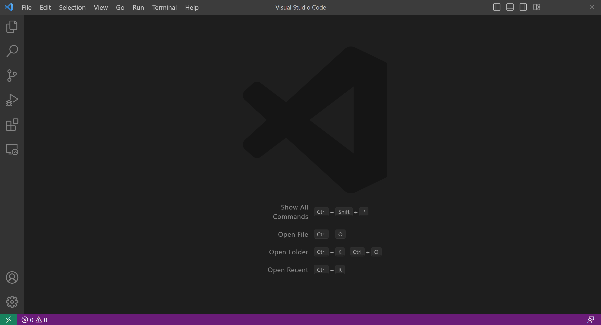
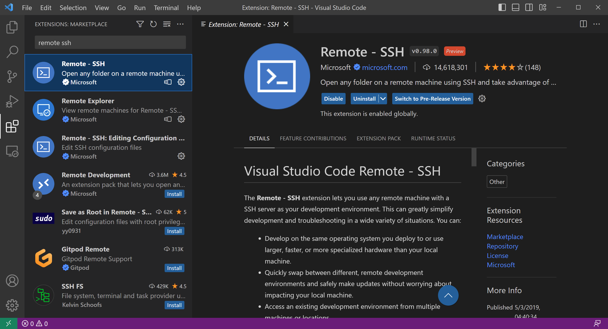
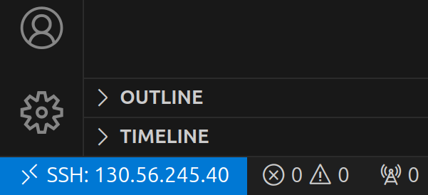
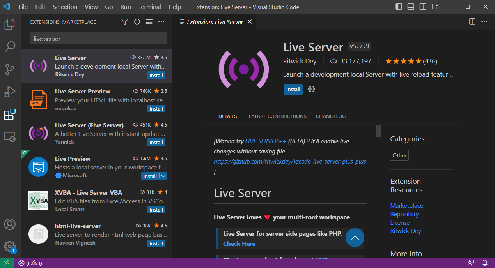

# Setting up your environment

This workshop is designed around the ARDC Nectar Research Cloud. Each participant will be assigned their own virtual machine (VM) which will have all of the prerequisite software pre-installed. The main requirements for participants will be:

- A personal computer
- Internet access
- Visual Studio Code (VS Code)
- A web browser

If you are working through these course materials on your own, see [Setup instructions for your own machine](#setup-instructions-for-your-own-machine) below.

## Installing and setting up VS Code

Visual Studio Code (VS Code) is a lightweight and powerful source code editor available for Windows, macOS and Linux computers.

1. Download Visual Studio Code for your system from [here](https://code.visualstudio.com/download) and follow the instructions for:
    - [macOS](https://code.visualstudio.com/docs/setup/mac)
    - [Linux](https://code.visualstudio.com/docs/setup/linux)
    - [Windows](https://code.visualstudio.com/docs/setup/windows)

2. Open the VS Code application on your computer

3. Click on the extensions button (four blocks) on the left side bar.

4. Search for and install the "Remote - SSH" extension. Click on the blue `install` button.

### Login via Visual Studio Code

To connect to your VM within VS Code, you first need to add the login details to an SSH config file on your computer. You can do this within VS Code as follows:

1. Find and copy the IP address for your Nectar VM that you were provided with.
2. In VS Code, use the keyboard shortcut `Ctrl + Shift + P` (Windows/Linux) or `Cmd + Shift + P` (MacOS) to open the command palette.
3. Select `Select Remote-SSH: Add New SSH Host...`
4. In the text box that appears, type `ssh <USERNAME>@<ip_address>`, substituting your provided username and IP address.
    - For example, if your username is `me` and your IP address is `130.56.245.40`, you would type `ssh me@130.56.245.40`
5. Press `Enter` to submit the SSH command.
6. In the drop-down box, select an SSH configuration file to update.
    - Typically, you will want to update the configuration file that is in `${HOME}/.ssh/config`, which will usually be the first one in the list.
7. You should get a pop-up message saying "Host added!" in the VS Code window.

Now you are ready to connect to the VM via VS Code. To do so:

1. Open the command palette again (`Ctrl + Shift + P` / `Cmd + Shift + P`) and select `Remote-SSH: Connect Current Window to Host...`
2. In the drop-down box, select the newly-added remote, which should be at the top of the list and should be labelled with your VM's IP address.
3. Type in your provided password and press enter.

Having successfully logged in, you should see a small blue or green box in the bottom left corner of your screen:

### Install extensions on the remote machine

We will now install some helpful VS Code extensions:

- **Live Server:** enables you to view HTML reports on the remote machine without having to download them to your local computer first.

1. Ensure you are still connected to the VM as above.
2. Click on the extensions button (four blocks) on the left side bar.
3. For each of the extensions listed above, search for the extension name, click on the matching result, and click on the blue `install` button.

### Open the workshop folder

The last thing to do is to navigate to the workshop folder:

1. Go to the File Explorer view in the left-hand side bar, or press `Ctrl + Shift + E` (Windows/Linux) or `Cmd + Shift + E` (Mac) if it isn't visible.
2. Click the blue "Open Folder" button.
3. Select or type `~` and press `Enter` to open the `$HOME` folder in your VM (VS Code should automatically replace the `~` with the full path to your home folder, i.e. `/home/<USERNAME>`)
4. If prompted, select the box for `Trust the authors of all files in the parent folder ‘home’` then click `Yes, I trust the authors`
5. To open a terminal, type `Ctrl + J` (Windows) or `Cmd + J` (MacOS)
    - **TIP:** You can also use `Ctrl + ~` (all systems) to open a terminal, and `Ctrl + Shift + ~` to open additional terminal tabs, which show up in a panel on the right-hand side of the terminal view.

### Tips for using VS Code

- [VS code cheatsheet for Windows](https://code.visualstudio.com/shortcuts/keyboard-shortcuts-windows.pdf)
- [VS code cheatsheet for MacOS](https://code.visualstudio.com/shortcuts/keyboard-shortcuts-macos.pdf)

| Shortcut | Windows/Linux | MacOS |
|----------|---------|-------|
| Show command palette | `Ctrl + Shift + P` | `Cmd + Shift + P` |
| Toggle sidebar | `Ctrl + B` | `Cmd + B` |
| Open new window | `Ctrl + Shift + N` | `Cmd + Shift + N` |
| Open new file | `Ctrl + N` | `Cmd + N` |
| Open existing file/folder | `Ctrl + O` | `Cmd + O` |
| Open/close terminal |`Ctrl + J` | `Cmd + J` |
| Open/close terminal (alternative) |`Ctrl + ~` | `Ctrl + ~` |
| Open additional terminal |`Ctrl + Shift + ~` | `Ctrl + Shift + ~` |
| Next file or terminal tab | `Ctrl + PageDown` | `Cmd + Shift + ]` |
| Previous file or terminal tab | `Ctrl + PageUp` | `Cmd + Shift + [` |
| Quick file open |`Ctrl + P` | `Cmd + P` |
| Zoom in | `Ctrl +` | `Cmd +` |
| Zoom out | `Ctrl -` | `Cmd -` |
| Find | `Ctrl + F` | `Cmd + F` |
| Save | `Ctrl + S` | `Cmd + S` |
| Select current line | `Ctrl + L` | `Cmd + L` |
| Edit every instance of highlighted string | `Ctrl + Shift + L` | `Cmd + Shift + L` |

## Setup instructions for your own machine

The following instructions are for anyone working through the course materials on their own without access to one of the workshop VMs. There are separate instructions for [Windows](#instructions-for-windows) and [Mac/Linux](#instructions-for-mac-and-linux).

### Instructions for Windows

TODO

### Instructions for Mac and Linux

TODO
