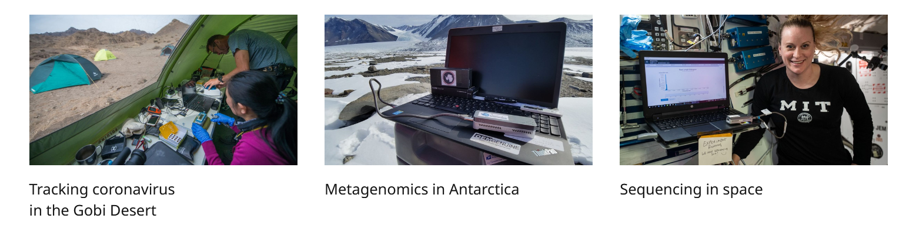
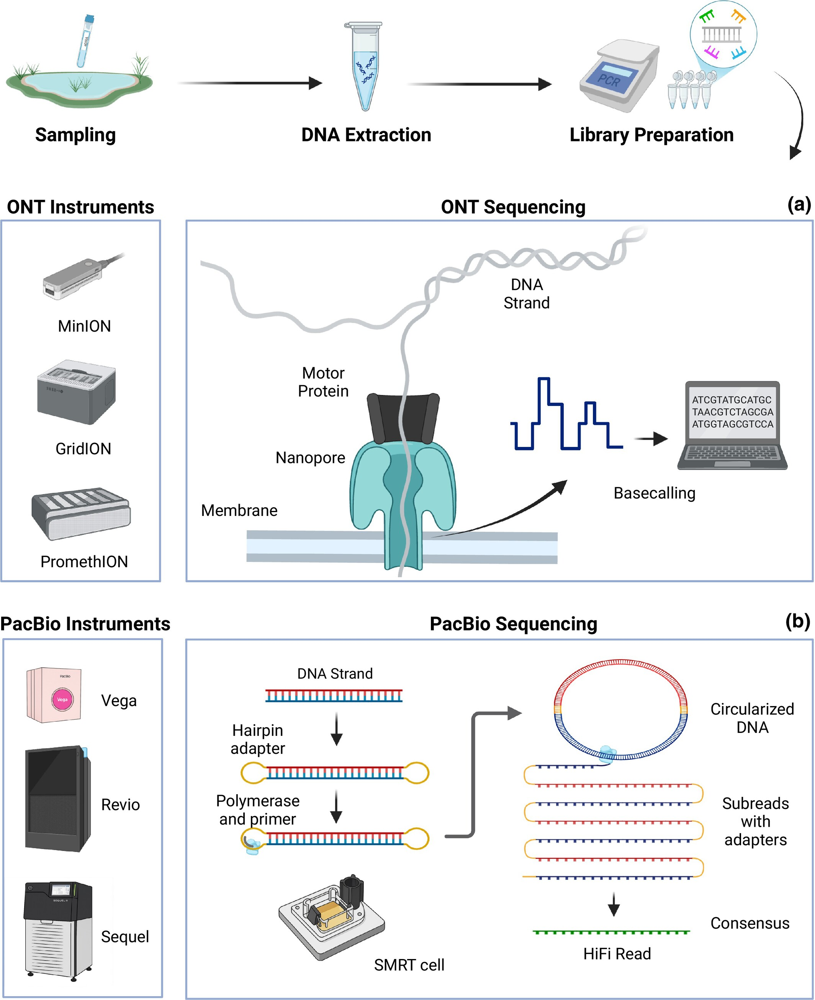
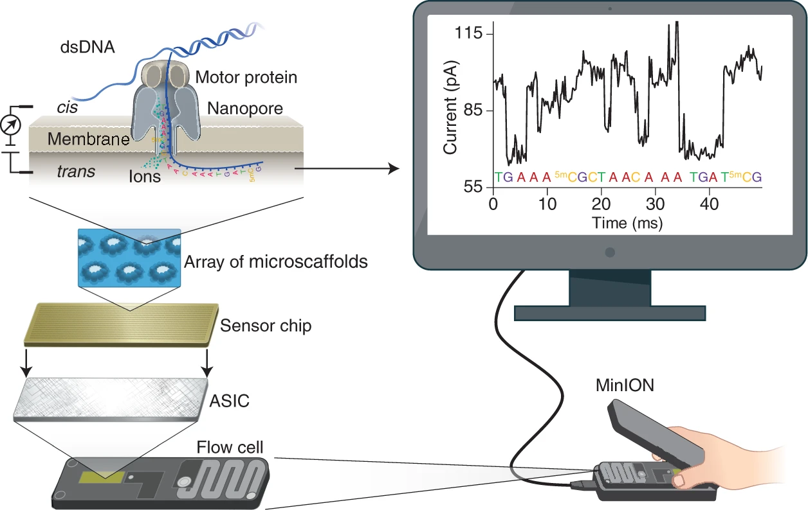
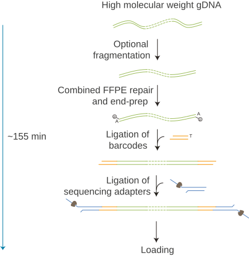
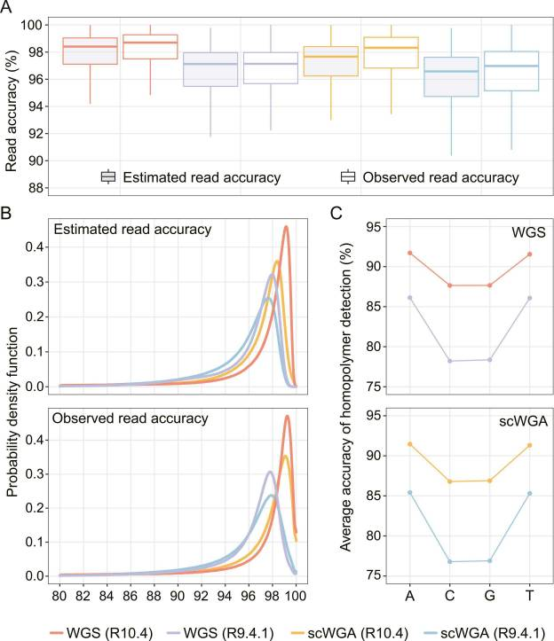
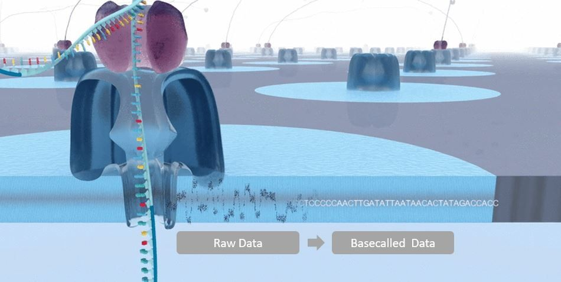
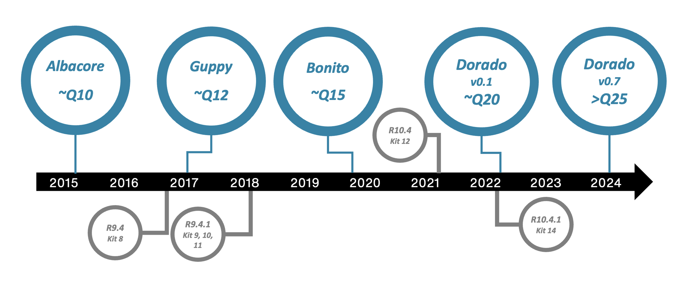
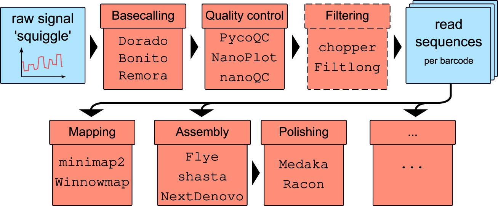

# Introduction to long reads analysis

!!! hint "Learning objectives"

    - Explain why long-read sequencing is used for bacterial genome assembly, and how it compares with short-read sequencing
    - Describe how Oxford Nanopore sequencing and basecalling work, from raw signal to FASTQ
    - Describe the overall pipeline this training follows, from basecalling through to annotation

Long-read sequencing has transformed how we assemble bacterial genomes. Rather than fragmenting DNA into short 150–300 bp pieces and later reordering the puzzle back together in silico, long reads sequence native DNA molecules that are many kilobases long — often long enough to span an entire plasmid, or even a full bacterial chromosome, in a single pass.

This introduction covers what you need before moving on to hands-on assembly: what long reads are good for, how ONT and PacBio differ, how nanopore sequencing works under the hood, and how basecalling turns a raw electrical signal into the DNA sequence you'll eventually assemble.

## How MinION opened up sequencing

Before MinION, sequencing was tethered to the lab: large instruments, precision calibration, and reliable power meant sequencing happened wherever the infrastructure was, not wherever the sample was collected. MinION broke that constraint by putting an entire sequencer into a device the size of a USB stick.

That portability has been tested in some genuinely extreme settings. Researchers sequenced ice sheet microbial communities entirely off-grid, powered by solar panels, during an 11-day ski and sledge trek across Iceland. MinION has flown to the International Space Station, sequencing DNA from bacteriophage, *E. coli*, and mouse samples in microgravity 400 km above Earth. It's been used as a teaching tool aboard a research vessel sailing the Bering Sea for a week, letting students run real-time sequencing despite rough weather. And in Madagascar, a mobile lab built around a miniaturised thermal cycler and an ONT sequencer enabled rapid biodiversity assessment in a nature reserve threatened by deforestation — fast enough to inform conservation decisions and train local scientists on-site.

*Source: https://nanoporetech.com/products/sequence/minion-in-action*

## Antimicrobial resistance and hospital outbreaks

That same speed and portability are exactly what makes nanopore sequencing so useful in a hospital or clinical microbiology setting, where turnaround time can directly affect patient outcomes. Bacterial WGS has become a core tool for hospital infection control and antimicrobial resistance (AMR) surveillance: rapid, accurate identification of a pathogen and its resistance gene complement can materially change treatment decisions. One proof-of-concept study used nanopore sequencing to identify pathogens and antibiotic resistance genes from respiratory samples in an average of 6.7 hours, compared with roughly 40 hours for traditional culture-based methods — fast enough to inform treatment decisions in intensive care rather than after the fact. The same approach also picked up unexpected, non-culturable infectious loads that routine testing had missed entirely.

## Long reads vs short reads: strengths and trade-offs

The case for long reads in bacterial genome assembly comes down to one core problem: repeats. Short-read assemblers struggle whenever a repeated sequence is longer than the reads (or the overlap between them) can span. Long reads solve this simply by being longer than the repeats themselves: a single read spanning 10 kb or more will typically stretch across a repetitive element and into unique sequence on either side, letting the assembler place it unambiguously.

This has flow-on benefits beyond just closing genomes. Long, contiguous reads make it far easier to detect structural variation — large indels, rearrangements, and regions of high GC content — that short reads simply cannot span. Long reads also enable direct detection of epigenetic modifications, such as 5-methylcytosine, as a by-product of sequencing, with no additional wet-lab step required — something short-read platforms cannot offer at all.

The trade-offs are real, though. Historically, long-read platforms have carried considerably higher per-base error rates than short reads: in ONT's case this stems from the difficulty of precisely controlling the speed at which a DNA molecule moves through the nanopore, while PacBio's errors tend to be more randomly distributed. Long-read sequencing also generally requires a larger amount of high-quality, high-molecular-weight input DNA — PacBio and ONT library preparations typically need 150 ng to 1 µg of amplification-free DNA, compared with as little as 1–500 ng for Illumina protocols — and per-Gb sequencing costs remain higher for long-read platforms across the board.

In practice, the gap between short- and long-read accuracy has been narrowing steadily, and hybrid strategies — short reads for base-level accuracy, long reads for structural resolution — remain popular for exactly this reason.

## ONT vs PacBio

ONT and PacBio are the two dominant long-read sequencing platforms, each making a different trade-off. ONT prioritises cost per base and read length: its ultra-long sequencing chemistry can generate reads well beyond 100 kb, with a reported maximum exceeding 4 megabases. This can be particularly valuable for spanning very large repetitive regions and resolving complex genomic structures. PacBio, by contrast, generally produces shorter reads, with the Sequel II typically generating HiFi reads averaging 10–20 kb and some extending beyond 100 kb. In return, it achieves higher raw accuracy through its circular consensus sequencing (HiFi) approach.

Neither platform is inherently "better"; the optimal choice depends on the application. Factors such as required read length, accuracy, sample complexity, and budget all influence platform selection. The strengths of both technologies have been widely recognised, with long-read sequencing (ONT and PacBio HiFi) jointly named Nature Methods Method of the Year in 2022.

*ONT nanopore sequencing (a) vs PacBio SMRT/HiFi sequencing (b). Source: https://besjournals.onlinelibrary.wiley.com/doi/10.1111/2041-210x.70250*

## How ONT works

ONT sequencing is built around a flow cell studded with an array of protein nanopores embedded in an electro-resistant membrane, with a voltage applied across it. Each nanopore sits within its own channel, connected to a sensor that continuously measures the electrical current passing through it. A motor protein attached to each nanopore ratchets a single DNA (or RNA) strand through the pore, base by base. As different bases pass through, they perturb the current in characteristic ways; this raw electrical signal — often called a "squiggle" — is recorded in real time and later decoded into a nucleotide sequence by a basecalling algorithm.

Because sequencing and signal decoding both happen in real time, results can, in principle, be inspected as they're generated — a property that underpins ONT's adaptive sampling and rapid-diagnostic use cases.

*Principle of nanopore sequencing: a motor protein ratchets DNA/RNA through a nanopore, and the resulting current changes are decoded into a sequence. Source: https://www.nature.com/articles/s41587-021-01108-x*

### Different ONT sequencers

ONT offers a family of devices built around the same underlying flow cell technology but scaled for different throughput needs.

- **Flongle** — a small, low-cost, single-use flow cell adapter, useful for quick or low-yield runs.
- **MinION** — released in 2016, this is the original pocket-sized sequencer. It uses a single flow cell with up to 512 channels and supports run times of up to ~72 hours. Depending on the flow cell chemistry and sample quality, it typically generates tens of gigabases of sequencing data per run. Its small size and ability to run from a laptop's USB port make it particularly well suited to field and expedition work.
- **GridION** — released in 2017, this is essentially five MinIONs integrated into a single benchtop instrument. By running up to five flow cells in parallel, it can generate hundreds of gigabases of sequencing data per run while providing greater throughput and scalability than the MinION.
- **PromethION** — released in 2018 and built for high throughput, running up to 48 flow cells at once, each with thousands of nanopores, for a maximum device yield in the multi-terabase range.

*Source: https://nanoporetech.com/products/sequence*

### Barcoding and multiplexing

Flow cells aren't cheap, and a single sample rarely needs a whole one to itself — which is where barcoding comes in. ONT's barcoding kits attach a short, standardised barcode sequence to the DNA from each sample during library preparation, at the start of the strand (and, for some kits, the end too), which lets you pool several samples together and sequence them on the same flow cell in a single run. A complete barcode arrangement has three parts: the barcode sequence itself, and a flanking region on either side — an upstream flanking region between the barcode and the sequencing adapter, and a downstream flanking region between the barcode and the actual sample sequence. The flanking sequences differ from kit to kit, but the barcode sequences themselves are standardised across ONT's kits.

*Multiplex Ligation Sequencing Kit XL V14. Source: https://nanoporetech.com/document/chemistry-technical-document*

After the run, reads need to be sorted back out by sample — this is demultiplexing, and MinKNOW handles it either live as the run progresses or as a separate post-run step.

## Accuracy evolution

Nanopore accuracy has improved substantially, driven largely by successive flow cell chemistries and better basecalling models rather than any single breakthrough. The current R10.4.1 chemistry, paired with modern basecallers, achieves greater than 99% single-read accuracy for simplex reads — ONT's "Q20 chemistry" milestone — and duplex reads, where both strands of a DNA molecule are sequenced and cross-validated against one another, can now exceed 99.9% accuracy, which is at the level of PacBio's HiFi approach.

*Timeline of MinION read accuracy improvements across chemistry and basecaller versions. Source: https://pmc.ncbi.nlm.nih.gov/articles/PMC6045860/*

*R10.4 vs R9.4.1 flow cell read accuracy, including homopolymer detection performance. Source: https://pmc.ncbi.nlm.nih.gov/articles/PMC10070092/*

Three related metrics are worth knowing when evaluating a sequencing run: the per-base Phred quality score, the raw read quality (an average Q-score across the whole read), and the raw read accuracy (the proportion of bases in a read that match a reference once insertions, deletions, and substitutions are all counted as errors). As a rule of thumb, 99% accuracy means roughly one error in every 100 bases — and at today's Q20+ chemistry, that error rate is finally low enough that long-read-only assembly of a bacterial genome is a realistic, routine option, rather than something that always requires short-read polishing to trust.

## Basecalling

Basecalling is the step that turns the raw electrical signal — the squiggle — into the actual A/C/G/T sequence you'll use for assembly. Raw current measurements are recorded by ONT's MinKNOW software and organised into individual "reads" (one per DNA/RNA strand), stored in the POD5 file format. A basecalling algorithm, built on a neural network, then translates that raw signal into called bases, typically after a pre-processing step that trims adapters and normalises the signal. The output is written as unaligned BAM files (which can also carry modified-base and alignment information) and, from there, as FASTQ files — the standard input format for downstream assembly tools.

*Source: https://nanoporetech.com/platform/accuracy*

Basecalling can be run live, as data streams off the sequencer during a run, or afterwards as a standalone post-processing step — useful if you want to reprocess older runs with an improved model.

### Different basecalling models

ONT's basecallers offer three models, trading speed against accuracy:

- **Fast** — the quickest and least computationally demanding option, and the only one guaranteed to keep pace with live basecalling on any nanopore device, but with the lowest raw read accuracy of the three.
- **High accuracy (HAC)** — a middle ground: meaningfully more accurate than Fast, at a moderate computational cost. Compatible with real-time basecalling on GridION and PromethION devices with sufficient compute, and generally recommended for high-throughput variant analysis work.
- **Super accurate (SUP)** — the most accurate model, and the most computationally intensive. This is the model recommended for de novo assembly projects.

*Raw read accuracy for HAC vs SUP basecalling models, R10.4.1 chemistry. Source: https://nanoporetech.com/platform/accuracy*

Which model to use is ultimately a trade-off between accuracy and compute time, and it's worth choosing deliberately rather than defaulting to whatever the sequencer suggests.

### Dorado is replacing Guppy

ONT's basecalling tools have gone through several generations. Guppy previously replaced an earlier tool called Albacore as ONT's official basecaller, and Guppy has since been superseded in turn by Dorado, a considerably faster tool that is now the production basecaller shipped with, and integrated into, MinKNOW.

Dorado supports both the legacy FAST5 format and the newer, more compact POD5 format, includes basecalling models for all current ONT kits, can predict modified bases (such as methylation) directly during basecalling, and has built-in barcode demultiplexing for multiplexed runs. 

*Source: https://nanoporetech.com/platform/technology/basecalling*

## Basic pipeline

Every bacterial genome in this training will move through the same broad pipeline, and it's worth having the full picture before diving into any one step of it:

1. **Basecalling** — raw nanopore signal is converted into FASTQ reads (covered above).
2. **Quality control** — checking read length, quality, and contamination before doing anything else.
3. **Preprocessing** *(optional)* — trimming and filtering reads, if QC suggests it's actually needed.
4. **Assembly** — reconstructing the genome from reads into contigs, ideally one closed contig per replicon.
5. **Polishing** — correcting remaining base-level errors in the draft assembly using a consensus tool.
6. **Annotation** — identifying genes of interest in the finished assembly, including antimicrobial resistance genes.

*Standard nanopore data pipeline: basecalling, QC/filtering, then downstream analysis. Source: https://academic.oup.com/nar/article/54/3/gkag023/8454528?login=false#551724511*

Each of these is covered as its own module in this training, and each builds directly on the output of the one before it — a low-quality read set will haunt every later step, and a poorly assembled genome will produce misleading annotation results no matter how good the annotation tool is.

# Scenario

You are newly appointed scientists in the Infection Prevention & Control Team (IPCT) at a 1,000-bed teaching hospital.

It is Monday morning. The microbiology laboratory urgently contacts your team about a patient in the Intensive Care Unit (ICU).

A patient was admitted 3 days ago following emergency abdominal surgery. As part of routine screening, a rectal swab was collected. During routine microbiology investigations, the laboratory isolated a carbapenemase-producing bacterium (likely to be resistant to most antibiotics) from the sample and referred the isolate for whole-genome sequencing (WGS).

The sequencing report has now arrived on your desk. Your task is to identify the most likely bacterial species and assess whether the isolate represents a high-risk outbreak strain.

# Exercise

Before that happens, though, you need to establish rapport so you can work better together. Break into groups, introduce yourselves, tell everyone why you're attending this workshop. Then together choose an IPCT team name.

# References

TO DO