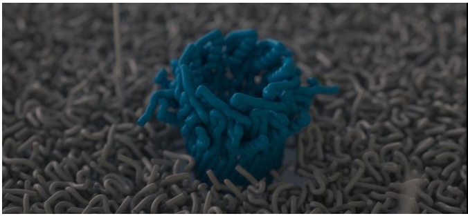
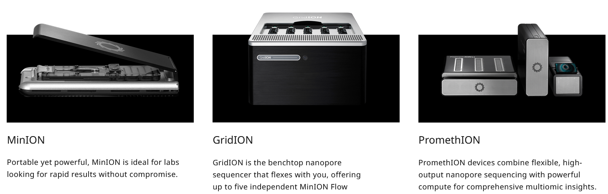
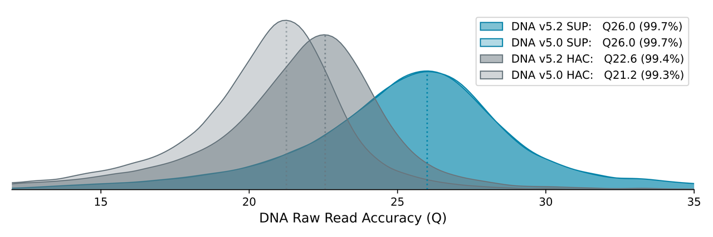
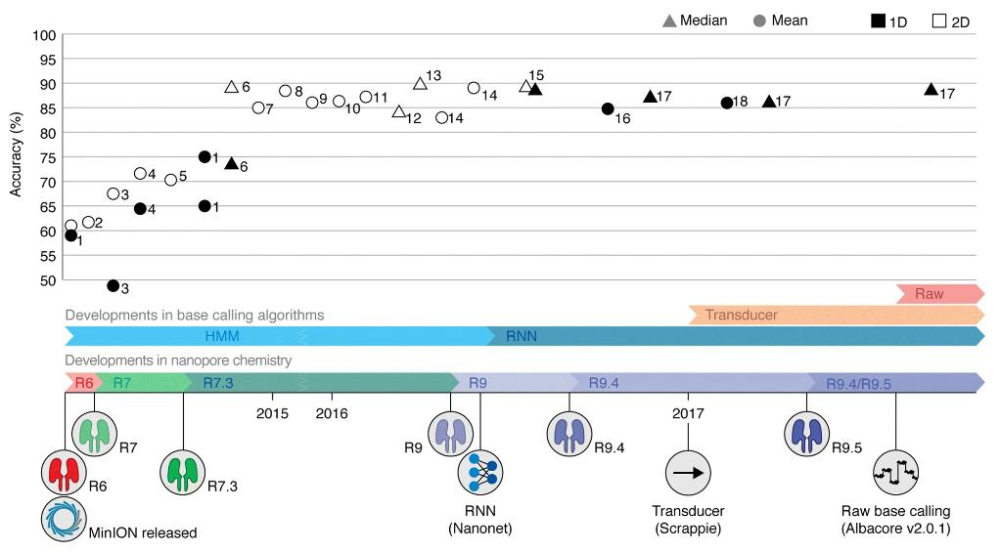

# Introduction to long reads analysis

Long-read sequencing (LRS) has transformed how we assemble bacterial genomes. Rather than fragmenting DNA into short 150–300 bp pieces and later reordering the puzzle back together in silico, LRS reads native DNA molecules that are many kilobases long — often long enough to span an entire plasmid, or even a full bacterial chromosome, in a single pass. For anyone assembling whole-genome sequences (WGS) of bacterial isolates, that single change ripples through the whole workflow: fewer contigs, fewer ambiguous joins, and genomes that actually close.

This introduction covers what you need before moving on to hands-on assembly: what long reads are good for, how ONT and PacBio differ, how nanopore sequencing works under the hood, and how basecalling turns a raw electrical signal into the DNA sequence you'll eventually assemble.

## How MinION opened up sequencing

Before MinION, sequencing was tethered to the lab: large instruments, precision calibration, and reliable power meant sequencing happened wherever the infrastructure was, not wherever the sample was collected. MinION broke that constraint by putting an entire sequencer into a device the size of a USB stick.

That portability has been tested in some genuinely extreme settings. Researchers sequenced ice sheet microbial communities entirely off-grid, powered by solar panels, during an 11-day ski and sledge trek across Iceland. MinION has flown to the International Space Station, sequencing DNA from bacteriophage, *E. coli*, and mouse samples in microgravity 400 km above Earth. It's been used as a teaching tool aboard a research vessel sailing the Bering Sea for a week, letting students run real-time sequencing despite rough weather. And in Madagascar, a mobile lab built around a miniaturised thermal cycler and an ONT sequencer enabled rapid biodiversity assessment in a nature reserve threatened by deforestation — fast enough to inform conservation decisions and train local scientists on-site.

The same qualities that make these expeditions possible — small footprint, no dependence on mains power, results in hours rather than days — are exactly what make MinION appealing for isolate sequencing in a clinical microbiology lab or a modestly resourced research setting: you don't need a dedicated sequencing facility, just a laptop and a flow cell.

## Antimicrobial resistance and hospital outbreaks

That same speed and portability is exactly what makes nanopore sequencing so useful in a hospital or clinical microbiology setting, where turnaround time can directly affect patient outcomes. Bacterial WGS has become a core tool for hospital infection control and antimicrobial resistance (AMR) surveillance: rapid, accurate identification of a pathogen and its resistance gene complement can materially change treatment decisions. One proof-of-concept study used nanopore sequencing to identify pathogens and antibiotic resistance genes from respiratory samples in an average of 6.7 hours, compared with roughly 40 hours for traditional culture-based methods — fast enough to inform treatment decisions in intensive care rather than after the fact. The same approach also picked up unexpected, non-culturable infectious loads that routine testing had missed entirely.

The same speed advantage extends to outbreak investigation. Nanopore sequencing has been used to trace hospital-associated infections and to characterise recent outbreaks, including monkeypox and COVID-19, and its real-time, adaptive sequencing capabilities have also proven useful in foodborne outbreak investigations, where identifying the responsible pathogen quickly — without waiting on lengthy culture enrichment — can be the difference between containing an outbreak and letting it spread. Foodborne illness alone is estimated to affect 600 million people a year and cause over 420,000 deaths, so shaving days off detection time carries real weight. A systematic review of nanopore sequencing in food microbiology reported detection times under 24 hours, 95–98% species identification accuracy, and greater than 90% sensitivity for AMR gene detection, at roughly a quarter of the cost of traditional whole-genome sequencing workflows — though homopolymeric regions remain a persistent source of error (8–15%), and bioinformatics expertise is still a rate-limiting factor for many labs.

## Long reads vs short reads: strengths and trade-offs

The case for long reads in bacterial genome assembly comes down to one core problem: repeats. Short-read assemblers struggle whenever a repeated sequence is longer than the reads (or the overlap between them) can span — rRNA operons, insertion sequences, and repeated genes all create ambiguity that short-read assemblers can't resolve, fragmenting the genome into many contigs and making complete genome resolution nearly unattainable. Long reads solve this simply by being longer than the repeats themselves: a single read spanning 10 kb or more will typically stretch across a repetitive element and into unique sequence on either side, letting the assembler place it unambiguously.

This has flow-on benefits beyond just closing genomes. Long, contiguous reads make it far easier to detect structural variation — large indels, rearrangements, and regions of unusually high GC content — that short reads simply cannot span. Long reads also enable direct detection of epigenetic modifications, such as 5-methylcytosine, as a by-product of sequencing, with no additional wet-lab step required — something short-read platforms cannot offer at all.

The trade-offs are real, though. Historically, long-read platforms have carried considerably higher per-base error rates than short reads: in ONT's case this stems from the difficulty of precisely controlling the speed at which a DNA molecule moves through the nanopore, while PacBio's errors tend to be more randomly distributed. Long-read sequencing also generally requires a larger amount of high-quality, high-molecular-weight input DNA — PacBio and ONT library preparations typically need 150 ng to 1 µg of amplification-free DNA, compared with as little as 1–500 ng for Illumina protocols — and per-Gb sequencing costs remain higher for long-read platforms across the board.

| Platform | MiSeq | NovaSeq 6000 | Sequel II | Revio | Flongle | MinION | GridION | PromethION |
|---|---|---|---|---|---|---|---|---|
| Company | Illumina | Illumina | PacBio | PacBio | ONT | ONT | ONT | ONT |
| Average read length | Up to 2 × 300 bp | Up to 2 × 250 bp | ~13.5–20 kb | 15–18 kb | 20 kb | 20 kb | 20 kb | 20 kb |
| Yield per cell | Up to 15 Gb | ~350 Gb | 25 Gb (HiFi) | 90 Gb | 1–1.5 Gb | 15–20 Gb | 15–20 Gb | ~120 Gb |
| Runtime | 4–56 h | 13–44 h | 30 h | 24 h | 16–24 h | 72 h | 72 h | 72 h |
| Read accuracy (Q20+) | 99.75% | 99.75% | 99.18–99.8% | >99.5% | 97–99% | 97–99% | 97–99% | 97–99% |
| Direct RNA-seq | No | No | No | No | Yes | Yes | Yes | Yes |
| DNA input needed | 1–500 ng | 1–500 ng | 150 ng–1 µg | 150 ng–1 µg | 150 ng–1 µg | 150 ng–1 µg | 150 ng–1 µg | 150 ng–1 µg |

In practice, the gap between short- and long-read accuracy has been narrowing steadily, and hybrid strategies — short reads for base-level accuracy, long reads for structural resolution — remain popular for exactly this reason. For a single bacterial isolate, though, long-read-only assembly is now routinely capable of producing a single closed, circular chromosome — something short reads alone essentially never achieve on their own.

## ONT vs PacBio

ONT and PacBio are the two dominant long-read platforms, and each makes a different trade-off. ONT favours read length: its ultra-long sequencing chemistry can generate reads well beyond 100 kb, with some reported maximum reads exceeding 2 megabases — particularly useful for spanning very large repeats or resolving complex genomic elements. PacBio, by contrast, produces comparatively shorter reads — the Sequel II typically generates reads averaging 10–20 kb, with some extending past 100 kb — but achieves this with higher raw accuracy, through its circular consensus sequencing (HiFi) approach.

*Sample processing workflow and sequencing with long-read technologies. (a) ONT instruments and sequencing: Movement of the DNA strand through the nanopore leading to data generation. (b) PacBio instruments and sequencing: SMRT cell sequencing, showing the circular consensus sequencing (CCS) process for generation of HiFi reads (Generated with BioRender https://BioRender.com/lszcq1k). Source: https://besjournals.onlinelibrary.wiley.com/doi/10.1111/2041-210x.70250*

Neither platform is a straightforwardly "better" choice; the decision depends on your specific needs — desired read length, required accuracy, sample complexity, and budget all play a role. Both platforms have improved enough that Nature Methods jointly named long-read sequencing (ONT and PacBio HiFi) its Method of the Year in 2022. Cost is often the deciding factor in practice: ONT's lower cost per base and the availability of portable, low-infrastructure devices led Johns Hopkins researcher Steven Salzberg to describe ONT as, in his words, "with few exceptions, the only one real choice for long-read sequencing."

## How ONT works

ONT sequencing is built around a flow cell studded with an array of protein nanopores embedded in an electro-resistant membrane, with a voltage applied across it. Each nanopore sits within its own channel, connected to a sensor that continuously measures the electrical current passing through it. A motor protein attached to each nanopore ratchets a single DNA (or RNA) strand through the pore, base by base. As different bases pass through, they perturb the current in characteristic ways; this raw electrical signal — often called a "squiggle" — is recorded in real time and later decoded into a nucleotide sequence by a basecalling algorithm.

Because sequencing and signal decoding both happen in real time, results can, in principle, be inspected as they're generated — a property that underpins ONT's adaptive sampling and rapid-diagnostic use cases.

*Principle of nanopore sequencing. A MinION flow cell contains 512 channels with 4 nanopores in each channel, for a total of 2,048 nanopores used to sequence DNA or RNA. The wells are inserted into an electrically resistant polymer membrane supported by an array of microscaffolds connected to a sensor chip. Each channel associates with a separate electrode in the sensor chip and is controlled and measured individually by the application-specific integration circuit (ASIC). Ionic current passes through the nanopore because a constant voltage is applied across the membrane, where the trans side is positively charged. Under the control of a motor protein, a double-stranded DNA (dsDNA) molecule (or an RNA–DNA hybrid duplex) is first unwound, then single-stranded DNA or RNA with negative charge is ratcheted through the nanopore, driven by the voltage. As nucleotides pass through the nanopore, a characteristic current change is measured and is used to determine the corresponding nucleotide type at ~450 bases per s (R9.4 nanopore). Source: https://www.nature.com/articles/s41587-021-01108-x*

### Flow cells

The flow cell is where the sequencing chemistry actually happens: it houses the nanopore sensors, the motor proteins, and the associated reagents that make sequencing possible. Flow cell chemistry has gone through several generations, with each iteration improving raw accuracy, sequencing speed, and the volume of reads a single cell can handle. The current generation, R10.4.1, represents the biggest jump yet — it's the chemistry behind "Q20" sequencing, ONT's shorthand for single-read accuracy exceeding 99%.

*Source: https://nanoporetech.com/platform/technology/flow-cells-and-nanopores*

### Different ONT sequencers

ONT offers a family of devices built around the same underlying flow cell technology but scaled for different throughput needs.

- **Flongle** — a small, low-cost, single-use flow cell adapter, useful for quick or low-yield runs (roughly 1–1.5 Gb per cell, over a 16–24 h run).
- **MinION** — released in 2016, this is the original pocket-sized sequencer: one flow cell, up to 512 available channels, a maximum run time around 72 hours, and a device yield typically in the 15–20 Gb range (with a stated maximum up to ~40–50 Gb). It's small enough to run from a laptop's USB port, which is what makes it viable for field and expedition work.
- **GridION** — released in 2017, essentially five MinIONs in a single benchtop unit, running five flow cells in parallel for a combined device yield of roughly 200–250 Gb.
- **PromethION** — released in 2018 and built for high throughput, running up to 48 flow cells at once, each with thousands of nanopores, for a maximum device yield in the multi-terabase range.

*Source: https://nanoporetech.com/products/sequence*

For a single bacterial isolate, a Flongle or a single MinION flow cell is often more than sufficient — you don't need PromethION-scale throughput to close one genome.

## Basecalling

Basecalling is the step that turns the raw electrical signal — the squiggle — into the actual A/C/G/T sequence you'll use for assembly. Raw current measurements are recorded by ONT's MinKNOW software and organised into individual "reads" (one per DNA/RNA strand), stored in the POD5 file format. A basecalling algorithm, built on a neural network, then translates that raw signal into called bases, typically after a pre-processing step that trims adapters and normalises the signal. The output is written as unaligned BAM files (which can also carry modified-base and alignment information) and, from there, as FASTQ files — the standard input format for downstream assembly tools.

*Source: https://nanoporetech.com/platform/accuracy*

Basecalling can be run live, as data streams off the sequencer during a run, or afterwards as a standalone post-processing step — useful if you want to reprocess older runs with an improved model.

### Different basecalling models

ONT's basecallers offer three models, trading speed against accuracy:

- **Fast** — the quickest and least computationally demanding option, and the only one guaranteed to keep pace with live basecalling on any nanopore device, but with the lowest raw read accuracy of the three.
- **High accuracy (HAC)** — a middle ground: meaningfully more accurate than Fast, at a moderate computational cost. Compatible with real-time basecalling on GridION and PromethION devices with sufficient compute, and generally recommended for high-throughput variant analysis work.
- **Super accurate (SUP)** — the most accurate model, and the most computationally intensive. This is the model recommended for de novo assembly projects — which makes it the default choice for bacterial isolate WGS, where the cleanest possible genome matters more than basecalling speed.

*DNA raw read accuracy modal data obtained with Ligation Sequencing Kit V14 (with enzyme E8.2.1) and PromethION R10.4.1 Flow Cells, using nanopore sequencing data for the human genome (HG002 cell lines). Both HAC and SUP models are featured for version 5.0 and 5.2 (integrated in MinKNOW). Source: https://nanoporetech.com/platform/accuracy*

Which model to use is ultimately a trade-off between accuracy and compute time, and it's worth choosing deliberately rather than defaulting to whatever the sequencer suggests.

### Dorado is replacing guppy

ONT's basecalling tools have gone through several generations. Guppy previously replaced an earlier tool called Bonito as ONT's official basecaller, and Guppy has since been superseded in turn by Dorado, a considerably faster tool that is now the production basecaller shipped with, and integrated into, MinKNOW.

Dorado supports both the legacy FAST5 format and the newer, more compact POD5 format, includes basecalling models for all current ONT kits, can predict modified bases (such as methylation) directly during basecalling, and has built-in barcode demultiplexing for multiplexed runs. Bonito still exists as a research-oriented alternative for users who want to train their own basecalling neural networks, and Remora adds a further layer specifically for nucleotide modification calling. For routine bacterial isolate sequencing, though, Dorado is now the standard tool.

## Accuracy evolution

Nanopore accuracy has improved substantially, driven largely by successive flow cell chemistries and better basecalling models rather than any single breakthrough. The current R10.4.1 chemistry, paired with modern basecallers, achieves greater than 99% single-read accuracy for simplex reads — ONT's "Q20 chemistry" milestone — and duplex reads, where both strands of a DNA molecule are sequenced and cross-validated against one another, can now exceed 99.9% accuracy. For comparison, PacBio's HiFi approach (circular consensus sequencing) reaches roughly 99.8% accuracy.

*Timeline of reported MinION read accuracies and Oxford Nanopore Technologies (ONT) technological developments. Nanopore chemistry updates and advances in base-caller software are represented as colored bars. The plotted accuracies are ordered on the basis of the chemistry and base-calling software used, not according to publication date. Source: https://pmc.ncbi.nlm.nih.gov/articles/PMC6045860/* 

*The quality of nanopore read from whole-genome shotgun (WGS) and single-cell whole-genome amplification (WGA) sequencing using R9.4.1 and R10.4 flow cells. A Both R10.4 reads from WGS and scWGA sequencing libraries outperformed the R9.4.1 reads in terms of original Guppy basecaller estimated (grey) and read mapping observed (white) accuracy with medium and quartiles. The dispersion of the boxplot also shows that observed read accuracy is higher than estimated ones accordingly. B The density distribution plot indicates the R10.4 reads had higher modal read accuracy than R9.4.1 both in estimated (top) and observed (bottom) ones. C R10.4 had a higher average accuracy detection rate on homopolymers ranging from 4 to 9 bp than R9.4.1 both for WGS and scWGA libraries. It can also identify the preference for adenine (A) and thymine (T) over cytosine (C) and guanine (G) in homopolymer detection of nanopore reads. Source: https://pmc.ncbi.nlm.nih.gov/articles/PMC10070092/*

Three related metrics are worth knowing when evaluating a sequencing run: the per-base Phred quality score, the raw read quality (an average Q-score across the whole read), and the raw read accuracy (the proportion of bases in a read that match a reference once insertions, deletions, and substitutions are all counted as errors). As a rule of thumb, 99% accuracy means roughly one error in every 100 bases — and at today's Q20+ chemistry, that error rate is finally low enough that long-read-only assembly of a bacterial genome is a realistic, routine option, rather than something that always requires short-read polishing to trust.

## Basic pipeline

Every bacterial isolate in this training moves through the same broad pipeline, and it's worth having the full picture before diving into any one step of it:

1. **Basecalling** — raw nanopore signal is converted into FASTQ reads (covered above).
2. **Quality control** — checking read length, quality, and contamination before doing anything else.
3. **Preprocessing** *(optional)* — trimming and filtering reads, if QC suggests it's actually needed.
4. **Assembly** — reconstructing the genome from reads into contigs, ideally one closed contig per replicon.
5. **Polishing** — correcting remaining base-level errors in the draft assembly using a consensus tool.
6. **Annotation** — identifying genes of interest in the finished assembly, including antimicrobial resistance genes.

*The standard pipeline for nanopore sequencing data involves basecalling of the raw data, followed by quality control (QC) and filtering. The reads can then be analyzed with specialized long-read tools for mapping, polished assembly, or other workflows. Source: https://academic.oup.com/nar/article/54/3/gkag023/8454528?login=false#551724511*

Each of these is covered as its own module in this training, and each builds directly on the output of the one before it — a low-quality read set will haunt every later step, and a poorly assembled genome will produce misleading annotation results no matter how good the annotation tool is.

## Scenario

The case study running through this training is a hospital outbreak investigation. A cluster of patients has developed infections resistant to carbapenems — a "last resort" class of broad-spectrum antibiotics normally reserved for the most severe, multi-drug-resistant cases. Confirming whether these infections are actually related, and identifying exactly which resistance genes are involved, needs more than a standard diagnostic culture: it calls for whole-genome sequencing of each bacterial isolate.

Over the course of this training, you'll take long-read sequencing data from isolates connected to this outbreak all the way from raw reads through to a finished, annotated genome assembly — checking read quality, assembling and polishing each genome, and finally screening it for carbapenem resistance genes to help build the picture of how, and how far, this outbreak has spread.

# Exercise

Break into groups.

1. Choose a team name.
2. As a group, look at the outbreak scenario above and discuss: which type of sequencing analysis will you need to perform on your assigned isolate, and why? Think about what you've just covered in this module — read length, accuracy, portability, real-time results — and what you'll actually need in order to answer the outbreak investigation's questions.
