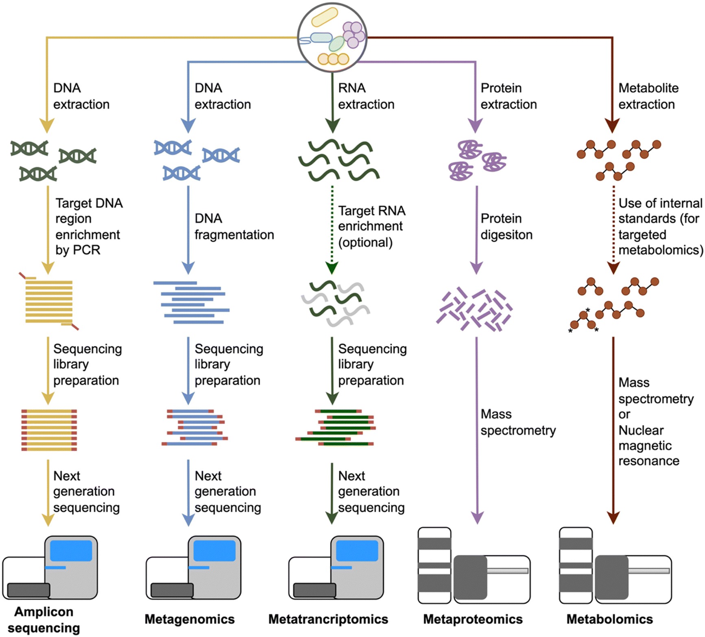

# Introduction to long-read metagenomics

Every microbial community leaves a genetic paper trail. Metagenomics reads it, and long-read sequencing is changing just how much of that trail we can actually make out. This session sets the scene: what metagenomics can tell us, why long reads (especially ONT) have been a game changer, and where the trade-offs still lie, before we get hands-on with quality control and preprocessing.

**Agenda for this session**

1. Types of microbiome analysis
2. How MinION opened up sequencing and microbiome research
3. Long reads vs short reads: strengths and trade-offs
4. ONT vs PacBio
5. How ONT works
6. Basecalling
7. Basic pipeline
8. Scenario
9. Break out room

## Session 1: Types of microbiome analysis

Metagenomics studies the genetic material of microorganisms directly in their natural habitats, revealing who is there and what they are doing [3]. From a single sample, it can tell us:

- relative abundance and community richness
- taxonomic profiling (who is in the sample)
- functional profiling and pathway analysis (what they can do)
- phylogeny
- pathogen detection [4]

Typical sample types include soil, water, faeces, and saliva.

There are two main ways to get there:

- **Marker gene/amplicon sequencing**: sequencing a specific gene region, usually 16S rRNA for bacteria, 18S rRNA or ITS for fungi, occasionally other markers like gyrB
- **Shotgun metagenomic sequencing**: sequencing all the DNA in a sample, not just one gene

## Session 2: How MinION opened up sequencing and microbiome research

Long-read sequencing has reshaped metagenomics. It has sharpened strain-level pathogen identification, made complete metagenome-assembled genomes (MAGs) achievable, and improved taxonomic classification. Some of that is better accuracy, but just as much comes from rapidly maturing analysis methods.

Why it matters in practice:

- **Flexible with sample type**: works on faeces, saliva, environmental samples, even tricky ones like colorectal cancer tissue with high human DNA content [72,73]
- **Sharper resolution**: reliably resolves species and even strains, something short reads struggle with
- **Whole marker genes**: can sequence the full 16S gene, and even entire fungal ribosomal operons (16S-ITS-28S) [74,75]
- **Virome research**: enables analysis of complete viral genomes [76,77,78]
- **Better genome recovery**: higher-quality MAGs across diverse ecosystems [79]
- **Epigenetics for free**: detects epigenetic modifications directly during sequencing, no extra assay required [80,81]

## Session 3: Long reads vs short reads: strengths and trade-offs

**Why long reads help.** Long-read sequencing (LRS) produces reads that are kilobases long, giving more complete and contiguous genomic information. Fewer, longer fragments mean simpler genome assembly and fewer errors, especially in the highly repetitive regions where short reads struggle [11]. That length also improves detection of large indels, complex rearrangements, structural variants, high-GC regions, and repeats, and makes epigenetic marks like 5-methylcytosine (5mC) readily detectable.

**The accuracy story.** LRS has a reputation for lower accuracy than short-read sequencing (SRS), but that gap is closing fast. ONT's error rate mostly comes from the challenge of controlling DNA speed through the nanopore, while PacBio's errors are more random [13]. The latest hardware and chemistry, PacBio's circular consensus sequencing (99.8% accuracy) and ONT's newer flow cells (99.5%) plus phi29 polymerase to slow DNA translocation, have pushed both platforms well past their earlier reputations [14,15].

**The catch.** LRS is still more expensive per base than SRS, and needs more, higher-quality input DNA: PacBio and ONT typically need 150 ng to 1 µg, versus as little as 1 to 500 ng for Illumina [7,18]. Dedicated analysis tools are also less mature than the short-read ecosystem.

**Horses for courses.** SRS remains cheaper, highly accurate, and effective within well-defined regions. LRS wins where structure matters: high structural variability, repeats, haplotype phasing, co-inherited alleles, and detecting low-abundance taxa [85]. Combining both lets researchers get precise taxonomic and functional calls from short reads while using long reads to resolve genomic structure and organisation.

**Table 1. Comparison between short-read and long-read technologies**

*Note: superscript footnote markers (a-d) in the original source table refer to notes that are not reproduced here.*

| Platform | Company | Read length (avg) | Yield/cell (Gb) | Runtime (h) | Accuracy (Q20+) | Direct RNA-seq | DNA input | Cost per Gb |
|---|---|---|---|---|---|---|---|---|
| MiSeq | Illumina | Up to 2 × 300 bp | Up to 15 | 4–56 | 99.75% [128] | No | 1–500 ng [18] | US$178–1,705 [130,131] |
| NovaSeq 6000 | Illumina | Up to 2 × 250 bp | ~350 | 13–44 | 99.75% [128] | No | 1–500 ng [18] | US$3.95 [131] |
| Sequel II | PacBio | ~13.5–20 kb [52] | 25 (HiFi) | 30 | 99.18–99.8% [52] | No | 150 ng–1 µg [7] | US$30–43 [131,132] |
| Revio | PacBio | 15–18 kb | 90 | 24 | >99.5% [129] | No | 150 ng–1 µg [7] | US$8–11 [132] |
| Flongle | Nanopore | 20 kb | 1–1.5 | 16–24 | 97–99% [12] | Yes | 150 ng–1 µg [7] | US$118–437 [131,132] |
| MinION | Nanopore | 20 kb | 15–20 | 72 | 97–99% [12] | Yes | 150 ng–1 µg [7] | US$21–51 [131,132] |
| GridION | Nanopore | 20 kb | 15–20 | 72 | 97–99% [12] | Yes | 150 ng–1 µg [7] | US$29–51 [132] |
| PromethION | Nanopore | 20 kb | ~120 | 72 | 97–99% [12] | Yes | 150 ng–1 µg [7] | US$6–12 [132] |

A few reasons short reads alone can fall short: repetitive or highly homologous regions trip up assembly and alignment when they exceed the overlap length of reads or contigs, so complete genome resolution from short reads alone is nearly always out of reach [9,10]. In a mixed microbial sample, closely related strains that differ at only a few positions ("intergenomic repeats") are especially hard to tell apart without sequencing their neighbouring regions too [4,5,7,11]. Longer reads directly address this by spanning more of an organism's distinguishing sequence [9].

Long reads also read out methylation status (5mC and 5hmC) on CpG islands alongside the sequence itself, and ONT can even sequence RNA directly, adding another way to distinguish organisms in a sample [6,8].

Clinically, long-read metagenomics is already earning its keep: surveillance of antibiotic resistance genes and hospital-associated pathogens [14,15], and rapid characterisation of outbreaks such as monkeypox and COVID-19 [16,17].

A full-length 16S gene (~1,500 bp, nine variable regions) gives much better taxonomic resolution, down to species and strain level, plus the ability to spot clinically relevant SNPs [52,53]. Short-read platforms simply cannot sequence the whole gene [53]. This is one of the clearest wins for long-read, third-generation, single-molecule real-time sequencing, which also skips the clonal amplification step (and its biases) that short-read library prep requires [28,29].

## Session 4: ONT vs PacBio

Both are leading long-read platforms, but they play to different strengths:

- **ONT**: longer reads (including ultra-long reads), better at resolving complex regions and large genomic elements
- **PacBio**: shorter reads, but higher accuracy and more precise base calling

Neither is a universal winner. The right choice depends on the read length you need, your accuracy requirements, how complex your genome or metagenomic sample is, and your budget.

In numbers: PacBio Sequel II typically produces 10-20 kb reads, occasionally beyond 100 kb. ONT MinION and GridION range from a few kb up to 100+ kb, with a maximum recorded read length of 2.273 megabases (Mb).

## Session 5: How ONT works

**[Video placeholder]**

**The essentials.** Library prep takes 1-2 hours, and runs take around 72 hours (Flongle: 16-24 hours). Average read length is 13-20 kb, with reach up to 4 Mb, enough to span whole chromosomes in some organisms [12]. Error rate sits around 1-3%, slightly higher than PacBio HiFi, but ONT wins on throughput and cost [7,12].

**Portability is the killer feature.** MinION and Flongle are small, work offline, and have travelled to remote fieldwork sites and even the International Space Station for in situ sequencing [13].

**Three machines, one family:**

| Platform | Released | Flow cells | Max runtime | Max yield | Channels |
|---|---|---|---|---|---|
| MinION | 2016 | 1 | 72 h | 40–50 Gb | 512 |
| GridION | 2017 | 5 | 72 h | 200–250 Gb | 2,560 |
| PromethION | 2018 | 48 | 68 h | 8.6–15 Tb | 144,000 [22] |

GridION is, in essence, five MinIONs bolted together.

**[Figure placeholder: different ONT devices]**

**How the sequencing actually happens.** Each flow cell holds an array of protein nanopores in an artificial membrane, with a voltage applied across it. A motor protein guides a single DNA (or RNA) molecule through a nanopore, and the resulting change in electrical current is decoded in real time by basecalling algorithms to reconstruct the sequence [64].

Reads can be captured as 1D (one strand only), 2D (template and complement joined by a hairpin, effectively sequenced twice), or 1D2 (template and complement linked by an adapter instead of a hairpin) [67].

**The bottom line.** ONT offers long reads, portability, real-time analysis, and a lower cost per base than PacBio. Simplex accuracy sits near 99%, and duplex reads with the latest R10.4.1 chemistry exceed 99.9% [68,69]. It is used for phasing, assembly, structural variant detection, SNP/indel calling, and methylation detection, and shared Nature Methods' Method of the Year 2022 with PacBio HiFi [54]. As Johns Hopkins researcher Steven Salzberg put it, ONT is "with few exceptions, the only one real choice for long-read sequencing," citing its accuracy, cost, and portability [54].

## Session 6: Basecalling

Guppy replaced Bonito as ONT's official basecaller, and the faster Dorado is set to replace Guppy [28]. Three basecalling modes are available, trading speed for accuracy in this order: fast, high-accuracy, super-accuracy. The more accurate the mode, the bigger the neural network behind it, and the more compute it demands [28].

## Session 7: Basic pipeline

*Facilitator note: walk through the basic long-read metagenomics pipeline here, from sequencing and basecalling through to downstream analysis, tying back to the concepts covered in Sessions 1-6.*

## Session 8: Scenario

*Facilitator note: introduce the workshop scenario here.*

## Session 9: Break out room

### Team name

*Record your team name here.*

### Which type of analysis will we perform?

Choose between the two approaches from Session 1: marker gene/amplicon sequencing (16S/18S/ITS rRNA) or shotgun metagenomic sequencing. Discuss with your team which one fits your scenario best, and be ready to explain why.
