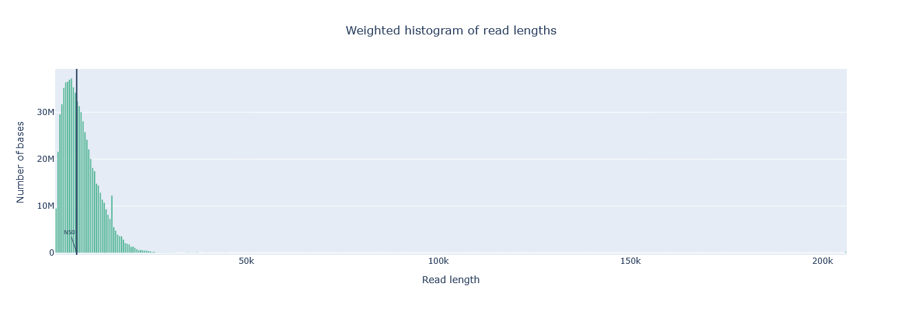
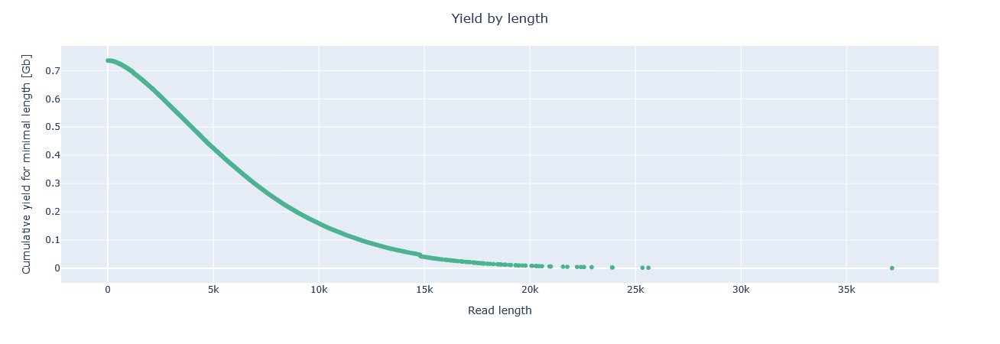
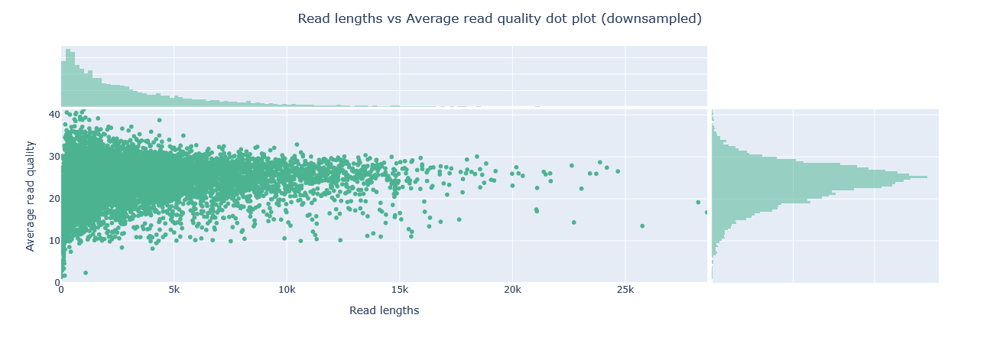
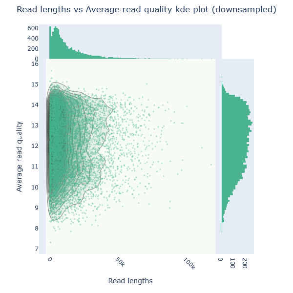
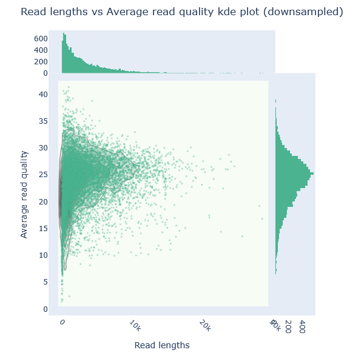
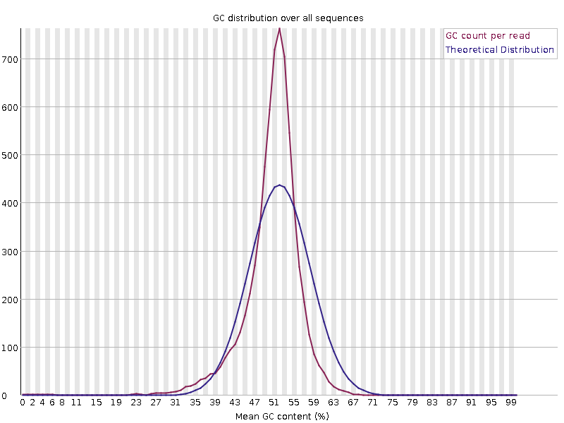
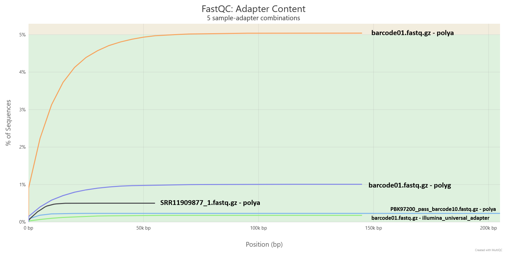

# Basics of long read quality assessment

!!! hint "Learning objectives"
    - Explain why quality control matters, and how QC differs between short- and long-read sequencing
    - Interpret the Phred quality score and read N50 as measures of sequencing quality
    - Run NanoPlot, FastQC, and MultiQC on a FASTQ file, and interpret what their reports show

## Why do we assess quality?

Every sequencing platform introduces errors, including incorrectly called bases, low-quality or excessively short reads, and occasional contaminating DNA unrelated to the target organism. These errors are a technical limitation of the sequencing technology rather than a flaw in the sample itself, but if left unchecked they can bias downstream analyses and produce genome assemblies that appear plausible while containing subtle inaccuracies. Quality control is therefore not an optional add-on but the first essential step of any sequencing analysis. Before proceeding, it is important to assess data quality and remove poor-quality content through read trimming and filtering.

## Short reads vs long reads quality metrics

Quality control requirements differ substantially between short-read and long-read sequencing because the underlying data are fundamentally different. Short-read QC typically focuses on metrics such as per-base quality scores, GC content, sequence complexity, duplication levels, adapter contamination, ambiguous bases, and overrepresented sequences. Long-read datasets, however, contain reads that are much longer and more variable in length, requiring a different set of analytical assumptions and quality metrics.

This difference is reflected in the tools used to assess data quality. FastQC, one of the most widely used QC tools for short-read sequencing, was designed around short-read data and therefore lacks several metrics that are particularly informative for long reads. It is also not optimised for the very large datasets commonly generated by long-read platforms. Conversely, many long-read-specific QC tools do not provide analyses that short-read users often expect, such as adapter detection, duplication analysis, or identification of overrepresented sequences.

While some quality metrics are shared across sequencing technologies, others are especially important for long-read data. The Phred quality score, which reflects the probability of an incorrect base call, remains a fundamental measure of sequencing accuracy in both short- and long-read datasets. By contrast, read N50 is particularly valuable in long-read sequencing because it summarises the read-length distribution and provides an indication of how effectively long genomic regions can be spanned. Understanding these metrics is essential for interpreting long-read sequencing quality and assessing the suitability of a dataset for downstream analysis.

### Phred score

The Phred score is a measure of how confident the base-calling algorithm is in each individual base call. It's logarithmic, so small changes in the score represent large changes in expected accuracy:

| Phred quality score | Probability of incorrect base call | Base call accuracy |
|---|---|---|
| 10 | 1 in 10 | 90% |
| 20 | 1 in 100 | 99% |
| 30 | 1 in 1,000 | 99.9% |
| 40 | 1 in 10,000 | 99.99% |
| 50 | 1 in 100,000 | 99.999% |
| 60 | 1 in 1,000,000 | 99.9999% |

A Phred score of 20 (Q20) is a common baseline threshold — it means, on average, only 1 in 100 called bases is expected to be wrong.

### Read N50

N50 is the read length at which the cumulative length of all reads at or above that length equals 50% of the total bases in the dataset. Put differently: half of all the sequenced bases in your run sit inside reads that are at least this long. For example, if a run's N50 is reported as 5,974 bp, that means half the total sequence generated is contained in reads of 5,974 bp or longer — not that most individual reads are that length.

N50 is especially informative for long-read data, where read lengths vary widely and a simple mean can be misleading. We'll come back to N50 again in the assembly module, where it becomes just as important as a measure of assembly contiguity as it is here as a measure of raw read length.


*Worked example: 10 reads totalling 110,000 bp. Sorting them longest-to-shortest and adding up their lengths shows that the cumulative total crosses 55,000 bp (50% of all sequence) partway through the 12,000 bp read — so N50 = 12,000 bp, even though most individual reads in the set are shorter than that.*

For another detailed explanation see [this blog post](https://www.molecularecologist.com/2017/03/29/whats-n50/).

## Software overview

A range of tools exist to pull basic statistics out of a sequencing run — read length distribution, presence of adapter sequence, contamination from small fragments — and to filter out low-quality, too-short, or adapter-contaminated reads before they reach assembly. Because this training works with Oxford Nanopore long-read data, NanoPlot is the tool we'll lean on most heavily. FastQC and MultiQC are still worth knowing, since they run on ONT data too and cover some ground NanoPlot doesn't, but we'll treat them as a secondary, complementary check rather than the main event.

### NanoPlot

NanoPlot is part of NanoPack, a widely used QC suite built specifically for long-read sequencing data. It creates a statistical summary (mostly focused on read length and quality), a number of plots and a html summary file.

#### Typical command and options

This will use NanoPlot 1.47.0. This is an example command to process a FASTQ file:

```bash
NanoPlot \
    --fastq /path/to/sample.fastq.gz \
    -p sample_prefix \
    --loglength \
	--N50 \
    -o /path/to/output_dir
```

- `--fastq` — the input FASTQ file(s) to analyse.
- `-p` / `--prefix` — a prefix added to every output file name, so results from different samples don't collide when everything lands in a shared output structure (also necessary when running MultiQC from outputs in different folders so it doesn't collapse all samples into one).
- `--loglength` — also plots read length on a log scale, which is usually easier to read than a linear scale given how wide a long-read length distribution can be.
- `--N50` — show the N50 marker on the length histogram.
- `-o` / `--outdir` — where to write the output.

If you want to run it on a sequencing summary file instead of reads, you can use a similar command but use `--summary` argument instead of `--fastq` and provide the `sequencing_summary.txt` which was generated by Oxford nanopore basecallers. This file contains one row per read and it is intended to allow fast analysis of the results of a sequencing run.

That's a small slice of what NanoPlot can do. The rest of its options fall into a few groups (more options can be found on [NanoPlot GitHub page](https://github.com/wdecoster/nanoplot) or when you run NanoPlot with a help option `NanoPlot -h`):

- **Input source** *(pick one)* — `--fastq`, `--fasta`, `--fastq_rich` (adds channel/time info), `--fastq_minimal` (same, but faster and with fewer checks), `--summary`, `--bam` / `--ubam` / `--cram` (alignment files), `--pickle` (previously stored NanoPlot data), or `--feather`/`--arrow`.
- **Filtering or transforming input before plotting** — `--minlength` / `--maxlength` (hide reads outside a length range), `--minqual` (drop reads below a given average quality), `--drop_outliers`, `--downsample N` (randomly subsample to N reads), `--alength` (use aligned rather than sequenced length, BAM mode only), `--readtype {1D,2D,1D2}`, `--barcoded` (split the summary file by barcode), `--runtime_until N` (only use the first N hours of a run).
- **General run options** — `-t` / `--threads`, `--verbose`, `--store` (save extracted data as a pickle for re-plotting later without re-parsing), `--raw` (also save as a tab-separated file), `--huge` (for one very large input file), `--no_static` (skip PNG output), `--tsv_stats`, `--info_in_report`.
- **Plot customisation** — `-c` / `--color`, `-cm` / `--colormap`, `-f` / `--format` (output image format(s), e.g. png, svg, pdf), `--plots {kde,hex,dot}` (which bivariate plots to generate), `--no-N50` (hide the N50 marker on the length histogram), `--title`, `--font_scale`, `--dpi`, `--hide_stats`.

#### Outputs

Running NanoPlot directly on a FASTQ file gives the following.

##### Summary statistics

General summary:

<table>
  <tr>
    <td>
      <table>
        <tr><th colspan="2">barcode01</th></tr>
        <tr><td>Mean read length</td><td>13,976.8</td></tr>
        <tr><td>Mean read quality</td><td>11.9</td></tr>
        <tr><td>Median read length</td><td>9,017.5</td></tr>
        <tr><td>Median read quality</td><td>12.2</td></tr>
        <tr><td>Number of reads</td><td>95,064.0</td></tr>
        <tr><td>Read length N50</td><td>24,028.0</td></tr>
        <tr><td>STDEV read length</td><td>14,277.0</td></tr>
        <tr><td>Total bases</td><td>1,328,688,619.0</td></tr>
      </table>
    </td>
    <td>
      <table>
        <tr><th colspan="2">PBK97200_pass_barcode10</th></tr>
        <tr><td>Mean read length</td><td>3,302.3</td></tr>
        <tr><td>Mean read quality</td><td>20.4</td></tr>
        <tr><td>Median read length</td><td>2,167.0</td></tr>
        <tr><td>Median read quality</td><td>24.1</td></tr>
        <tr><td>Number of reads</td><td>222,761.0</td></tr>
        <tr><td>Read length N50</td><td>5,863.0</td></tr>
        <tr><td>STDEV read length</td><td>3,412.9</td></tr>
        <tr><td>Total bases</td><td>735,621,222.0</td></tr>
      </table>
    </td>
    <td>
      <table>
        <tr><th colspan="2">SRR11909877_1</th></tr>
        <tr><td>Mean read length</td><td>7,176.3</td></tr>
        <tr><td>Mean read quality</td><td>9.2</td></tr>
        <tr><td>Median read length</td><td>7,031.0</td></tr>
        <tr><td>Median read quality</td><td>9.8</td></tr>
        <tr><td>Number of reads</td><td>189,371.0</td></tr>
        <tr><td>Read length N50</td><td>8,724.0</td></tr>
        <tr><td>STDEV read length</td><td>3,887.3</td></tr>
        <tr><td>Total bases</td><td>1,358,981,383.0</td></tr>
      </table>
    </td>
  </tr>
</table>

Number, percentage and megabases of reads above quality cutoffs

<table>
  <tr>
    <td>
      <table>
        <tr><th colspan="2">barcode01</th></tr>
        <tr><td>&gt;Q10</td><td>86,779 (91.3%) 1,224.1Mb</td></tr>
        <tr><td>&gt;Q15</td><td>90 (0.1%) 0.7Mb</td></tr>
        <tr><td>&gt;Q20</td><td>0 (0.0%) 0.0Mb</td></tr>
        <tr><td>&gt;Q25</td><td>0 (0.0%) 0.0Mb</td></tr>
        <tr><td>&gt;Q30</td><td>0 (0.0%) 0.0Mb</td></tr>
      </table>
    </td>
    <td>
      <table>
        <tr><th colspan="2">PBK97200_pass_barcode10</th></tr>
        <tr><td>&gt;Q10</td><td>220,781 (99.1%) 734.0Mb</td></tr>
        <tr><td>&gt;Q15</td><td>211,886 (95.1%) 717.3Mb</td></tr>
        <tr><td>&gt;Q20</td><td>179,241 (80.5%) 652.6Mb</td></tr>
        <tr><td>&gt;Q25</td><td>92,271 (41.4%) 373.7Mb</td></tr>
        <tr><td>&gt;Q30</td><td>14,173 (6.4%) 36.0Mb</td></tr>
      </table>
    </td>
    <td>
      <table>
        <tr><th colspan="2">SRR11909877_1</th></tr>
        <tr><td>&gt;Q10</td><td>84,625 (44.7%) 638.4Mb</td></tr>
        <tr><td>&gt;Q15</td><td>0 (0.0%) 0.0Mb</td></tr>
        <tr><td>&gt;Q20</td><td>0 (0.0%) 0.0Mb</td></tr>
        <tr><td>&gt;Q25</td><td>0 (0.0%) 0.0Mb</td></tr>
        <tr><td>&gt;Q30</td><td>0 (0.0%) 0.0Mb</td></tr>
      </table>
    </td>
  </tr>
</table>

Top 5 highest mean basecall quality scores and their read lengths

<table>
  <tr>
    <td>
      <table>
        <tr><th colspan="2">barcode01</th></tr>
        <tr><td>1</td><td>15.8 (1,081)</td></tr>
        <tr><td>2</td><td>15.8 (2,828)</td></tr>
        <tr><td>3</td><td>15.7 (2,416)</td></tr>
        <tr><td>4</td><td>15.7 (1,392)</td></tr>
        <tr><td>5</td><td>15.5 (5,673)</td></tr>
      </table>
    </td>
    <td>
      <table>
        <tr><th colspan="2">PBK97200_pass_barcode10</th></tr>
        <tr><td>1</td><td>45.3 (609)</td></tr>
        <tr><td>2</td><td>44.9 (895)</td></tr>
        <tr><td>3</td><td>44.2 (991)</td></tr>
        <tr><td>4</td><td>44.0 (595)</td></tr>
        <tr><td>5</td><td>44.0 (679)</td></tr>
      </table>
    </td>
    <td>
      <table>
        <tr><th colspan="2">SRR11909877_1</th></tr>
        <tr><td>1</td><td>14.7 (119)</td></tr>
        <tr><td>2</td><td>14.0 (127)</td></tr>
        <tr><td>3</td><td>13.9 (113)</td></tr>
        <tr><td>4</td><td>13.8 (157)</td></tr>
        <tr><td>5</td><td>13.7 (162)</td></tr>
      </table>
    </td>
  </tr>
</table>

Top 5 longest reads and their mean basecall quality score

<table>
  <tr>
    <td>
      <table>
        <tr><th colspan="2">barcode01</th></tr>
        <tr><td>1</td><td>147,809 (12.7)</td></tr>
        <tr><td>2</td><td>134,466 (10.0)</td></tr>
        <tr><td>3</td><td>131,604 (10.4)</td></tr>
        <tr><td>4</td><td>131,488 (13.3)</td></tr>
        <tr><td>5</td><td>124,264 (11.8)</td></tr>
      </table>
    </td>
    <td>
      <table>
        <tr><th colspan="2">PBK97200_pass_barcode10</th></tr>
        <tr><td>1</td><td>206,079 (2.5)</td></tr>
        <tr><td>2</td><td>44,419 (15.1)</td></tr>
        <tr><td>3</td><td>41,068 (21.6)</td></tr>
        <tr><td>4</td><td>39,142 (3.2)</td></tr>
        <tr><td>5</td><td>37,157 (21.4)</td></tr>
      </table>
    </td>
    <td>
      <table>
        <tr><th colspan="2">SRR11909877_1</th></tr>
        <tr><td>1</td><td>55,060 (10.0)</td></tr>
        <tr><td>2</td><td>51,688 (7.9)</td></tr>
        <tr><td>3</td><td>48,457 (10.6)</td></tr>
        <tr><td>4</td><td>45,594 (7.5)</td></tr>
        <tr><td>5</td><td>44,714 (9.7)</td></tr>
      </table>
    </td>
  </tr>
</table>


##### Histogram of read length

This plot shows the distribution of read (fragment) lengths within a sample. Unlike most Illumina runs, where read length is essentially fixed by the sequencing chemistry, long reads vary considerably in length, so this histogram shows the relative amount of sequence at each different fragment size.


*barcode01 — a broad, right-skewed distribution stretching out past 140 kb, with N50 sitting at 24,028 bp (marked line). Compared with the other two samples, a substantial share of its bases come from genuinely long reads well beyond 40 kb, rather than being concentrated in one narrow size range.*



*PBK97200_pass_barcode10 — sharply skewed towards short reads: the bulk of bases sit under 10 kb, the N50 marker (5,863 bp) falls right at the peak, and almost nothing extends past 30 kb. This is the shortest and most tightly-clustered of the three length profiles.*


*SRR11909877_1 — the most symmetric, bell-shaped profile of the three, with a clear mode around 7–9 kb and the N50 marker (8,724 bp) sitting close to that peak.*

NanoPlot's *weighted* length histogram is worth clarifying, since it's not obvious from the plot alone. Each bar (or "bin") is weighted by the total number of nucleotides it contains, not by the number of reads: a bin holding a handful of very long reads can be taller than a bin holding many short ones, since it's the base count that determines bar height. This is deliberate — it's the same weighting MinKNOW uses in its live run view — and it means the plot is really showing you where most of your *sequence* sits, not where most of your *reads* sit. For the standard non-transformed histogram, each bin spans 500 nucleotides by default, with a minimum of 10 bins across the plot.

##### Yield by length

Shows the total number of gigabases generated by all reads longer than or equal to that specific read length value.


*barcode01 starts at ~1.32 Gb and declines gradually, with a long scattered tail of yield still visible out past 100 kb — the mirror image of its broad weighted histogram above.*



*PBK97200 starts lower, at ~0.73 Gb, and falls away sharply — essentially none of its yield comes from reads longer than ~20 kb, consistent with its short, tightly-clustered length profile.*


*SRR11909877_1 starts at ~1.36 Gb (matching its reported 1.36 Gb total) and drops off steadily, reaching close to zero by ~15–20 kb — a steeper decline than barcode01's, but not as abrupt as PBK97200's.*

##### Read lengths vs average read quality dot plot/kde plot

This plot combines read length and read quality (Q-score) into a single view, plotting one against the other. In general, there's no strong relationship between read length and read quality, but visualising them together in one plot makes it easy to spot aberrations. One pattern that does show up reasonably often: in runs containing a lot of short reads, those shorter reads are sometimes of noticeably lower quality than the rest of the run.


*barcode01 — quality sits in a narrow band, mostly 8–15, regardless of read length; even the longest reads (past 80 kb) stay in that same range. This is the lowest and tightest quality ceiling of the three samples.*



*PBK97200 — by far the widest quality spread (roughly 0–40), with the highest-quality reads concentrated among the shortest ones near the y-axis. This matches its reported top-5 quality scores (44–45) belonging to reads only 600–1,000 bp long — a real quality/length trade-off in this sample, not visible in the other two.*


*SRR11909877_1 — quality clustered around 8–12 with a visible mode near 10, and a moderate length range mostly under 20 kb. This is the lowest mean-quality sample of the three, consistent with its 9.2 mean/9.8 median Q-score reported above.*



*The same barcode01 data as a density contour: one tight, single-lobed cluster around Q13–14, confirming there's no meaningfully distinct low- or high-quality subpopulation hiding in this sample.*



*PBK97200's contour is far more diffuse than barcode01's or SRR11909877's, spanning roughly Q15–35 with no single tight peak — visual confirmation that this sample's read quality is much more heterogeneous than the other two.*


*SRR11909877_1 forms a tall, narrow, teardrop-shaped cluster around Q9–11, concentrated almost entirely at short-to-moderate read lengths — the most tightly-bound quality/length relationship of the three samples.*

*KDE = Kernel Density Estimation* (instead of an overcrowded scatter plot, the kernel density estimation smooths data points into contours). 

Running NanoPlot on a sequencing summary file instead shows more statistics and plots than we get when considering only a FASTQ file.

##### Summary statistics

Active channels - Number of active channels

##### Selected additional plots

**Number of active pores over time** — together, these show how evenly the flow cell's pores were used, and how many stayed active for the whole run. 

A good run looks "busy" throughout: most pores are active and producing data right through to the end. 


*This is a genuinely healthy example: active pores start around 50–70 per 10 minutes and decline smoothly and gradually over the full 48-hour run, still sitting at 10–20 by the end. No sudden cliffs, no reload spikes — just the ordinary, expected wear of pores over a single long, continuous load.*

A bad run looks the opposite — most pores fall quiet early on, and the plot turns mostly blank for the back half of the run — which usually points to poor flow cell loading, or a small or degraded amount of starting sample.


*This example shows exactly that pattern, three times over: active pores spike to ~480 per 10 minutes at the start, decay sharply to a floor of ~40–50 within a few hours, then jump back up at around 8 hours and again at around 16 hours — each spike smaller than the last (~410, then ~260) as the flow cell has less capacity left to recover with each reload. Three reloads over roughly 24 hours, with output collapsing to near-nothing between each one, could be a sign of a struggling library or a poorly performing flow cell.*

**Cumulative yield in number of reads/gigabase** and **Number of reads over time** — these track how much sequence you're actually getting as the run progresses. 

A good run keeps producing new reads at a reasonably steady rate right up until it's stopped — a sign there was still material left to sequence, and the run length, not the sample, was the limiting factor. 


*Cumulative yield here is still climbing at the 48-hour mark — it hasn't flattened out — which, together with the steadily declining (but never-zero) reads-per-10-minutes plot beside it, confirms the run was stopped while it still had something left to give, rather than the flow cell running dry.*

A bad run front-loads almost all its output into a small fraction of the total time and then tails off to almost nothing: for example, a run where half of all reads and bases came out in the first 5 hours of a 25-hour experiment is a clear warning sign, even though some gradual tapering-off is completely normal. Spotting this pattern early is useful in practice too — it's often better to stop a struggling run and troubleshoot the sample or library than to let the flow cell keep going for very little extra data.


*The three reload cycles from the active-pores plot show up here too: cumulative yield rises steeply after each reload (~0h, ~8h, ~16h) then visibly flattens before the next one, ending at only ~2.5 Gb total after 24 hours despite three separate top-ups. The reads-over-time plot shows the same sawtooth directly — output spikes to several thousand reads per 10 minutes right after each reload, then collapses to a few hundred within an hour or two. Diminishing returns with each reload is the giveaway that reloading alone wasn't fixing the underlying problem with this run.*

**Violin plot of read lengths over time** — read length should stay fairly stable across a run, though a slight upward drift over time is common and not itself a concern: shorter fragments tend to reach a pore first, so they get over-represented early on, and once they're used up, more of what's left to sequence is longer. This effect is less noticeable if the flow cell is reloaded with fresh library partway through, and barely shows up at all in a library that's already been size-selected to a narrow length range.


*For this run, read length is remarkably stable across all sixteen 3-hour windows spanning the full 48 hours — each violin has the same low, fat base with a similar thin tail out to 40–75 kb. There's no real drift here, which fits with this being a single continuous load rather than a run with multiple reloads.*


*Here the picture tracks the reload pattern directly: the longest tails appear right after each reload (0–3h reaching ~120 kb, and especially 6–9h — just before the ~8h reload — reaching ~150 kb), then shrink over the next couple of intervals as the longer fragments from that batch get used up, before the next reload resets it again.*

### FastQC

FastQC takes FASTA or FASTQ files as input and produces a comprehensive quality report. It displays sequence quality, sequence content, GC content, N content (ambiguous bases), length distribution, and duplication levels, and also flags overrepresented sequences and analyses k-mer content. Together, these let you spot problems in a run at a glance and decide how to handle them.

#### Typical command and options

This training runs FastQC v0.12.1. This is an example command to process a FASTQ file:

```bash
fastqc \
    -f fastq \
    -o /path/to/output_dir \
    /path/to/sample.fastq.gz
```

- `-f` / `--format` — bypasses FastQC's automatic file-format detection and forces it to treat the input as the given format (`fastq`, `bam`, `sam`, `bam_mapped`, or `sam_mapped`).
- `-o` / `--outdir` — the output directory. It must already exist — FastQC won't create it for you.
- The final argument is the sequence file to process; multiple files can be listed and are processed independently.

Other options worth knowing about:

- **Output handling** — `--extract` / `--noextract` (uncompress the report after creating it, or leave it zipped), `--dir` (temp directory for intermediate report images), `--svg` (save graphs as SVG instead of PNG).
- **Performance** — `-t` / `--threads` (how many files to process in parallel; each thread reserves 250 MB of memory), `--memory` (base memory per file, default 512 MB — raise it for files with very long reads), `-j` / `--java` (path to a specific Java binary).
- **Read grouping and length handling** — `--nogroup` (stop grouping bases together for reads over 50 bp, so every base gets its own column; not recommended for long reads — it can crash FastQC or produce enormous plots), `--min_length` (an artificial minimum length used for read grouping, useful for making stats comparable across datasets with variable read lengths), `--dup_length` (truncate reads to this length before checking for duplicates — useful for long reads with more miscalls, or adapter-dimer contamination).
- **Custom reference files** — `-c` / `--contaminants` (a custom contaminant list to screen overrepresented sequences against), `-a` / `--adapters` (a custom adapter list to search for), `-l` / `--limits` (custom warn/error thresholds, and can disable specific modules entirely), `-k` / `--kmers` (k-mer length for the k-mer content module, 2–10, default 7).
- **Nanopore-specific mode** — `--nano` (treat inputs as FAST5 nanopore files; whole directories can be passed in, with all FAST5 files inside combined into a single report).

More options can be found on the [FastQC page](https://www.bioinformatics.babraham.ac.uk/projects/fastqc/) or when you run FastQC with a help option `fastqc -h`.

#### Outputs

Rather than opening a separate FastQC report for every sample, MultiQC aggregates FastQC output from all your samples into a single, comparable summary report — that's how the reports below are actually viewed in this training, even though the underlying data comes from FastQC. FastQC's report is built around a dozen individual panels; grouped by what they're actually checking for, they boil down to four things worth knowing how to read.

##### Base and GC content

Per-base sequence content plots the percentage of each of the four bases (A, C, G, T) at every position across all reads. In a random, unbiased library, there should be little to no difference between the four bases at any given position — %A should track %T, and %G should track %C — so the four lines on the plot should run roughly parallel to each other throughout the read.

Per-sequence GC content plots the number of reads against the percentage of G and C bases in each read, compared against a theoretical distribution assuming uniform GC content across all reads — as expected for whole-genome shotgun sequencing. Since the true GC content of the genome isn't known in advance, the modal GC content from the observed data is used to build that reference distribution. An unusually shaped distribution can indicate a contaminated library or another biased subset of reads. A distribution that's shifted but still roughly normal in shape points to a systematic bias rather than contamination — but because the tool doesn't know your genome's expected GC content in advance, this kind of shift won't necessarily be flagged as an error on its own.

GC content is generally less of a sequencing-bias concern for long reads than it is for short reads — long-read libraries tend to give more even coverage across a genome regardless of its GC content, rather than systematically over- or under-representing extreme-GC regions the way short-read data often does. Part of why long-read GC content plots tend to look cleaner comes down to library preparation, not just the sequencing chemistry: standard long-read protocols (ligation and rapid kits) sequence native, single DNA molecules with no PCR amplification step. That matters because PCR amplification is a major source of the GC-content bias that shows up in short-read data — extreme GC-rich or GC-poor regions amplify less efficiently than average, so a PCR-amplified library systematically over- or under-represents them, which is exactly the kind of shifted or oddly-shaped distribution the GC content plot above is designed to catch. Skip the amplification step and you skip that particular bias source, which is a large part of why long-read sequencing has generally been considered close to sequence-composition-bias-free in the first place. (Worth flagging: PCR-based long-read library kits do exist — e.g. the Rapid PCR Barcoding Kit — and reintroduce this same bias risk, so "long-read" alone doesn't guarantee amplification-free.)

That reputation isn't the whole story, though: long reads can still struggle with certain simple repetitive sequences, sometimes failing to sequence through them at all even at very high coverage, for reasons unrelated to amplification — it seems to come down to how these repeats behave physically during sequencing itself, rather than anything about library preparation.

<table>
  <tr>
    <td></td>
    <td></td>
    <td></td>
  </tr>
</table>

*barcode01 (left) has a single, sharp peak around 55–57% GC that's noticeably narrower and taller than the theoretical curve overlaid on it — a small shoulder around 35–43% is visible but minor. PBK97200 (middle) is the one to flag: it's clearly bimodal, with a secondary peak around 43–45% almost as prominent as the main peak at ~55%, and a real dip between them — a pattern the theoretical single-peak curve doesn't match at all, worth following up as a possible sign of a second organism or contaminating DNA in that sample. SRR11909877_1 (right) is the cleanest of the three: one dominant, fairly narrow peak around 51–53%, close to (if sharper than) its theoretical curve, with only a very minor hump around 23–27%.*


##### Adapter content

FastQC's Adapter Content module searches for a set of known adapter and primer k-mers and then reports, at each read position, how much of the library contains a match up to that point. In other words, it asks: “At position X in the read, how many reads already contain one of the known adapter-like sequences?”

This is a broad warning about unexpected sequence content: it can reflect adapter or primer carryover, contamination, or an overrepresented sequence motif rather than a strict biological terminal tail. The key point is that the plot is cumulative. Once a match is seen in a read, FastQC counts it as present for the rest of that read. This means the percentage can increase as read length increases, even when the signal is not concentrated at the very end of the read.

This is useful because residual adapter or primer sequence can remain visible at read ends when a library includes short fragments, barcodes, or primer carryover. The module warns when any known adapter sequence is present in more than 5% of reads, and fails above 10%.

The most common reason for a warning is that a substantial fraction of reads are shorter than the insert length, so adapter- or primer-like sequence remains detectable near the ends. This does not necessarily mean the library is broken, but it does mean those reads are worth checking before downstream analysis.

!!! warning "An empty adapter content panel doesn't mean nothing happened"

    Don't be surprised if this panel comes back essentially empty: Dorado (and Guppy before it) can trim adapter and primer sequences during basecalling, well before the reads reach QC. A clean adapter-content plot here does not necessarily mean no sequence cleanup was needed — it may simply mean the basecaller already removed the offending sequence.



*This is a good example of the “usually empty” panel actually catching something: four of the five sample–adapter combinations MultiQC plotted stay flat and negligible (under ~1%) across the whole read length. The remaining pattern rises steadily and plateaus just above 5%, entering FastQC's warning zone at the top of the plot.*

This A/T-rich signal is often interpreted as low-complexity or residual sequence at the read end rather than a true adapter junction, but it is still worth checking before downstream analysis.

TO DO Homopolymers in long reads sequencing

### MultiQC

MultiQC is a bioinformatics tool that aggregates log files, statistics and plots from multiple analysis tools across many samples into a single, interactive HTML quality control report. Its support for FastQC outputs is very good but quite limited for NanoPlot - it only parses the summary statistics.

#### Typical command and options

This training runs MultiQC v1.35. This is an example command: 

```bash
multiqc \
    -o /path/to/output_dir \
    -f \
    --fullnames \
    /path/to/input_dir
```

- `-o` / `--outdir` — where to write the aggregated report.
- `-f` / `--force` — overwrite any existing report rather than refusing to run.
- `-s` / `--fullnames` — keep sample names as their full, uncleaned file names, rather than letting MultiQC tidy them up automatically. Worth using when you have samples with similar names, e.g. with the same prefix.
- The final argument, `/path/to/input_dir`, is the directory MultiQC scans for logs — it finds every FastQC and NanoPlot output nested inside it, wherever they happen to sit, without needing each sample specified individually.

Other options worth knowing about:

- **Choosing what to include** — `-m` / `--module` and `-e` / `--exclude` (limit to, or exclude, specific modules), `--ignore` (glob-exclude analysis files), `--ignore-samples` (glob-exclude sample names), `-l` / `--file-list` (supply an explicit file list to search, instead of scanning a directory).
- **Sample name handling** — `-d` / `--dirs` (prepend the containing directory to sample names — handy for disambiguating identically named files from different folders), `--replace-names` (rename samples via a lookup file).
- **Report customisation** — `-i` / `--title`, `-b` / `--comment`, `-t` / `--template`, `--custom-css-file`.
- **Output format** — `-p` / `--export` (also save plots as static images alongside the report), `-k` / `--data-format` (export the underlying parsed data as tsv/csv/json/yaml), `--pdf` (generate a PDF report; requires Pandoc), `--no-report` (only export data/plots, skip the HTML report).

For more detailed instructions, run `multiqc -h` or see the [documentation](https://docs.seqera.io/multiqc/getting_started/running_multiqc).

#### Outputs

MultiQC doesn't add new metrics of its own — its report is the FastQC and NanoPlot outputs described above, aggregated across samples into one browsable, comparable HTML page. See the Outputs sections under NanoPlot and FastQC above for how to read what actually appears in it.

### Alternatives

TO DO pycoQC IF TIME LEFT

!!! success "Wrap-up"
    You now know how to assess the quality of a raw long-read dataset — read length, quality, and adapter content — using NanoPlot, FastQC, and MultiQC, and how to interpret what a "good" or "bad" run looks like. Next, in the preprocessing module, we'll look at whether — and how — to act on what these reports tell you.

# Exercise

Run FastQC and NanoPlot on the sample you need to process

```bash
# Create the top-level output directories
mkdir -p qc_raw/fastqc
mkdir -p qc_raw/nanoplot
```

```bash
# EDIT THIS LINE: replace with the path to your sample FASTQ file
input_fastq=/path/to/your/sample.fastq.gz

# Derive a clean sample ID from the file name
sample_id=$(basename "$input_fastq")
sample_id=${sample_id%.fastq.gz}

# NanoPlot output for this sample
mkdir -p qc_raw/nanoplot/"$sample_id"
NanoPlot \
    --fastq "$input_fastq" \
    -p "${sample_id}_" \
    --loglength \
	--N50 \
    -o qc_raw/nanoplot/"$sample_id"/

# FastQC output for this sample
mkdir -p qc_raw/fastqc/"$sample_id"
fastqc \
    -f fastq \
    -o qc_raw/fastqc/"$sample_id" \
    "$input_fastq"
```

Then at the end run MultiQC on the entire `qc_raw` folder

```bash
# Run once after all sample QC reports have been generated
mkdir -p qc_raw/multiqc
multiqc \
    -o qc_raw/multiqc \
    -f \
    --fullnames \
    qc_raw
```

Look at the NanoPlot and the MultiQC report. 


!!! question "Answer the following questions" 
    1. How many reads and bases do you have in total?
    2. What is the mean Qscore?
    3. What is the median, mean, minimum and maximum read length, what is the N50?
    4. Is there a link between read length and Phred score?
    5. What is the length of the longest read in the file and its associated mean quality score?
    6. Did the read length change over time?

??? solution "Solution"
    TO DO

!!! hint "Discussion points"
    - Overall, how good is your data?
    - Are there areas that should be trimmed?

??? success "Solution"
    TO DO 

# References

TO DO