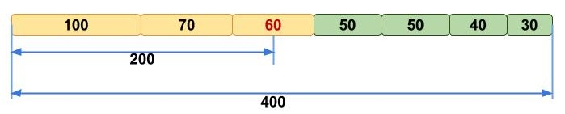

# Basics of long read quality assessment

## Why do we assess quality?

Every sequencing platform introduces errors, including incorrectly called bases, low-quality or excessively short reads, and occasional contaminating DNA unrelated to the target organism. These errors are a technical limitation of the sequencing technology rather than a flaw in the sample itself, but if left unchecked they can bias downstream analyses and produce genome assemblies that appear plausible while containing subtle inaccuracies. Quality control is therefore not an optional add-on but the first essential step of any sequencing analysis. Before proceeding, it is important to assess data quality and remove poor-quality content through read trimming and filtering.

## Short reads vs long reads quality metrics

Quality control requirements differ substantially between short-read and long-read sequencing because the underlying data are fundamentally different. Short-read QC typically focuses on metrics such as per-base quality scores, GC content, sequence complexity, duplication levels, adapter contamination, ambiguous bases, and overrepresented sequences. Long-read datasets, however, contain reads that are much longer and more variable in length, requiring a different set of analytical assumptions and quality metrics.

This difference is reflected in the tools used to assess data quality. FastQC, one of the most widely used QC tools for short-read sequencing, was designed around short-read data and therefore lacks several metrics that are particularly informative for long reads. It is also not optimised for the very large datasets commonly generated by long-read platforms. Conversely, many long-read-specific QC tools do not provide analyses that short-read users often expect, such as adapter detection, duplication analysis, or identification of overrepresented sequences.

While some quality metrics are shared across sequencing technologies, others are especially important for long-read data. The Phred quality score, which reflects the probability of an incorrect base call, remains a fundamental measure of sequencing accuracy in both short- and long-read datasets. By contrast, read N50 is particularly valuable in long-read sequencing because it summarises the read-length distribution and provides an indication of how effectively long genomic regions can be spanned. Understanding these metrics is essential for interpreting long-read sequencing quality and assessing the suitability of a dataset for downstream analysis.

### Phred score

The Phred score is a measure of how confident the base-calling algorithm is in each individual base call. It's logarithmic, so small changes in the score represent large changes in expected accuracy:

| Phred quality score | Probability of incorrect base call | Base call accuracy |
|---|---|---|
| 10 | 1 in 10 | 90% |
| 20 | 1 in 100 | 99% |
| 30 | 1 in 1,000 | 99.9% |
| 40 | 1 in 10,000 | 99.99% |
| 50 | 1 in 100,000 | 99.999% |
| 60 | 1 in 1,000,000 | 99.9999% |

A Phred score of 20 (Q20) is a common baseline threshold — it means, on average, only 1 in 100 called bases is expected to be wrong.

### Read N50

N50 is the read length at which the cumulative length of all reads at or above that length equals 50% of the total bases in the dataset. Put differently: half of all the sequenced bases in your run sit inside reads that are at least this long. For example, if a run's N50 is reported as 5,974 bp, that means half the total sequence generated is contained in reads of 5,974 bp or longer — not that most individual reads are that length.

N50 is especially informative for long-read data, where read lengths vary widely and a simple mean can be misleading. We'll come back to N50 again in the assembly module, where it becomes just as important as a measure of assembly contiguity as it is here as a measure of raw read length.


*Source: https://www.molecularecologist.com/2017/03/29/whats-n50/*


## Software overview

A range of tools exist to pull basic statistics out of a sequencing run — read length distribution, presence of adapter sequence, contamination from small fragments — and to filter out low-quality, too-short, or adapter-contaminated reads before they reach assembly. Because this training works with Oxford Nanopore long-read data, NanoPlot is the tool we'll lean on most heavily. FastQC and MultiQC are still worth knowing, since they run on ONT data too and cover some ground NanoPlot doesn't, but we'll treat them as a secondary, complementary check rather than the main event.

### NanoPlot

NanoPlot is part of NanoPack, a widely used QC suite built specifically for long-read sequencing data. It creates a statistical summary mostly focused on read length and quality, a number of plots and a html summary file.

### FastQC

FastQC takes FASTA or FASTQ files as input and produces a comprehensive quality report. It displays sequence quality, sequence content, GC content, N content (ambiguous bases), length distribution, and duplication levels, and also flags overrepresented sequences and analyses k-mer content. Together, these let you spot problems in a run at a glance and decide how to handle them.

TO DO expand

### MultiQC

### Alternatives

TO DO

## Typical command and options

This training runs NanoPlot directly on each sample's FASTQ file:

```bash
NanoPlot \
    --fastq /path/to/sample.fastq.gz \
    -p sample_prefix \
    --loglength \
    -o /path/to/output_dir
```

- `--fastq` — the input FASTQ file(s) to analyse.
- `-p` / `--prefix` — a prefix added to every output file name, so results from different samples don't collide when everything lands in a shared output structure.
- `--loglength` — also plots read length on a log scale, which is usually easier to read than a linear scale given how wide a long-read length distribution can be.
- `-o` / `--outdir` — where to write the output.

That's a small slice of what NanoPlot can do. The rest of its options fall into a few groups:

- **Input source** *(pick one)* — `--fastq`, `--fasta`, `--fastq_rich` (adds channel/time info from albacore, MinKNOW, or guppy), `--fastq_minimal` (same, but faster and with fewer checks), `--summary` (a sequencing summary file instead of reads), `--bam` / `--ubam` / `--cram` (alignment files), `--pickle` (previously stored NanoPlot data), or `--feather`/`--arrow`.
- **Filtering or transforming input before plotting** — `--minlength` / `--maxlength` (hide reads outside a length range), `--minqual` (drop reads below a given average quality), `--drop_outliers`, `--downsample N` (randomly subsample to N reads), `--alength` (use aligned rather than sequenced length, BAM mode only), `--readtype {1D,2D,1D2}`, `--barcoded` (split the summary file by barcode), `--runtime_until N` (only use the first N hours of a run).
- **General run options** — `-t` / `--threads`, `--verbose`, `--store` (save extracted data as a pickle for re-plotting later without re-parsing), `--raw` (also save as a tab-separated file), `--huge` (for one very large input file), `--no_static` (skip PNG output), `--tsv_stats`, `--info_in_report`.
- **Plot customisation** — `-c` / `--color`, `-cm` / `--colormap`, `-f` / `--format` (output image format(s), e.g. png, svg, pdf), `--plots {kde,hex,dot}` (which bivariate plots to generate), `--legacy` (older plotting style), `--N50` / `--no-N50` (show or hide the N50 marker on the length histogram), `--title`, `--font_scale`, `--dpi`, `--hide_stats`.

## Outputs

The next sections work through what each report actually shows, starting with NanoPlot's long-read-specific views, then a condensed look at FastQC output aggregated through MultiQC.

### NanoPlot output

NanoPlot can be run directly on FASTQ (or aligned BAM) files rather than the sequencing summary alone, which gives it access to per-read sequence information rather than just summary statistics — this is the primary way we'll be assessing long-read QC in this training.

#### Summary statistics

TO DO

#### Histogram of read length

This plot shows the distribution of read (fragment) lengths within a sample. Unlike most Illumina runs, where read length is essentially fixed by the sequencing chemistry, long reads vary considerably in length, so this histogram shows the relative amount of sequence at each different fragment size.

#### Read lengths vs average read quality dot plot/kde plot

This plot combines read length and read quality (Q-score) into a single view, plotting one against the other. In general, there's no strong relationship between read length and read quality, but visualising them together in one plot makes it easy to spot aberrations. One pattern that does show up reasonably often: in runs containing a lot of short reads, those shorter reads are sometimes of noticeably lower quality than the rest of the run.

#### NanoPlot from summary data

TO DO

### FastQC via MultiQC

Rather than opening a separate FastQC report for every sample, MultiQC aggregates FastQC output from all your samples into a single, comparable summary report. FastQC's report is built around a dozen individual panels; grouped by what they're actually checking for, they boil down to four things worth knowing how to read.

#### Quality score profile

It's common for mean quality to drop off towards the end of reads, since sequencers tend to incorporate more incorrect bases as a read progresses — but a very large, sudden drop partway through a read is a sign something's gone wrong rather than a fact of life. 

Looking at quality per sequence rather than per position, the distribution should ideally form a tight peak in the upper range of the plot. A secondary cluster of low-quality sequences can appear too — often because those particular reads were poorly imaged (for example, sitting at the edge of the imaging field of view) — but this should only ever account for a small percentage of the total.

#### Base and GC content

Per-base sequence content plots the percentage of each of the four bases (A, C, G, T) at every position across all reads. In a random, unbiased library, there should be little to no difference between the four bases at any given position — %A should track %T, and %G should track %C — so the four lines on the plot should run roughly parallel to each other throughout the read.

Per-sequence GC content plots the number of reads against the percentage of G and C bases in each read, compared against a theoretical distribution assuming uniform GC content across all reads — as expected for whole-genome shotgun sequencing. Since the true GC content of the genome isn't known in advance, the modal GC content from the observed data is used to build that reference distribution. An unusually shaped distribution can indicate a contaminated library or another biased subset of reads. A distribution that's shifted but still roughly normal in shape points to a systematic bias rather than contamination — but because the tool doesn't know your genome's expected GC content in advance, this kind of shift won't necessarily be flagged as an error on its own. For long-read data, this distribution carries even more weight, since it's also shaped by fragment size selection, primer choice, and the amount and quality of input DNA.

#### Duplication and contamination

A related check flags individual sequences that make up an outsized share of a sample: a normal, diverse library shouldn't have any single sequence making up more than a tiny fraction of the total, so finding one that does means either it's genuinely, biologically significant, or the library is contaminated or less diverse than expected. FastQC specifically lists every sequence making up more than 0.1% of a sample's reads, and for each one searches a database of common contaminants for the closest match, requiring at least a 20 bp match with no more than one mismatch — a hit doesn't automatically confirm the source of contamination (many adapter sequences closely resemble one another) but is still a useful lead.

Finally, adapter content: multiplex identifiers, adapters, and primer sequences introduced during library preparation show up as artefacts at the ends of reads. An uneven base frequency distribution at certain positions across many reads can be a sign of residual tag sequence — not necessarily a problem in itself, but it does mean those sequences will need to be adapter-trimmed before downstream analysis. FastQC plots a cumulative percentage of the library in which each known adapter sequence has been seen, by position — since a read is counted as "containing" an adapter for the rest of its length once the adapter is first detected, this percentage can only increase as you move along the read.

# Exercise

```bash
FASTQ=/path/to/your/sample.fastq.gz

ID=$(basename "$FASTQ")
ID=${ID%.fastq.gz}
mkdir -p qc_before/nanoplot/"$ID"
NanoPlot \
	--fastq "$FASTQ" \
	-p "${ID}_" \
	--loglength \
	-o qc_before/nanoplot/"$ID"/
```

Run fastqc and nanoplot on your sample
Answer questions

1. How many sequences does your sample contain?
2. What is the quality score distribution? How does the quality score changes depending on the base pair position?
3. What's the peak for short reads vs long reads?
3. What And the mean score?

Exercise 1:
	1. How many sequences are in this file?
	2. How many bases are there in this entire file?
What is the length of the longest read in the file and its associated mean quality score?
