# Basics of long read quality assessment

!!! hint Learning objectives
    - Explain why quality control matters, and how QC differs between short- and long-read sequencing
    - Interpret the Phred quality score and read N50 as measures of sequencing quality
    - Run NanoPlot, FastQC on a FASTQ file, and interpret what their reports show

## Why do we assess quality?

Every sequencing platform introduces errors, including incorrectly called bases, low-quality or excessively short reads, and occasional contaminating DNA unrelated to the target organism. These errors are a technical limitation of the sequencing technology rather than a flaw in the sample itself, but if left unchecked they can bias downstream analyses and produce genome assemblies that appear plausible while containing subtle inaccuracies. Quality control is therefore not an optional add-on but the first essential step of any sequencing analysis. Before proceeding, it is important to assess data quality and remove poor-quality content through read trimming and filtering.

## Short reads vs long reads quality metrics

Quality control requirements differ substantially between short-read and long-read sequencing because the underlying data are fundamentally different. Short-read QC typically focuses on metrics such as per-base quality scores, GC content, sequence complexity, duplication levels, adapter contamination, ambiguous bases, and overrepresented sequences. Long-read datasets, however, contain reads that are much longer and more variable in length, requiring a different set of analytical assumptions and quality metrics.

This difference is reflected in the tools used to assess data quality. FastQC, one of the most widely used QC tools for short-read sequencing, was designed around short-read data and therefore lacks several metrics that are particularly informative for long reads. It is also not optimised for the very large datasets commonly generated by long-read platforms. Conversely, many long-read-specific QC tools do not provide analyses that short-read users often expect, such as adapter detection, duplication analysis, or identification of overrepresented sequences.

While some quality metrics are shared across sequencing technologies, others are especially important for long-read data. The Phred quality score, which reflects the probability of an incorrect base call, remains a fundamental measure of sequencing accuracy in both short- and long-read datasets. By contrast, read N50 is particularly valuable in long-read sequencing because it summarises the read-length distribution and provides an indication of how effectively long genomic regions can be spanned. Understanding these metrics is essential for interpreting long-read sequencing quality and assessing the suitability of a dataset for downstream analysis.

### Phred score

The Phred score is a measure of how confident the base-calling algorithm is in each individual base call. It's logarithmic, so small changes in the score represent large changes in expected accuracy:

| Phred quality score | Probability of incorrect base call | Base call accuracy |
|---|---|---|
| 10 | 1 in 10 | 90% |
| 20 | 1 in 100 | 99% |
| 30 | 1 in 1,000 | 99.9% |
| 40 | 1 in 10,000 | 99.99% |
| 50 | 1 in 100,000 | 99.999% |
| 60 | 1 in 1,000,000 | 99.9999% |

A Phred score of 20 (Q20) is a common baseline threshold — it means, on average, only 1 in 100 called bases is expected to be wrong.

### Read N50

N50 is the read length at which the cumulative length of all reads at or above that length equals 50% of the total bases in the dataset. Put differently: half of all the sequenced bases in your run sit inside reads that are at least this long. For example, if a run's N50 is reported as 5,974 bp, that means half the total sequence generated is contained in reads of 5,974 bp or longer — not that most individual reads are that length.

N50 is especially informative for long-read data, where read lengths vary widely and a simple mean can be misleading. We'll come back to N50 again in the assembly module, where it becomes just as important as a measure of assembly contiguity as it is here as a measure of raw read length.

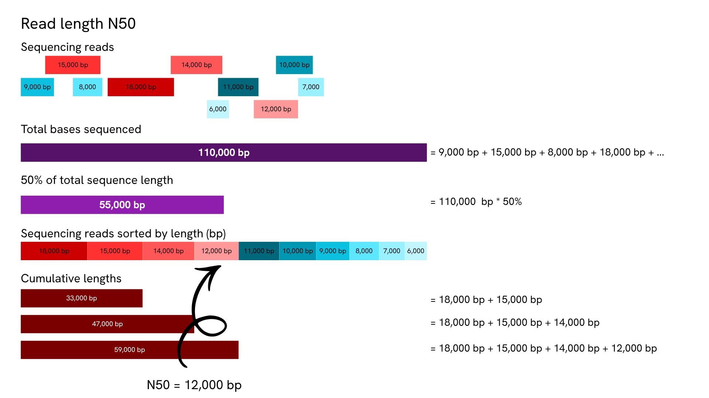

*Worked example: 10 reads totalling 110,000 bp. Sorting them longest-to-shortest and adding up their lengths shows that the cumulative total crosses 55,000 bp (50% of all sequence) partway through the 12,000 bp read — so N50 = 12,000 bp, even though most individual reads in the set are shorter than that.*

For another detailed explanation see [this blog post](https://www.molecularecologist.com/2017/03/29/whats-n50/).

## Software overview

A range of tools exist to pull basic statistics out of a sequencing run — read length distribution, presence of adapter sequence, contamination from small fragments — and to filter out low-quality, too-short, or adapter-contaminated reads before they reach assembly. Because this training works with Oxford Nanopore long-read data, NanoPlot is the tool we'll lean on most heavily. FastQC and MultiQC are still worth knowing, since they run on ONT data too and cover some ground NanoPlot doesn't, but we'll treat them as a secondary, complementary check rather than the main event.

### NanoPlot

NanoPlot is part of NanoPack, a widely used QC suite built specifically for long-read sequencing data. It creates a statistical summary (mostly focused on read length and quality), a number of plots and a html summary file.

#### Typical command and options

This will use NanoPlot 1.47.0. This is an example command to process a FASTQ file:

```bash
NanoPlot \
    --fastq /path/to/sample.fastq.gz \
    -p sample_prefix \
    --loglength \
	--N50 \
    -o /path/to/output_dir
```

- `--fastq` — the input FASTQ file(s) to analyse.
- `-p` / `--prefix` — a prefix added to every output file name, so results from different samples don't collide when everything lands in a shared output structure (also necessary when running MultiQC from outputs in different folders so it doesn't collapse all samples into one).
- `--loglength` — also plots read length on a log scale, which is usually easier to read than a linear scale given how wide a long-read length distribution can be.
- `--N50` — show the N50 marker on the length histogram.
- `-o` / `--outdir` — where to write the output.

If you want to run it on a sequencing summary file instead of reads, you can use a similar command but use `--summary` argument instead of `--fastq` and provide the `sequencing_summary.txt` which was generated by Oxford nanopore basecallers. This file contains one row per read and it is intended to allow fast analysis of the results of a sequencing run.

### FastQC

FastQC takes FASTA or FASTQ files as input and produces a comprehensive quality report. It displays sequence quality, sequence content, GC content, N content (ambiguous bases), length distribution, and duplication levels, and also flags overrepresented sequences and analyses k-mer content. Together, these let you spot problems in a run at a glance and decide how to handle them.

#### Typical command and options

This training runs FastQC v0.12.1. This is an example command to process a FASTQ file:

```bash
fastqc \
    -f fastq \
    -o /path/to/output_dir \
    /path/to/sample.fastq.gz
```

- `-f` / `--format` — bypasses FastQC's automatic file-format detection and forces it to treat the input as the given format (`fastq`, `bam`, `sam`, `bam_mapped`, or `sam_mapped`).
- `-o` / `--outdir` — the output directory. It must already exist — FastQC won't create it for you.
- The final argument is the sequence file to process; multiple files can be listed and are processed independently.

### Outputs

This section walks through NanoPlot and FastQC reports for barcode01 and PBK97200 (see [Samples](00.samples.md)), run directly on their FASTQ files, and then NanoPlot run on full sequencing summary files (separate from barcode01 and PBK97200) obtained from [Tim Kahlke's workshop](https://github.com/timkahlke/LongRead_tutorials) and [floundeR package](https://sagrudd.github.io/floundeR/).

#### barcode01 and PBK97200

##### Summary statistics

General summary:

|  | barcode01 | PBK97200_pass_barcode10 |
|---|---|---|
| Mean read length | 13,976.8 | 3,302.3 |
| Mean read quality | 11.9 | 20.4 |
| Median read length | 9,017.5 | 2,167.0 |
| Median read quality | 12.2 | 24.1 |
| Number of reads | 95,064.0 | 222,761.0 |
| Read length N50 | 24,028.0 | 5,863.0 |
| STDEV read length | 14,277.0 | 3,412.9 |
| Total bases | 1,328,688,619.0 | 735,621,222.0 |

Number, percentage and megabases of reads above quality cutoffs

|  | barcode01 | PBK97200_pass_barcode10 |
|---|---|---|
| >Q10 | 86,779 (91.3%) 1,224.1Mb | 220,781 (99.1%) 734.0Mb |
| >Q15 | 90 (0.1%) 0.7Mb | 211,886 (95.1%) 717.3Mb |
| >Q20 | 0 (0.0%) 0.0Mb | 179,241 (80.5%) 652.6Mb |
| >Q25 | 0 (0.0%) 0.0Mb | 92,271 (41.4%) 373.7Mb |
| >Q30 | 0 (0.0%) 0.0Mb | 14,173 (6.4%) 36.0Mb |

Top 5 highest mean basecall quality scores and their read lengths

|  | barcode01 | PBK97200_pass_barcode10 |
|---|---|---|
| 1 | 15.8 (1,081) | 45.3 (609) |
| 2 | 15.8 (2,828) | 44.9 (895) |
| 3 | 15.7 (2,416) | 44.2 (991) |
| 4 | 15.7 (1,392) | 44.0 (595) |
| 5 | 15.5 (5,673) | 44.0 (679) |

Top 5 longest reads and their mean basecall quality score

|  | barcode01 | PBK97200_pass_barcode10 |
|---|---|---|
| 1 | 147,809 (12.7) | 206,079 (2.5) |
| 2 | 134,466 (10.0) | 44,419 (15.1) |
| 3 | 131,604 (10.4) | 41,068 (21.6) |
| 4 | 131,488 (13.3) | 39,142 (3.2) |
| 5 | 124,264 (11.8) | 37,157 (21.4) |

##### Histogram of read length

This plot shows the distribution of read (fragment) lengths within a sample. Unlike most Illumina runs, where read length is essentially fixed by the sequencing chemistry, ONT reads vary considerably in length, so this histogram shows the relative amount of sequence at each different fragment size.

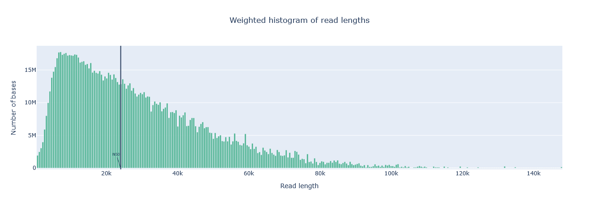


*barcode01 (top) is broadly right-skewed, stretching out past 140 kb with N50 at 24,028 bp; PBK97200 (bottom) is far more tightly clustered under 10 kb, with N50 at just 5,863 bp and almost nothing past 30 kb.*

!!! info Weighted length histogram
    Each bar (or "bin") is weighted by the total number of nucleotides it contains: a bin holding a handful of very long reads can be taller than a bin holding many short ones, since it's the base count that determines bar height. This is deliberate — it's the same weighting MinKNOW uses in its live run view — and it means the plot is really showing you where most of your *sequence* sits, not where most of your *reads* sit. For the standard non-transformed histogram, each bin spans 500 nucleotides by default, with a minimum of 10 bins across the plot.

##### Yield by length

Shows the total number of gigabases generated by all reads longer than or equal to that specific read length value.

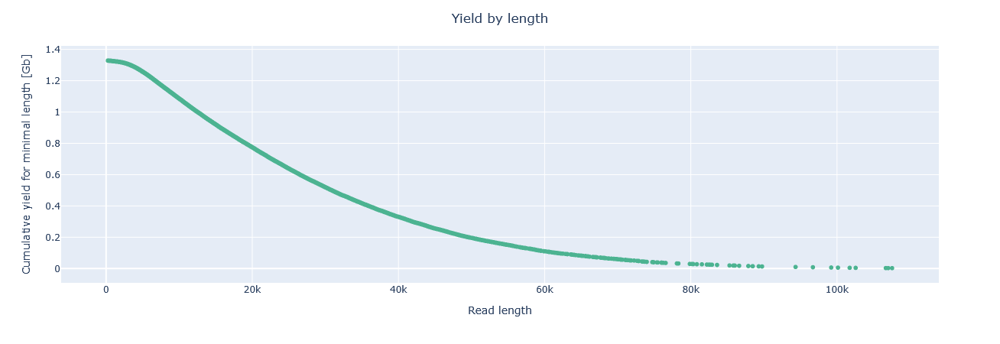


*barcode01 (top) starts higher (~1.32 Gb) and declines gradually, with yield still visible out past 100 kb; PBK97200 (bottom) starts lower (~0.73 Gb) and falls away sharply, with essentially nothing beyond ~20 kb — mirroring the length-histogram difference above.*

##### Read lengths vs average read quality dot plot/kde plot

This plot combines read length and read quality (Q-score) into a single view, plotting one against the other. In general, there's no strong relationship between read length and read quality, but visualising them together in one plot makes it easy to spot aberrations. One pattern that does show up reasonably often: in runs containing a lot of short reads, those shorter reads are sometimes of noticeably lower quality than the rest of the run.

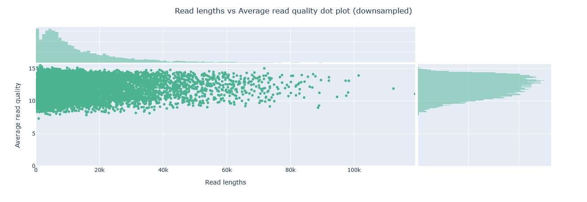


*barcode01 (top) holds a narrow quality band (8–15) regardless of read length; PBK97200 (bottom) spans a much wider range (0–40) with a real quality/length trade-off — its highest-quality reads are also its shortest, matching its top-5 quality scores (44–45) belonging to 600–1,000 bp reads.*

<table>
  <tr>
    <td></td>
    <td></td>
  </tr>
</table>

*barcode01 (left) forms one tight, single-lobed cluster around Q13–14; PBK97200 (right) is far more diffuse, spanning roughly Q15–35 with no single peak — confirming its read quality is far more heterogeneous.*

!!! info Kernel Density Estimation
    Kernel density estimation (KDE) smooths data points into contours, instead of an overcrowded scatter plot.  

##### Base and GC content

Per-base sequence content tracks the percentage of each base (A, C, G, T) at every read position — the four lines should run roughly parallel in an unbiased library. Per-sequence GC content plots the number of reads against their GC%, compared against a theoretical distribution built from the data's own modal GC content; an unusually shaped or shifted distribution can point to a contaminated library or another biased subset of reads.

ONT reads are generally less prone to GC bias than short reads, largely because standard ONT library prep skips PCR amplification — the main source of GC bias in short-read data. PCR-based ONT kits (e.g. Rapid PCR Barcoding) do reintroduce that risk, though, and some repetitive sequences can still be hard to sequence through regardless of amplification.

<table>
  <tr>
    <td>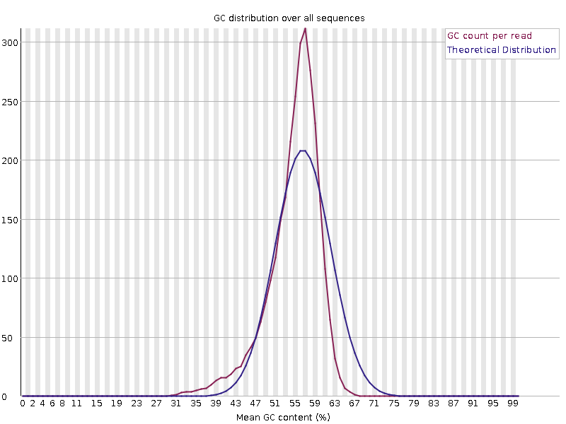</td>
    <td>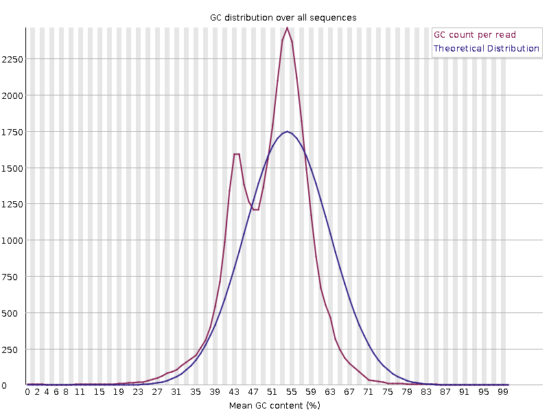</td>
  </tr>
</table>

*barcode01 (left) shows a single sharp peak around 55–57% GC, close to its theoretical curve; PBK97200 (right) is clearly bimodal, with a secondary peak around 43–45% nearly as prominent as the main one — worth flagging as a possible sign of a second organism or contaminating DNA.*

##### Adapter content

FastQC's Adapter Content module scans for known adapter/primer k-mers and reports, cumulatively, what fraction of reads contain a match by each read position — a match anywhere in a read counts for every position after it, not just where it sits. It warns above 5% and fails above 10%.

!!! warning An empty adapter content panel doesn't mean nothing happened

    Don't be surprised if this panel comes back essentially empty: Dorado (and Guppy before it) can trim adapter and primer sequences during basecalling, well before the reads reach QC. A clean adapter-content plot here does not necessarily mean no sequence cleanup was needed — it may simply mean the basecaller already removed the offending sequence.

<table>
  <tr>
    <td>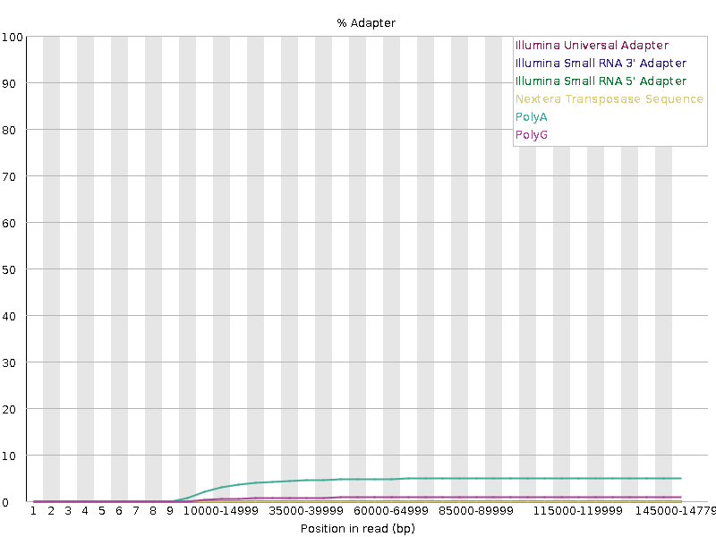</td>
    <td>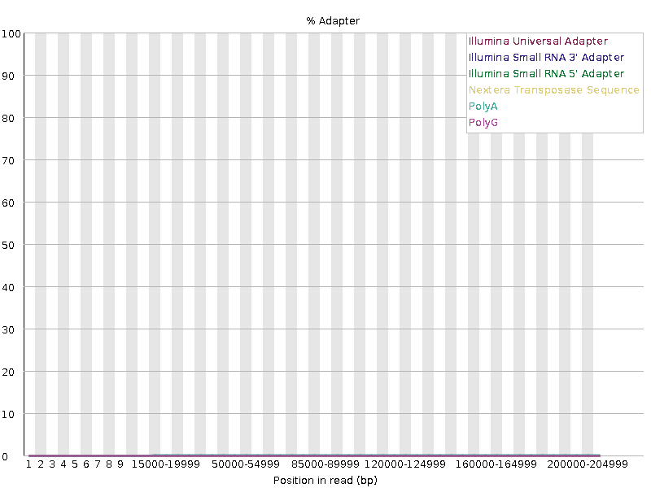</td>
  </tr>
</table>

*barcode01 (left) shows a PolyA signal climbing to a ~5% plateau — an A/T-rich pattern more likely to be low-complexity sequence at the read end than a genuine adapter, but still worth a check. PBK97200 (right) is flat at ~0% across every adapter type — the more typical result once a basecaller has already trimmed adapters.*

!!! info Homopolymers
    A homopolymer is a run of the same base repeated back-to-back (e.g. `AAAAAA`). Nanopore sequencing has historically struggled with these: on R9.4/R9.5 pores, the current signal reflects roughly five consecutive bases moving through the pore at once, so a long run of identical bases produces a similarly ambiguous signal regardless of exactly how many repeats it contains, making the precise length hard to call. This is a large part of why homopolymers remain one of the most common sources of residual error in ONT assemblies. R10 and later pores added a second sensing region specifically to improve homopolymer resolution, and accuracy has kept improving since. 

#### Sequencing summary files

##### Number of active pores over time

This plot shows how evenly the flow cell's pores were used, and how many stayed active for the whole run. A good run stays "busy" throughout; a bad run falls quiet early, often a sign of poor flow cell loading or a small/degraded sample.

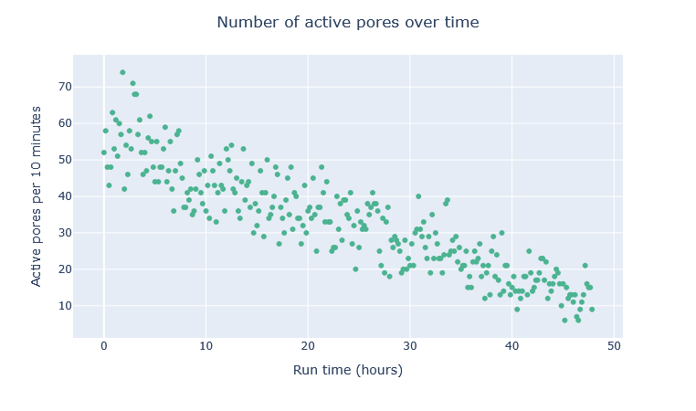
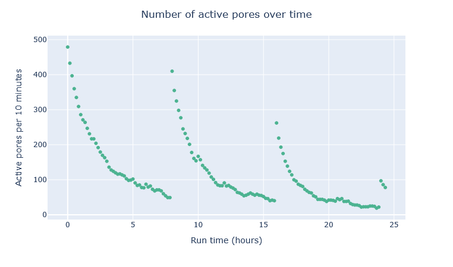

*The healthy run (top) declines smoothly from ~50–70 active pores per 10 minutes to 10–20 over 48 hours, with no sudden drops. The struggling run (bottom) spikes to ~480 at each of three reloads (~0h, 8h, 16h) but decays sharply within hours each time, recovering less with every reload — a sign that reloading alone wasn't fixing the underlying problem.*

##### Cumulative yield and number of reads over time

This plot tracka how much sequence you're actually getting as the run progresses. A good run keeps producing new reads at a steady rate right up until it's stopped; a bad run front-loads most of its output early and tails off to almost nothing.

<table>
  <tr>
    <td>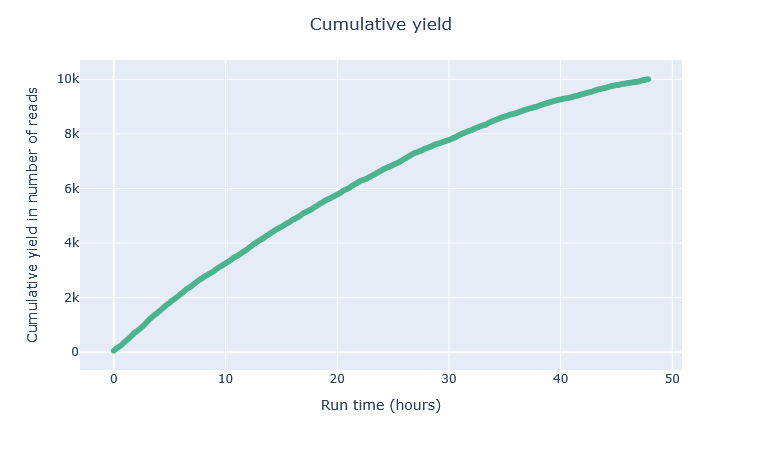</td>
    <td>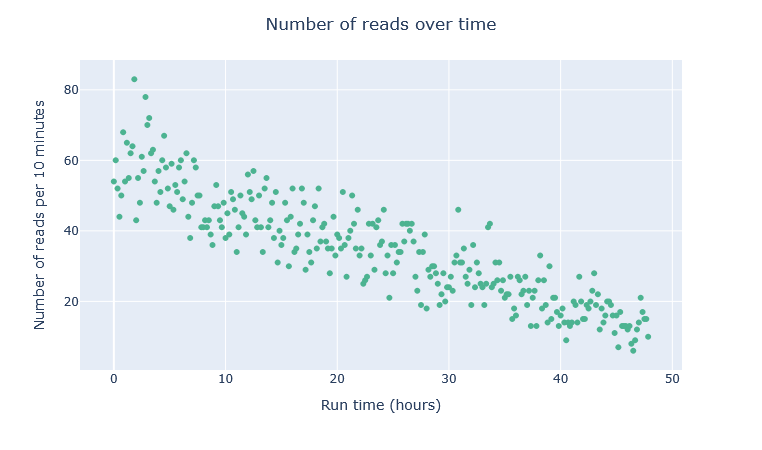</td>
  </tr>
</table>

<table>
  <tr>
    <td>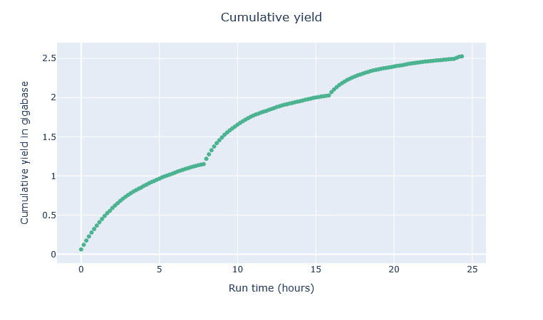</td>
    <td></td>
  </tr>
</table>

*The healthy run's yield is still climbing at 48 hours, with reads-per-10-minutes declining but never reaching zero — the run was stopped with material left to sequence. The struggling run's yield rises in steps after each of its three reloads then flattens before the next, ending at only ~2.5 Gb total, with reads-per-10-minutes spiking then collapsing after each one — diminishing returns each time.*

##### Violin plot of read lengths over time

Read length should stay fairly stable across a run, with only a slight upward drift as shorter fragments get used up first; a flow cell reload resets this pattern.

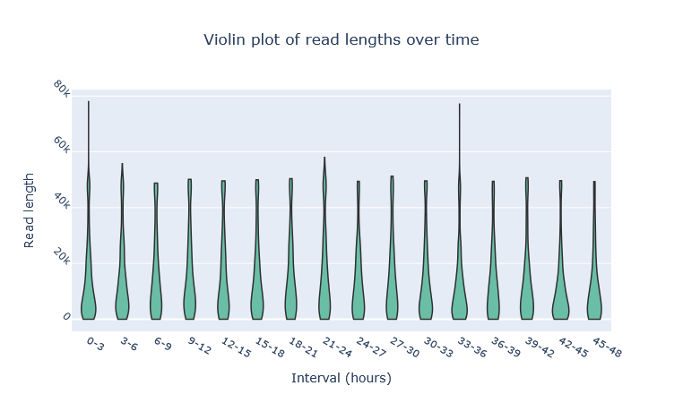


*The healthy run (top) is remarkably stable across all sixteen 3-hour windows, consistent with a single continuous load. The struggling run (bottom) shows the reload pattern directly: the longest tails appear right after each reload (up to ~150 kb), then shrink over the following windows before the next reload resets it again.*

### MultiQC

Every report so far in this module has covered one sample at a time. That's fine when you only have one, but a real run rarely does — and once you have several samples, several tools, or both, opening each one's HTML report individually to compare them stops being practical.

MultiQC solves exactly that: it scans a directory tree, finds every supported tool's output it can, and aggregates all of it into a single interactive HTML report — every sample and every tool's results sitting in one page instead of dozens. The caveat is its support for NanoPlot is quite limited, parsing only the summary statistics rather than the plots.

#### Typical command and options

This training runs MultiQC v1.35. This is an example command: 

```bash
multiqc \
    -o /path/to/output_dir \
    -f \
    --fullnames \
    /path/to/input_dir
```

- `-o` / `--outdir` — where to write the aggregated report.
- `-f` / `--force` — overwrite any existing report rather than refusing to run.
- `-s` / `--fullnames` — keep sample names as their full, uncleaned file names, rather than letting MultiQC tidy them up automatically. Worth using when you have samples with similar names, e.g. with the same prefix.
- The final argument, `/path/to/input_dir`, is the directory MultiQC scans for logs — it finds every FastQC and NanoPlot output nested inside it, wherever they happen to sit, without needing each sample specified individually.

!!! success Wrap-up
    You now know how to assess the quality of a raw long-read dataset — read length, quality, and adapter content and how to interpret what a "good" or "bad" run looks like. Next, in the preprocessing module, we'll look at whether — and how — to act on what these reports tell you.

# Exercise

Run FastQC and NanoPlot on the sample you need to process. You can use the following commands

```bash
# Create the top-level output directories
mkdir -p qc/raw/fastqc
mkdir -p qc/raw/nanoplot
```

```bash
# EDIT THIS LINE: replace with the path to your sample FASTQ file
input_fastq=/path/to/your/sample.fastq.gz

# Derive a clean sample ID from the file name
sample_id=$(basename "$input_fastq")
sample_id=${sample_id%.fastq.gz}

# NanoPlot output for this sample
NanoPlot \
    --fastq "$input_fastq" \
    -p "${sample_id}_raw_" \
    --loglength \
	--N50 \
    -o qc/raw/nanoplot/

# FastQC output for this sample
mkdir -p qc/raw/fastqc/
fastqc \
    -f fastq \
    -o qc/raw/fastqc/ \
    "$input_fastq"
```

Look at the NanoPlot and FastQC report. 


!!! question Answer the following questions
    1. How many reads and bases do you have in total?
    2. What is the mean Qscore?
    3. What is the median, mean and maximum read length, what is the N50?
    4. Is there a link between read length and Phred score?
    5. What is the length of the longest read in the file and its associated mean quality score?

!!! solution Solution
    Answers will vary depending on which sample you were assigned. Reference values from three of the samples used in this training:

    | Metric | ERR8282742 | ERR8282751 | ERR8282753 |
    |---|---|---|---|
    | Number of reads | 39,172 | 121,009 | 31,430 |
    | Total bases | 306.9 Mb | 882.0 Mb | 242.4 Mb |
    | Mean Qscore | 12.7 | 11.9 | 11.8 |
    | Median read length | 5,440 bp | 4,898 bp | 5,254 bp |
    | Mean read length | 7,835 bp | 7,289 bp | 7,711 bp |
    | Maximum read length | 73,346 bp | 75,054 bp | 98,476 bp |
    | Read length N50 | 12,290 bp | 11,490 bp | 12,333 bp |
    | Longest read — its mean quality score | 73,346 bp — Q12.2 | 75,054 bp — Q11.2 | 98,476 bp — Q7.3 |

    **Link between read length and Phred score?** Not a strong one, but there is a pattern: comparing each sample's "Top 5 highest mean basecall quality" reads against its "Top 5 longest" reads (both in the NanoPlot summary statistics above) shows the highest-quality reads are consistently short, while the longest reads on record score noticeably lower. This is a general long-read pattern, not a quirk of one sample.

!!! hint Discussion points
    - Overall, how good is your data?
    - Are there areas that should be trimmed?

!!! success Solution
    **Overall, how good is your data?** By ONT standards this is solid, workable bacterial isolate data: mean Qscore in the Q11–12 range, N50 in the 11–12 kb range, and well over 30x coverage of a typical ~5 Mb bacterial genome even for the smallest of the three samples. None of the three samples clear Q20, so this reflects an older/lower-accuracy basecalling setup rather than best-practice R10.4.1 chemistry — but it's well within range for a long-read-only assembly.

    **Are there areas that should be trimmed?** Worth checking the adapter content panel (see the warning above) and the low end of the length distribution — each sample still has a long tail of reads well under 1 kb, which contribute little to assembly and are exactly what a length-based filter in the next module would remove.

# References

TO DO