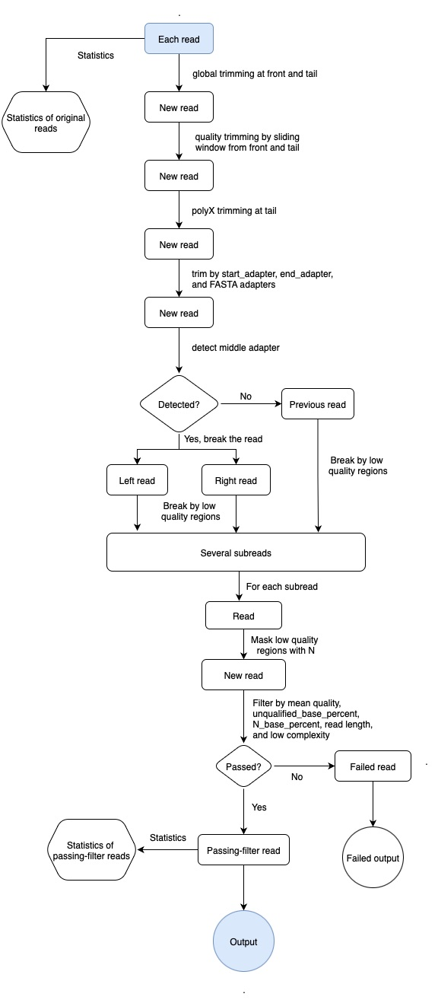

# Basics of long read preprocessing

!!! hint "Learning objectives"

    - Explain why long-read preprocessing is optional rather than mandatory, unlike short-read QC
    - Decide, from a QC report, whether filtering or trimming is actually needed for a given sample
    - Run Filtlong or fastplong to filter and trim long reads, and interpret their output

Once QC has told you what's actually in your reads, the next question is what — if anything — to do about it. For long reads, that's a genuinely open question rather than a formality: unlike short-read QC, which more or less requires trimming as a matter of course, long-read QC tools have traditionally just displayed the picture and left filtering and trimming as an optional next step, not a mandatory one.

## Does long-read data need the same preprocessing as short reads?

Short-read pipelines are built around the assumption that you'll trim adapters and quality-trim ends before anything else happens. Long-read tooling has historically taken a lighter touch: the QC step shows you the read length and quality distributions, and it's up to you whether filtering is worth doing at all, rather than assuming it's needed. 

!!! question "To preprocess or not to preprocess?"

    For bacterial genome assembly with a modern long-read assembler, the honest answer is: often, not much. Flye, the assembler used in this training, is explicit about this — its own documentation states that preprocessing usually isn't necessary, since Flye automatically filters out chimeric reads and reads with bad ends, and adapter trimming and quality filtering aren't required either. Oxford Nanopore gives essentially the same guidance from the sequencing side: most of their own benchmarks are built on the default pass/fail cut-offs applied in MinKNOW, so pass-filtered reads straight out of basecalling should generally already be fit for analysis, without a dedicated trimming step in between.

    That's not a blanket rule, though — it's a reasonable default, not a law. Whether preprocessing is worth doing still depends on your aim (raw contiguity vs consensus accuracy), the specific quality of your data (error rate, depth, length, how quality varies across a read), and which assembly tool you're using, since not every assembler handles messy ends and adapters as gracefully as Flye does. 

## What to check before deciding

Before deciding whether to filter, look at what your QC reports are actually telling you: average read length, average quality, whether quality varies meaningfully across the length of a read, and whether adapter sequence is still hanging around. Each of these points to a different plot — NanoPlot's "read length vs average read quality" view for the first two, FastQC's adapter content panel for the last — but together they tell you whether preprocessing would actually change anything or just cost you time.

### Quality 

A nanopore run might show a mean read quality sitting around Q9, which by itself isn't a red flag so much as a data point to weigh against your read depth: if you have plenty of reads to spare, it's reasonable to set a stricter quality threshold and filter more aggressively; if reads are scarcer, a lighter touch — or no filtering at all — may serve you better, since throwing away marginal reads costs you coverage you might actually need.

### Adapters

Adapters are worth checking separately, since they won't show up in a length or quality summary. If your reads were basecalled with adapter trimming switched off (see Dorado, below), or run through a tool that doesn't handle this, adapter sequence can still be sitting at the ends of reads even when length and quality otherwise look fine — and it's worth trimming regardless of what the rest of your QC report says.

### Coverage and read length

Of everything here, though, coverage and read length matter more than any single quality metric when it comes to whether an assembly will actually close. As a rough guide, 30x or greater coverage of PacBio or ONT reads, with an N50 of several kilobases, is generally enough for a contiguous assembly; higher coverage still can help improve consensus quality on top of that. Coverage in the 20–30x range can still work reasonably well depending on the platform and the read length distribution, but datasets below 10x coverage generally aren't worth attempting to assemble. Flye specifically expects coverage above 10x and an N90 read length over 1 kb (5 kb or more is preferable), and it simply won't run on reads shorter than 1 kb.

## Software overview

If your QC results do point towards filtering or trimming — noisy reads, a long tail of very short fragments, adapter contamination, or simply more reads than you need — a few tools are commonly used for long-read data. 

### Porechop

Porechop finds and removes ONT sequencing adapters from reads: adapters at the very start or end of a read are trimmed off, and if an adapter turns up in the *middle* of a read, that read is treated as chimeric and split into two. It also demultiplexes reads barcoded with ONT's Native Barcoding Kit, PCR Barcoding Kit, or Rapid Barcoding Kit.

!!! warning "Porechop is unmaintained"

    Porechop was declared unsupported/abandonware by its author back in October 2018. It's still one of the most widely used tools in long-read pipelines — the reputation is well earned, it works — but it hasn't been actively maintained since.

### Filtlong

Filtlong filters long reads using a combination of read length (longer is better) and read identity (higher is better), producing a smaller, better subset of your original reads. Without an external reference, it judges quality from the Phred scores already in your FASTQ file. A typical command looks like:

```bash
filtlong --min_length 1kb --keep_percent 90 --target_bases 500mb input.fastq.gz | gzip > output.fastq.gz
```

- `--min_length` / `-l` discards anything shorter than the given threshold; `--max_length` / `-L` does the same for anything longer.
- `--keep_percent` / `-p` throws out the worst-scoring reads by base count (not by read count) — so `--keep_percent 90` discards the worst 10% of bases.
- `--target_bases` / `-t` trims the read set down until only the given amount of sequence remains, which is handy for very large datasets.

Filtlong writes filtered reads to stdout in their *original input order*, not sorted by score — pipe to `gzip` (or wherever else you want the output to go), as above.

**How reads are chosen.** Filtlong first checks each read against a set of hard thresholds — `--min_length`, `--max_length`, `--min_mean_q` / `-q`, and `--min_window_q` — and any read that fails one of these is marked as failed outright, regardless of how it scores otherwise. Every read that survives is then given a final score, and if `--keep_percent` and/or `--target_bases` were used, reads are ranked by score and a cut-off applied — using whichever of the two settings is more stringent, if both are given.

**Scoring**, in brief: each read gets a length score (longer is better; a 5 kb read scores a middling 50, and the score approaches 100 as length increases), a mean quality score (the read's mean identity — from Phred scores, or from a reference if one's supplied), and a window quality score (the read's *worst* stretch, found with a sliding window, default size 250 bases, `--window_size`). The final score is a weighted geometric mean of the length and mean quality scores, then scaled down according to the window quality — so one bad patch in an otherwise strong read still costs it.

**Adjusting the balance between length and quality.** By default length and mean quality are weighted equally (`--length_weight`, `--mean_q_weight`, both default 1), but this is tunable.

For more detailed instructions, run `filtlong --help`, or check [github.com/rrwick/Filtlong](https://github.com/rrwick/Filtlong).

### fastplong

fastplong is a fast, general-purpose preprocessing and QC tool for long reads (Nanopore, PacBio, and others), built along similar lines to the popular short-read tool fastp. All the filters below are enabled with sensible defaults and each can be switched off individually if you don't want it.

```bash
fastplong -i in.fastq.gz -o out.fastq.gz
```

**Quality filtering** — enabled by default (`-Q` / `--disable_quality_filtering` turns it off). A read can be filtered in several ways:

- **Unqualified bases:** `-q` / `--qualified_quality_phred` sets the quality threshold for an individual base (default Q7), and `-u` / `--unqualified_percent_limit` sets the maximum percentage of a read that may fall below that threshold (default 40%). For example, to require individual bases to meet Q7 and allow no more than 30% of bases below that threshold, use:

	```bash
	fastplong -i in.fq -o out.fq -q 7 -u 30
	```

- **Ambiguous bases:** `--n_base_limit` sets the maximum number of `N` bases allowed in a read (disabled by default), while `-n` / `--n_percent_limit` sets the maximum percentage of `N` bases allowed (enabled by default). For example, to allow no more than 100 `N` bases and no more than 20% `N` bases, use:

	```bash
	fastplong -i in.fq -o out.fq --n_base_limit 100 --n_percent_limit 20
	```

- **Mean read quality:** `-m` / `--mean_qual` sets a minimum average quality for the whole read. Reads with an average quality score below this value are discarded; the default is 0, meaning that no minimum is required.

**Length filtering** — enabled by default (`-L` / `--disable_length_filtering` turns it off). `-l` / `--length_required` sets the minimum (default 20 bp), and `--length_limit` an optional maximum (default 0, meaning no limit).

**Adapter trimming** — enabled by default (`-A` / `--disable_adapter_trimming` turns it off), and trims both read ends. If you know your adapter sequences, specify them directly:

```bash
fastplong -i in.fq -o out.fq -s AAGGATTCATTCCCACGGTAACAC -e GTGTTACCGTGGGAATGAATCCTT
```

using `-s` / `--start_adapter` for the 5′ adapter and `-e` / `--end_adapter` for the 3′ adapter — if you only give `-s`, fastplong uses its reverse complement as the end adapter. For trimming several possible adapters at once, give a FASTA file instead with `-a` / `--adapter_fasta`. If none of these are specified, fastplong tries to auto-detect adapters at each end, which works reasonably well but carries some risk of misidentification, particularly on reads with no real adapter present. `-d` / `--distance_threshold` (default 0.25, i.e. 25% mismatch tolerance) controls how strict adapter matching is — raise it for noisier, higher-error data, and lower it for cleaner data — and `--trimming_extension` (default 10) trims a few extra bases past a detected adapter for a cleaner cut.

**Poly-X trimming** — disabled by default (`-x` / `--trim_poly_x` turns it on). When enabled, fastplong looks at the very end (3′) of each read for a homopolymer run — the same base repeated back-to-back, whatever that base happens to be (poly-A, poly-T, poly-G, or poly-C) — and trims it off if the run is at least `--poly_x_min_len` bases long (default 10 bp):

```bash
fastplong -i in.fq -o out.fq -x --poly_x_min_len 15
```

This is a much narrower check than adapter trimming: it only ever looks at the true 3′ terminus of a read, and only removes a genuine, unbroken run of one repeated base — it won't catch homopolymer-like stretches sitting anywhere else in a read, or a run that's broken up partway through by a stray sequencing error.

**Low-complexity filtering** — disabled by default (`-y` / `--low_complexity_filter` turns it on). Unlike poly-X trimming, this isn't a targeted trim — it's a whole-read filter. It scores each read by what percentage of bases differ from the base immediately following them (`base[i] != base[i+1]`), so a read that's mostly one repeated or near-repeated base scores as low complexity, and the *entire read* is discarded if that score falls below `-Y` / `--complexity_threshold` (default 30, i.e. at least 30% of consecutive base pairs must actually change):

```bash
fastplong -i in.fq -o out.fq -y -Y 30
```

Because it judges the read as a whole rather than just its ends, this will reliably catch reads that are mostly or entirely low-complexity junk, but it can't surgically remove just a low-complexity region from an otherwise good read — an otherwise strong read with only a short poly-A stretch at the end usually won't fail this filter at all, since the rest of the read still contains plenty of complexity.

Full option reference: `fastplong --help`, or [github.com/OpenGene/fastplong](https://github.com/OpenGene/fastpLong).


*fastplong workflow. Source: https://github.com/OpenGene/fastpLong*

#### Outputs

We've run fastplong on the `barcode01` sample:

```bash
fastplong \
  --in "${input_fastq}" \
  --qualified_quality_phred 13 \
  --mean_qual 13 \
  --trim_poly_x \
  --out "trim_filter/${sample_id}.trimmed.filtered.fastq" \
  --html "qc/fastplong_filter/${sample_id}.fastplong_report.html" \
  --json "qc/fastplong_filter/${sample_id}.fastplong_report.json"
```

This command keeps a read only if it meets both quality criteria:

- A base is “qualified” when its Phred score is greater than or equal to Q13 (`--qualified_quality_phred 13`) and at most 40% of bases may be below Q13. This is fastplong’s default `--unqualified_percent_limit 40`.
- The read’s average Phred quality must also be greater than or equal to Q13 (`--mean_qual 13`).

So a read is discarded if its mean quality is below Q13 or if more than 40% of its bases are below Q13.

It also applies the default length filter, discarding reads shorter than 20 bp, trims 3′ poly-X tails, and performs adapter trimming by default.

The following is printed to the standard output/error:

```
Trying to detect adapter sequence at read start
Detected: TAAGGTTAACACAAAGACACCGACAACTTTCTTCAGCACCT
Trying to detect adapter sequence at read end
Found possible adapter sequence, but it's too short: AGGTGCTGAAGAA, specify -e AGGTGCTGAAGAA to force trimming using this adapter

Before filtering:
total reads: 95064
total bases: 1328688619
Q20 bases: 486836383(36.6404%)
Q30 bases: 149845896(11.2777%)

After filtering:
total reads: 64248
total bases: 900258370
Q20 bases: 391376080(43.4738%)
Q30 bases: 130104974(14.452%)

Filtering result:
reads passed filter: 64248
reads failed due to low quality: 30840
reads failed due to too many N: 0
reads failed due to too short: 0
reads with adapter trimmed: 77375
bases trimmed due to adapters: 5658054
reads with polyX in 3' end: 365
bases trimmed in polyX tail: 10942

JSON report: fastplong_filter/barcode01.fastplong_report.json
HTML report: fastplong_filter/barcode01.fastplong_report.html
```

Alongside the summary printed to the console, fastplong's `--html` report renders the same before/after comparison as a series of plots and tables. Worth knowing what each one is actually showing:

- **Basic statistics** (before/after tables) — the same core figures as the stdout summary, plus median and N50 read length, and the percentage of bases above Q5/Q7/Q10/Q15/Q20/Q30/Q40. For barcode01, filtering barely moved the length figures at all — median length 9,018 bp → 8,975 bp, N50 24,028 bp → 24,232 bp, GC content 56.09% → 56.20% — which tells you this particular filter mostly removed low-quality reads, not particularly short or long ones.
- **Read median quality statistics** (histogram, before/after) — each read is reduced to a single median quality score, and the plot shows what fraction of reads (and of total bases) fall at each score. Before filtering, this spans roughly Q6–Q25 with a broad plateau across Q13–Q20 and a long thin tail below Q10; after filtering, everything below Q13 has been cut away — exactly what `--mean_qual 13` is meant to do — leaving essentially the same Q13–Q20 plateau shape, just with its low-quality shoulder removed.
- **Density plot of read median quality and read length** (before/after) — a 2D density view combining the two axes above, plotting median quality against read length for every read at once. It's the same kind of plot as NanoPlot's read-length-vs-quality view, just built into fastplong's own report.
- **Quality** (per-position, before/after) — a per-position quality curve, but split out by which base was called at each position (separate lines for A, T, C, and G) rather than one combined average. Splitting it this way can reveal a systematic quality difference tied to a specific base — for instance, if one nucleotide is consistently harder for the basecaller to call confidently — that a single averaged curve would hide.
- **Base contents** (per-position, before/after) — the same per-position base composition view as FastQC's "Per Base Sequence Content" plot, with the overall base percentages given directly in the legend. For barcode01: A 21.9%, T 22.0%, C 27.8%, G 28.3%, N ~0% before filtering, barely different after (A 21.9%, T 21.9%, C 27.9%, G 28.3%) — removing the lowest-quality reads didn't meaningfully shift the overall base composition.
- **KMER counting** (before/after) — a heatmap of k-mer frequency bias across the read set, the same underlying idea as FastQC's k-mer content module: it flags short sequence motifs turning up more or less often than chance would predict, which can point to residual adapter fragments, systematic basecalling bias, or genuine biological signal such as a repeat-rich genome.

Notably, there's no dedicated adapter- or poly-X-content plot in this report — unlike FastQC's cumulative adapter content view. For those, the summary counts printed to the console (quoted above) are the only numbers fastplong gives you, which matters for the question below.

!!! question
    FastQC reported so many reads with poly-A tails — why did fastplong trim only a handful of them? What other filters would you use if you really wanted to get rid of poly-A-rich regions? 

??? success "Solution"
    FastQC's poly-A track and fastplong's `--trim_poly_x` aren't actually measuring the same thing, which is why the numbers look so different.

    FastQC's adapter content plot works by scanning for a fixed poly-A reference sequence *anywhere* in a read, and it's cumulative: once that sequence has been seen once in a read, at any position, that read counts towards the percentage for every position from there onward — it doesn't matter whether the match sits at the very 3′ end or somewhere in the middle. That's why barcode01's poly-A curve climbs steadily and plateaus just above 5%: it's counting any read that ever contains an A-rich stretch resembling that reference, wherever it happens to fall.

    fastplong's `--trim_poly_x`, by contrast, only looks at the true 3′ terminus of each read, and only trims a genuine homopolymer run — the same base repeated, at least 10 bp long by default — sitting right at that end. An A-rich stretch anywhere else in the read doesn't count, and neither does one broken up partway through by a stray sequencing error, which isn't unusual at ONT's per-base error rate. That's a much stricter, much more specific test than FastQC's "seen anywhere" check, so it's expected to flag far fewer reads: only 365 of 95,064 reads (0.38%) had anything trimmed from a 3′ poly-X run here, against FastQC reporting over 5% of reads containing an A-rich match somewhere in them.

    In short: FastQC is telling you how many reads contain something A-rich *somewhere*; fastplong is only acting on the much narrower case of a genuine poly-A (or poly-X) tail sitting right at the very end of the read. The two counts were never measuring the same event, so there's no reason to expect them to agree.

    If the goal is to more aggressively strip out poly-A-rich sequence — not just the strict, unbroken 3′ tails `--trim_poly_x` catches — a few options are worth combining:

    - **Supply poly-A explicitly as a custom adapter**, via `-a` / `--adapter_fasta` with a poly-A entry (fastplong's own documentation gives exactly this as a worked example). Unlike `--trim_poly_x`, adapter trimming isn't restricted to a clean homopolymer run right at the 3′ end — it uses fuzzy, edit-distance-based matching (tunable with `--distance_threshold`), so it can find and trim poly-A-like stretches with a few mismatches in them, wherever they sit near a read's ends. This is the closest fastplong equivalent to what FastQC's adapter content check is actually doing.
    - **Loosen `--poly_x_min_len`** below the default 10 bp, so `--trim_poly_x` also catches shorter poly-A runs at the 3′ end that currently fall under the length threshold.
    - **Low-complexity filtering is a good instinct** (`-y` / `--low_complexity_filter`, described above) — but it's worth being clear about what it actually does before reaching for it: it's a whole-read discard, not a targeted trim. It scores each entire read by how often consecutive bases differ, and throws the whole read away if that score drops below `-Y` / `--complexity_threshold` (default 30%). That reliably clears out reads that are mostly or entirely low-complexity junk — including heavily poly-A-dominated reads — but it won't touch an otherwise good read that only has a short poly-A stretch at the end, since the rest of the read still keeps its score above threshold. It's a good complement to the two options above, not a replacement for them: use it to discard genuinely junk reads, and `--trim_poly_x` or a custom poly-A adapter to clean up otherwise-usable reads that just happen to carry a poly-A tail.

### Dorado and Guppy

Worth knowing before reaching for Porechop or fastplong: ONT's own basecallers can already handle some of this. Dorado can trim adapter/primer sequences and demultiplex barcoded reads, and supports doing both either in-line during basecalling or afterwards as a separate step on an already-basecalled dataset (`dorado trim` / `dorado demux`). Guppy is more limited: general adapter trimming only happens in-line during basecalling, with no standalone way to re-trim already-basecalled reads — but demultiplexing is available separately too, via its own `guppy_barcoder` tool, which can also trim the detected barcode sequences as part of that offline step. Since some of this can happen well upstream of QC and preprocessing, it's worth checking whether your reads have already been through it before assuming Porechop or fastplong still need to do the job.

!!! success "Wrap-up"
    You can now look at a QC report and make a deliberate decision about whether preprocessing is worth doing, and if so, run Filtlong or fastplong to filter and trim your reads. Next, we'll use these (optionally cleaned) reads to check what species they actually came from, before moving on to assembly.

# Exercise

Run filtlong to keep only long reads longer than 1 kb and retain only the top 50% of reads by quality. Direct the standard output to a file named `<sample>.filtered.fastq.gz`. Run FastQC and NanoPlot on the filtered file and analyse how the quality statistics changed (use the commands from the Quality control module but change the folder name to `qc_filtered`). 

!!! question "Answer the following questions" 
    1. What is the mean Qscore after filtering?
    2. What is the median, mean, minimum and maximum read length, what is the N50 after filtering? 

??? solution "Solution"
    Answers will vary depending on which sample you were assigned. Reference values after running `filtlong --min_length 1kb --keep_percent 50` on three of the samples used in this training:

    | Metric | ERR8282742 (filtered) | ERR8282751 (filtered) | ERR8282753 (filtered) |
    |---|---|---|---|
    | Number of reads | 9,602 | 29,698 | 7,884 |
    | Total bases | 153.5 Mb | 441.0 Mb | 121.2 Mb |
    | Mean Qscore | 14.2 | 13.3 | 13.5 |
    | Median read length | 13,748 bp | 12,542 bp | 13,222 bp |
    | Mean read length | 15,982 bp | 14,851 bp | 15,371 bp |
    | Minimum read length | 5,935 bp | 4,850 bp | 4,944 bp |
    | Maximum read length | 73,346 bp | 75,054 bp | 63,158 bp |
    | Read length N50 | 17,541 bp | 16,721 bp | 17,305 bp |

    Filtering pushed the mean Qscore up by roughly 1.4–2 points and N50 up by around 40–50% across all three samples, while cutting the read count by roughly 75% — consistent with `--keep_percent 50` discarding half the *bases* by score, which is disproportionately the shorter, lower-quality reads. Notice the minimum read length after filtering (4,850–5,935 bp) sits far above the hard `--min_length 1kb` floor: because filtlong's score is weighted by length as well as quality, `--keep_percent 50` alone already removed essentially every read under ~5 kb before the length floor had to act.

!!! hint "Discussion points"
    1. We're taking 50% of the best reads to make the sample run faster, but what would be a better way of establishing how much we want to keep?
    2. Why would it be not the best idea to keep using Porechop?

??? solution "Solution"
    1. A better approach is to filter based on coverage, not on an arbitrary “top 50%” cutoff. For long-read bacterial assembly, the goal is usually to retain enough high-quality sequence to reach the required depth for assembly, such as roughly 100× coverage of the target genome. Using Filtlong with a minimum read length of 1,000 bp and a target of 500,000,000 bp is more defensible because it keeps the longest, highest-quality reads needed for assembly while discarding poor or very short reads. This is more objective and reproducible than simply keeping half the reads to make the run faster.
    2. Porechop was declared unsupported/abandonware by its author back in October 2018 and hasn't been updated since (see the warning above) — it still works and is still widely used, but relying on an unmaintained tool means no bug fixes, no support for newer chemistries or adapter sequences, and no guarantee it keeps working as basecallers and library kits evolve. fastplong, or Dorado/Guppy's own in-line adapter trimming, are the actively maintained alternatives covered in this module.

# References

TO DO