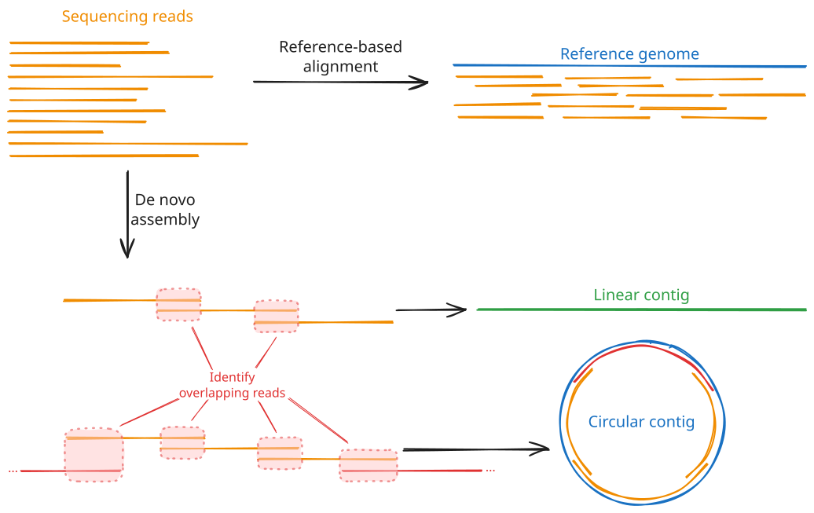
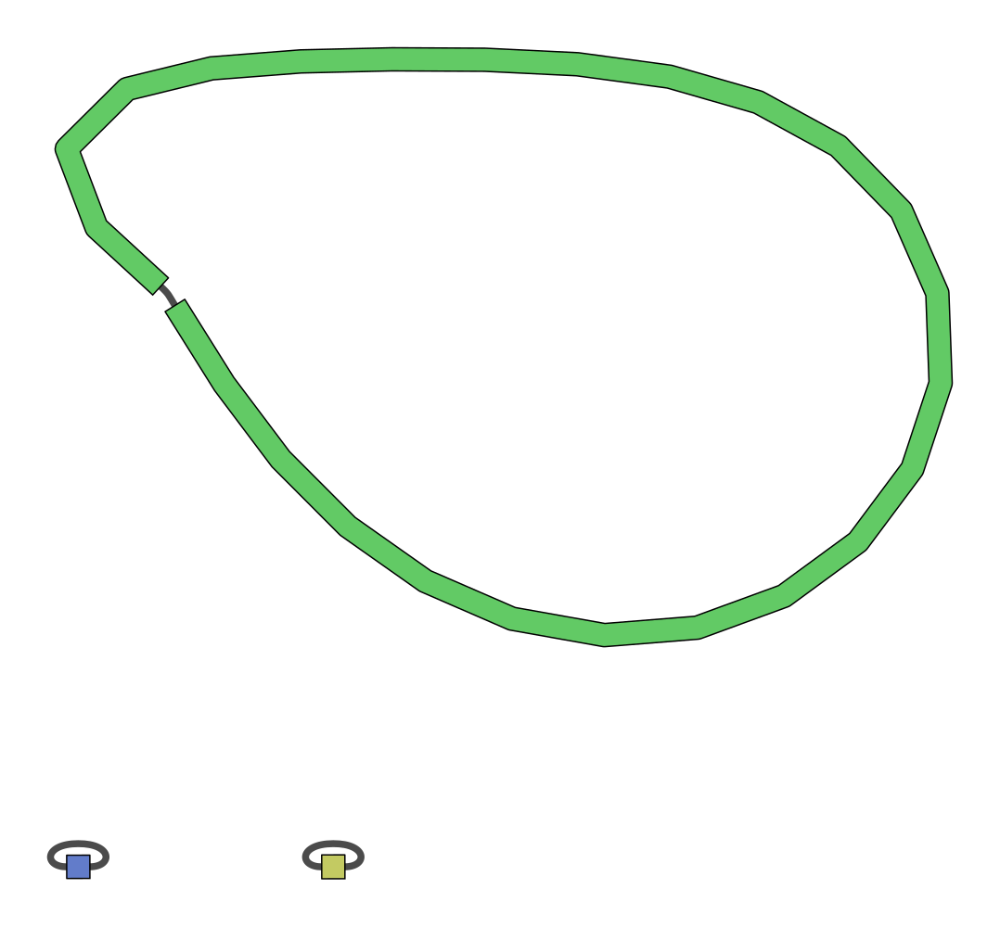
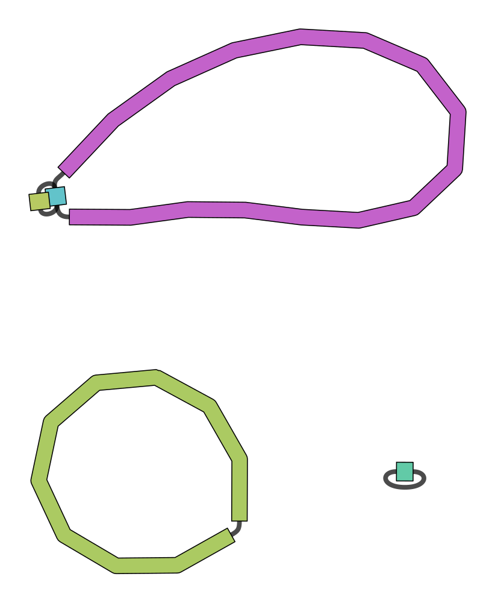

# Lesson 5 - *De novo* bacterial genome assembly

!!! hint "Learning objectives"

    - Explain the goals of *de novo* genome assembly from long reads
    - Use tools like `flye` to perform *de novo* bacterial genome assembly

## 5.1 Introduction to *de novo* genome assembly

Now that we have clean sequencing reads and we know that our samples aren't contaminated with sequences from other species or the host genome, we can start working on *de novo* genome assembly.

If you have ever worked with vertebrate sequencing data before, such as human or mouse, you have probably never done *de novo* assembly before - instead, you likely worked with a **reference genome** and **aligned** the sequencing reads to that. This approach works very well for well-studied species that have a relatively stable genome, where most individuals will closely align to the reference genome. In these cases, the published reference genome will likely be of much higher quality than anything you can generate from a single sequencing experiment, so it makes little sense to run *de novo* assembly. However, the more that an individual diverges from the reference genome, the less accurate the read alignments will be, and the less useful the reference genome approach becomes. Bacteria and other micro-organisms are often capable of rapidly acquiring new mutations, meaning that any given isolate will likely not closely align to any existing reference genome. Therefore, for these species, *de novo* assembly from long read sequencing becomes the most sensible approach.

Genome assembly works by identifying the overlaps between the reads and attempting to stitch them together into one or more larger, contiguous sequences. This isn't a trivial task: the assembler needs to look through thousands or millions of sequences, identify potential overlaps, then score and rank those overlaps to determine the most likely sequence they originated from. This process can be seriously hindered by repetitive sequences, such as those often found in bacteria, as these will often match lots of reads and become hard to place in the larger assembled genome. The use of long read sequencing aims to mitigate this issue by capturing such repetitive sequences along with surrounding, distinct sequences that make them easier to place.



The output of *de novo* genome assembly will be one or more **contigs**, i.e. contiguous sequences. They will also typically generate a **graph** of the genome - a representation of all of the sequences that make up the contigs and how they link to one another. A good quality assembly will resemble a chain of sequences with single links between each pair; a bad quality assembly will show lots of branching, meaning the assembler was unable to determine a unique, linear sequence from the input reads. Most assemblers will perform some basic quality control and filtering on these contigs to remove low-quality contigs and retain only those that had good coverage from the sequencing reads and show little or no branching. We will talk more about assembly quality control metrics in [Session 2, Lesson 7](./07.assembly_qc.md).

When assembling bacterial genomes, we are looking for a few distinct features. First, bacterial genomes are typically **circular**, i.e. they are circular loops of DNA rather than linear sequences with a clear start and end. That means that any *de novo* assembler we use needs to be able to recognise and handle circular sequences. Second, bacteria typically have a single, large chromosome, possibly (but not necessarily) accompanied by one or more smaller circular sequences called **plasmids**. Therefore, when assessing the quality of our assemblies, we will expect to see one or more circular contigs, one being fairly large (megabase-scale) and others being much smaller (kilobase-scale).

The following plots demonstrate what good and bad assembly graphs might look like for bacterial samples:

### Clean assembly graph

In this example, the assembler was able to assemble three circular contigs. The large contig will be the bacterial chromosome, while the two much smaller contigs are plasmids. Note how each contig consists of a single sequence (the thick coloured bar) connected end-to-end with itself by a single edge (the thin grey line). This indicates that there was no ambiguity about how the reads could be assembled into a complete genome.



---

### Slightly branched graph

This assembly example is mostly clean, consisting of three circular contigs. However, it does contain a single branch point in the chromosome assembly, indicating that there was some ambiguity about how to assemble this contig. This could be due to repetitive elements or simply too low coverage to provide enough confidence on a single assembly structure. Deeper sequencing, longer reads, and higher quality base calls may improve this result.



---

### Heavily branched graph

This is an example of a poor quality assembly. There are several branch points in the top sequence, and at one locus there is a very complex, branching graph structure. The branching structures will be very difficult to analyse as we can't be confident about the true structure of the genome at these loci.


---

## 5.2 Common tools for *de novo* bacterial genome assembly

There are several high-quality *de novo* assembly tools out there, most of which are open source and actively being maintained. Deciding on the best tool for the job typically depends on how well they handle specific datasets. Generally, `flye` is currently considered one of the best assemblers for bacterial data, so we will be focusing on that tool in this workshop. However, other tools, such as `raven` and `canu` also exist and are more than suitable for bacterial genomics as well. In fact, a common approach to genome assembly is to run multiple assemblers and combine their results into a **consensus sequence**. This approach lets you take advantage of each tool's strengths and ideally construct a more complete, higher quality genome than any one could generate alone. See the links at the [bottom of the page]() for tools that can help you with this.

The three tools mentioned above are general long read sequencing assemblers, aimed at constructing contigs from the noisy data that comes from typical long read sequencers. There also exist bacterial-specific assemblers aimed at addressing the unique challenges of bacterial genome assembly. One of these tools, `plassember`, is specifically targeted at reconstructing small plasmid sequences, which other tools can often struggle with. We will come back to this tool later in [Lesson 6](./06.plasmids.md).

### 5.2.1 Typical *de novo* assembler commands and options

Below we have compiled the typical run commands for the `flye` assembler:

A typical `flye` run for ONT long read sequencing will look like:

```bash
flye \
    --nano-raw /path/to/sample.fastq \
    --out-dir /path/to/output/assembly \
    --threads <int>
```

The `--nano-raw` option specifies that the reads are older sequencing data that was called with the older `guppy` basecaller (versions older than `v5`). The data we are using in this workshop was basecalled with these older tools, and so **it needs to be provided to flye with this flag**. If you were using newer ONT data called with the `dorado` basecaller (or `guppy` versions greater than `v5`), and using the super high accuracy ("SUP") algorithm, you would provide the `--nano-hq` flag instead. PacBio reads can also be read with `--pacbio-raw` (for regular continuous long read (CLR) sequences) and `--pacbio-hifi` (for the higher-accuracy HiFi sequences).

#### Outputs and statistics

Running `flye` creates the specified output directory and populates it with several files and subdirectories. The two you will use most are:

- **`assembly.fasta`**: the final set of assembled contigs. This is the file you will typically carry forward into downstream analyses.
- **`assembly_info.txt`**: a tab-separated summary table with one row per contig in `assembly.fasta`:

| Column | Meaning |
| ------ | ------- |
| `#seq_name` | Contig identifier, matching the FASTA header in `assembly.fasta` |
| `length` | Length of the contig, in base pairs |
| `cov.` | Mean sequencing coverage across the contig |
| `circ.` | `Y` if `flye` determined the contig to be circular, `N` if linear |
| `repeat` | `Y` if the contig represents an unresolved repetitive sequence rather than a unique region |
| `mult.` | Estimated copy number of the contig relative to the rest of the assembly |
| `alt_group` | Groups together contigs that represent alternative versions of the same region (e.g. divergent haplotypes of a repeat) |
| `graph_path` | The path through the assembly graph that this contig corresponds to |

This table is the fastest way to answer questions like "how many contigs did I get?", "how long is my largest contig?", and "which contigs are circular?", without needing to parse the FASTA file itself.

Two other files are worth knowing about:

- **`assembly_graph.gfa`**: the assembly graph in [GFA](http://gfa-spec.github.io/GFA-spec/) format. Loading this into a viewer such as [Bandage](https://rrwick.github.io/Bandage/) lets you visually confirm circularity and spot any unresolved branching that isn't fully captured by `assembly_info.txt` alone.
- **`flye.log`**: a detailed log of the run, including the estimated genome size and coverage, and any warnings encountered along the way.

A well-assembled bacterial genome will typically show up in `assembly_info.txt` as one large, circular, low-copy-number contig (the chromosome), plus zero or more much smaller, circular contigs (plasmids). Small contigs with unusually high coverage relative to the chromosome are also a common signature of plasmids, since they are often present at a higher copy number per cell than the chromosome.

## 5.3 Exercise

In this exercise, you will assemble your assigned sample's genome with `flye`, then inspect and interpret the output files to characterise your assembly: how many contigs it contains, how large they are, and whether any look like plasmids.

### 5.3.1 Run flye

Run your assigned, trimmed and filtered FASTQ file (generated in [Lesson 3](./03.preprocess.md)) through `flye`. Place the output in a new directory called `flye`, and use 4 CPU threads.

??? success "Solution"

    ```bash
    mkdir -p flye

    flye \
        --nano-raw ~/filtered/sampleXX.filtered.fastq.gz \
        --out-dir flye \
        --threads 4
    ```

    Remember to substitute your sample name for `sampleXX`.

`flye` can take a few minutes to run, depending on the size of your genome and the number of reads. While you wait, re-read the description of `assembly_info.txt` above so you know what to look for once it's finished.

Once finished, you should have a `flye` directory that looks like:

```
flye/
├── 00-assembly/
├── 10-consensus/
├── 20-repeat/
├── 30-contigger/
├── 40-polishing/
├── assembly.fasta
├── assembly_graph.gfa
├── assembly_graph.gv
├── assembly_info.txt
├── flye.log
└── params.json
```

In the top level, you will find the new `assembly.fasta`, the associated `assembly_graph.gfa` graph file, the `assembly_info.txt` summary, along with log files and intermediate working directories (starting with `00-`, `10-`, `20-`, etc.).

### 5.3.2 Inspect the assembly

Once `flye` has finished, look at the per-contig summary table. Open it in VS Code either through the Explorer side panel or via the command line:

```bash
code flye/assembly_info.txt
```

#### 5.3.2.1 Questions

1. **How many contigs were assembled?**
2. **How long was the largest contig? How long was the smallest?**
3. **Were there any potential plasmids in your sample?** If so, how many, and what made you identify them as plasmids rather than chromosome fragments?
4. **Were all the contigs circular?** If not, why might that be?

!!! hint "Discussion points"

    - A likely plasmid is usually **small** (kilobase-scale, rather than the megabase-scale chromosome) and **circular**, often with **higher coverage** than the chromosome, since plasmids are frequently maintained at a higher copy number per cell.
    - A non-circular contig means `flye` couldn't close the loop with the available reads. Common reasons include insufficient coverage or read length across a difficult region (e.g. a long repeat), a genuinely linear plasmid (possible, but not as common as circular plasmids), contaminating sequence, or a chromosome/plasmid that got fragmented into two or more pieces.
    - Contigs marked as `repeat` appear at a higher copy number than the rest of the genome but were unable to be placed uniquely in the assembly. This could be an artefact due to insufficient read length or coverage, especially if it is also marked as linear. However, true plasmids may be flagged as both circular and repeats.
    - Contigs with a value in the `alt_group` column are alternative alleles to another contig in the same `alt_group`.

!!! success "Wrap-up"

    You now have a *de novo* assembly of your bacterial genome, and can describe it in terms of contig number, size, coverage, and circularity. Next, in [Lesson 6](./06.plasmids.md), we'll look at a specialised tool for recovering small plasmids that general-purpose assemblers like `flye` can sometimes miss. We'll also revisit these statistics in more depth in [Lesson 7](./07.assembly_qc.md), where we cover formal assembly quality control metrics.

## 5.4 Additional resources

For more information on each of the de novo long read assemblers we have discussed above, see their GitHub repositories and associated publications:

- Flye:
    - GitHub: [https://github.com/mikolmogorov/Flye](https://github.com/mikolmogorov/Flye)
    Publication: Mikhail Kolmogorov, Jeffrey Yuan, Yu Lin and Pavel Pevzner, "Assembly of Long Error-Prone Reads Using Repeat Graphs", Nature Biotechnology, 2019 [doi:10.1038/s41587-019-0072-8](https://doi.org/10.1038/s41587-019-0072-8)
- Raven:
    - GitHub: [https://github.com/lbcb-sci/raven](https://github.com/lbcb-sci/raven)
    - Publication:  Vaser R, Šikić M. Time- and memory-efficient genome assembly with Raven. Nature Computational Science. 2021 May;1(5):332-336. [DOI: 10.1038/s43588-021-00073-4](https://doi.org/10.1038/s43588-021-00073-4). PMID: 38217213.
- Canu:
    - GitHub: [https://github.com/marbl/canu](https://github.com/marbl/canu)
    - Publication: Koren S, Walenz BP, Berlin K, Miller JR, Phillippy AM. Canu: scalable and accurate long-read assembly via adaptive k-mer weighting and repeat separation. Genome Research. (2017). [doi:10.1101/gr.215087.116](https://doi.org/10.1101/gr.215087.116)

For information on consensus genome assembly for bacterial data, see the **Autocycler** tool developed by Ryan Wick:

- GitHub: [https://github.com/rrwick/Autocycler](https://github.com/rrwick/Autocycler)
- Publication: Wick RR, Howden BP, Stinear TP (2025). Autocycler: long-read consensus assembly for bacterial genomes. Bioinformatics. [doi:10.1093/bioinformatics/btaf474](https://doi.org/10.1093/bioinformatics/btaf474).