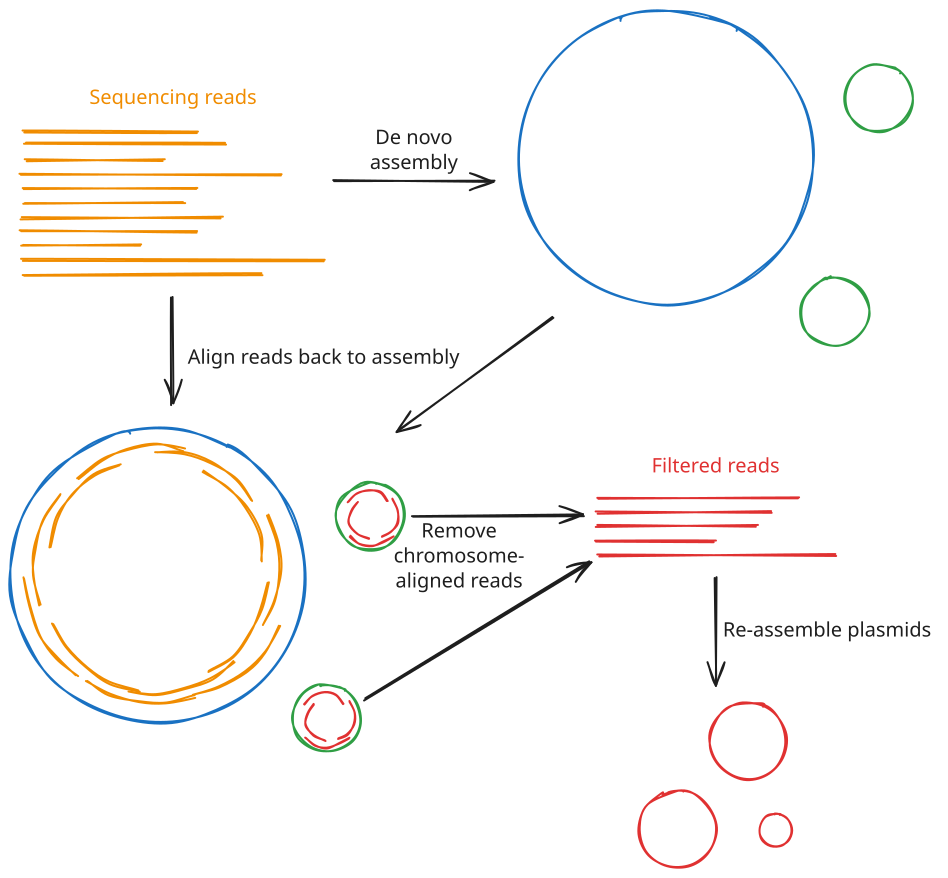

# Lesson 6 - *De novo* plasmid assembly

!!! hint "Learning objectives"

    - Explain the limitations of tools like `flye` for reconstructing plasmid sequences
    - Use specialised tools like `plassembler` to perform *de novo* assembly of plasmids from long reads

## 6.1 Introduction to plasmid detection

In [Lesson 5](./05.assembly.md), we briefly introduced the tool `plassembler` and its goal to specifically assemble bacterial plasmids. The detection of plasmids in the bacterial genome is of particular importance, especially within the context of identifying antimicrobial resistance genes present in a bacterial isolate. Plasmids are small, circular sequences of DNA that are supplementary to the main chromosome. While they aren't vital to the functioning and maintenance of the cell, they typically contain genes required for antimicrobial resistance. Additionally, plasmids are **mobile**, meaning they can be passed from cell to cell, and even between different species. This means that AMR genes present on a plasmid can spread between species. As such, being able to accurately detect, assemble, and analyse plasmids in bacterial sequencing data is vital when studying antimicrobial resistance.

Sequencing plasmids suffers from the same problems as sequencing the main bacterial chromosome; frequent repetitive sequences make assembly from short-read sequencing difficult to near impossible. Long read sequencing is essential for generating an accurate assembly of plasmids. However, at the same time, long read sequencing can often result in under-representation of smaller plasmids, particularly those less than 20kb in size. This can be due to these plasmids resisting fragmentation during the library preparation process, meaning fewer sequencing reads ultimately derive from these plasmids, and generic assemblers can end up discarding these reads due to low coverage.

## 6.2 `plassembler`

[`plassembler`](https://github.com/gbouras13/plassembler) ([Bouras *et al.*, 2023](https://doi.org/10.1093/bioinformatics/btad409)) is a tool built specifically for recovering bacterial plasmids that general-purpose assemblers like `flye` can miss or mis-assemble. It works *alongside* either `flye` or `raven`, working on the assumption that the chromosome has already been successfully assembled by that tool, and focusing on re-assembling the reads that don't align to it, which should, in theory, contain all the plasmid DNA.

At a high level, `plassembler` runs through the following steps:

1. **Start from a long-read-only assembly.** `plassembler` needs a `flye` or `raven` assembly of the full read set as a starting point. It can generate this itself, or you can hand it one you've already produced.
2. **Classify contigs as chromosome or putative plasmids.** Any contig longer than a user-specified length threshold (1mb by default) is treated as chromosomal; everything shorter is treated as a *candidate* plasmid contig.
3. **Extract the reads that don't belong to the chromosome.** All reads are mapped back against the assembly with `minimap2`. Reads that map to the chromosome are discarded, while those mapping to the small, candidate plasmid contigs, along with any reads that didn't map anywhere at all, are kept.
4. **Reassemble just those reads.** The remaining reads are reassembled from scratch with `unicycler` (another bacterial-specific assembly tool). Because the chromosomal reads have been removed, small or low-abundance plasmids that would otherwise be swamped by chromosomal coverage, or discarded outright by a whole-genome assembler's coverage filters, get a much better chance of assembling cleanly and circularising.
5. **Estimate copy number.** Reads are mapped back to both the chromosome and the newly assembled plasmid contigs, and the relative sequencing depth is used to estimate each plasmid's copy number per cell.
6. **Check against a plasmid database.** Each recovered contig is compared against [PLSDB](https://ccb-microbe.cs.uni-saarland.de/plsdb/), a curated database of published plasmid sequences. This tells you whether you've recovered a novel plasmid or one that closely matches something that has already been characterised.



### 6.2.1 Tool inputs

`plassembler` needs two things to run on long-read-only data: your reads, and a database used for the PLSDB comparison step. You download the database once with:

```bash
plassembler download -d /path/to/plassembler_db
```

This downloads a compact (~437MB), pre-built sketch of PLSDB.

The other key input is the `flye` assembly. You have two options here:

- Let `plassembler` run `flye` itself, by simply not providing an existing assembly.
- Supply the `flye` assembly you've already generated, using `--flye_assembly` (pointing at `assembly.fasta`) and `--flye_info` (pointing at `assembly_info.txt`).

Since we already generated a `flye` assembly of our sample in [Lesson 5](./05.assembly.md), we should reuse it rather than have `plassembler` redo that work.

A typical command, reusing an existing `flye` assembly, looks like this:

```bash
plassembler long \
    -l /path/to/sample.fastq \
    -d /path/to/plassembler_db \
    --flye_assembly /path/to/flye/assembly.fasta \
    --flye_info /path/to/flye/assembly_info.txt \
    -t <int> \
    -o /path/to/output/plassembler
```

### 6.2.2 Tool outputs and statistics

Running `plassembler` populates the output directory with several files, including:

- **`_plasmids.fasta`**: the final, assembled plasmid contigs, with each header annotated with its estimated copy number. An empty file will be created if no plasmids are detected.
- **`_plasmids.gfa`**: the corresponding assembly graph, viewable in [Bandage](https://rrwick.github.io/Bandage/) just like a `flye` assembly graph.
- **`_summary.tsv`**: a per-contig summary table giving each plasmid's length, estimated copy number, circularity, and (where one exists) its closest match in PLSDB.
- **`flye_output/`**: the underlying `flye` assembly, if `plassembler` ran `flye` itself rather than being given one.

### 6.2.3 Comparing `plassembler` and `flye` plasmid calls

Because `plassembler` starts from the small, non-chromosomal contigs and unmapped reads left over from a `flye` (or `raven`) assembly, its output and that of the main assembler will potentially overlap and will need to be manually reconciled. There are three broad outcomes to expect:

- **Agreement.** `plassembler` recovers a plasmid whose length is close to one `flye` already reported as a small, circular, high-coverage contig. This is the reassuring case: two independent assembly approaches converged on the same sequence, which is good evidence it's a genuine plasmid.
- **`plassembler` finds something `flye` didn't (or improves on it).** This is `plassembler`'s main selling point. A plasmid may be entirely absent from `flye`'s output (e.g. discarded as low-coverage), present but fragmented into pieces, or present but linear rather than circular. `plassembler`'s targeted reassembly can often close and circularise contigs that `flye` wasn't able to.
- **`plassembler` finds *fewer* plasmids than `flye`'s small contigs would suggest, or none at all.** This can mean that the additional contigs `flye` picked up were mis-assembled fragments of the chromosome, collapsed repeats, or contaminating DNA, and `plassembler`'s more careful read classification and reassembly step corrected this error. An empty `_plasmids.fasta` is a valid result if the underlying reads genuinely can't support a circularised plasmid, or if the sample simply doesn't carry one. However, `plassembler` can be sensitive to read coverage, so it is also possible that it simply didn't have enough reads left over after discarding the chromosomal reads to correctly assemble the plasmids.

In short, agreement between both tools is good evidence for the existence of a plasmid, while disagreement should be **manually inspected**.

When a plasmid candidate appears in only one tool's output, or the two tools disagree on the genome structure, a few checks can help you judge whether it's likely to be real:

- **Coverage relative to the chromosome.** Genuine plasmids are usually maintained at a similar or higher copy number than the chromosome, so their per-base coverage (`flye`'s `cov.` column, or `plassembler`'s estimated copy number) should be comparable to or greater than the chromosome's. A small contig with *chromosome-level or lower* coverage is more likely to be a mis-assembled chromosomal fragment.
- **Circularity.** A contig that closes into a circle (in either tool's output, or visually in Bandage) is much stronger evidence of a real plasmid than a linear contig of similar size, since plasmids are naturally circular molecules.
- **PLSDB hits.** A confident match in `plassembler`'s PLSDB comparison is strong independent evidence that a contig is a genuine, previously characterised plasmid, since it's very unlikely for a mis-assembled chromosomal fragment to closely match a known plasmid sequence.
- **Sequence content.** Looking at what genes are encoded on a candidate contig can also help: plasmid backbones typically carry genes for replication, mobilisation/conjugation, and (often) antimicrobial resistance, whereas a mis-assembled chromosomal fragment will tend to carry genes typical of core chromosomal function. This is a preview of the annotation work in later lessons, but it's a useful sanity check to keep in mind even now.
- **Length and repeat content.** A `flye` contig flagged as a `repeat` (see the `assembly_info.txt` columns in [Lesson 5](./05.assembly.md)), or one whose length looks suspiciously similar to a known repetitive element (e.g. an rRNA operon), is more likely to be a collapsed repeat than a standalone plasmid.

No single one of these checks is definitive on its own, but taken together they let you build a reasonably confident picture of which candidate contigs are real plasmids.

## 6.3 Exercise

In this exercise, you will run `plassembler` on your assigned sample, reusing the `flye` assembly from [Lesson 5](./05.assembly.md), then inspect its output to see whether it recovered any plasmids that `flye` alone missed.

### 6.3.1 Run plassembler

Run `plassembler` using your assigned FASTQ file and the `flye` assembly you generated in [Lesson 5](./05.assembly.md). Place the output in a new directory called `plassembler` and use 4 CPU threads. Use the pre-downloaded plassembler database located at `~/data/ref/plasmid_db_plassembler`.

??? success "Solution"

    ```bash
    plassembler long \
        -l /path/to/sampleXX.fastq.gz \
        -d ~/data/ref/plasmid_db_plassembler \
        --flye_assembly flye/assembly.fasta \
        --flye_info flye/assembly_info.txt \
        -t 4 \
        -o plassembler
    ```

    Remember to substitute your sample name for `sampleXX`, and use the full path to your trimmed and filtered FASTQ file. This assumes you ran `flye` into a directory called `flye`, as in the [Lesson 5 exercise](./05.assembly.md#631-run-flye).

### 6.3.2 Inspect the outputs

Once `plassembler` has finished, inspect the summary table:

```bash
column -t plassembler/*_summary.tsv
```

You can also cross-check the contig lengths against the ones `flye` reported in `flye/assembly_info.txt`, to see whether `plassembler` has genuinely found something new, or simply reassembled a plasmid `flye` had already recovered.

#### 6.3.2.1 Questions

1. **Did `plassembler` detect any contigs in your sample?** If so, how many?
2. **Were the recovered contigs circular, or were some linear?**
3. **Did any of the contigs get a hit against PLSDB?** If so, what does that tell you about the plasmid?
4. **How do the estimated copy numbers compare to what you'd expect?** Recall from [Lesson 5](./05.assembly.md) that plasmids are often maintained at a higher copy number per cell than the chromosome.

!!! hint "Discussion points"

    - Finding zero additional contigs is a perfectly valid result: it simply means `flye` had already recovered everything `plassembler` could find from these reads (or that your sample carries no plasmids at all).
    - A contig that remains linear (rather than circularising) may indicate that reads are still too sparse or too short to bridge the whole plasmid, even after the extra targeted reassembly.
    - A high-confidence PLSDB hit is a strong piece of independent evidence that a contig genuinely is a plasmid (and possibly which incompatibility group or host range it belongs to), rather than a mis-assembled fragment of chromosome.

### 6.3.3 Compare the `plassembler` and `flye` plasmid calls

Using `flye/assembly_info.txt` and `plassembler/*_summary.tsv`, work out which small contigs from each tool most plausibly represent the same underlying plasmid (matching on approximate length is usually enough), and which contigs are unique to one tool or the other.

For each candidate plasmid contig (whether it came from `flye`, `plassembler`, or both), use the checks discussed in [6.2.3](#623-comparing-plassembler-and-flye-plasmid-calls) to decide whether you think it's a genuine plasmid or likely an assembly artefact:

- Compare its coverage (`flye`'s `cov.` column, or `plassembler`'s estimated copy number) to the chromosome's coverage.
- Check whether it's circular.
- Check whether it has a PLSDB hit ([see below]())
- Check whether `flye` flagged it as a `repeat`.

#### 6.3.3.1 Checking contigs against PLSDB

As described above, PLSDB is a database of known plasmid sequences. If you search for your contigs in PLSDB and find a hit of similar length and high sequence identity, it's a good sign that your contig is a real plasmid.

When `plassembler` runs, it automatically checks each contig against PLSDB, and the results are included within the `plassember_summary.tsv` file. However, `flye` does not perform this step, so you will need to do this manually. There are two ways to do this:

- Via the [website](https://ccb-microbe.cs.uni-saarland.de/plsdb2025/search). This is fine for searching a single contig, but procesing several contigs at once can be slow and inefficient.
- On the command line using a pre-built database sketch and the tool `mash`. Luckily for us, the `plassembler` database is exactly the pre-built database sketch that we want, and the `plassembler` software package includes the `mash` tool, so both are already present on our VMs.

We have written a custom script to help you search the PLSDB database that comes with `plassembler` for hits from each of your contigs. The script can be found at `~/scripts/utilities/search_plsdb.sh`. You can run this as follows:

```bash
~/scripts/utilities/search_plsdb.sh \
    --fasta flye/assembly.fasta \
    --db ~/data/ref/plasmid_db_plassembler \
    --output flye/assembly.plsdb.txt
```

The script as run above will output a text file at `flye/assembly.plsdb.txt` that looks like:

```
===== assembly.part_contig_1.fasta =====

Identity	Shared Hashes	Median Multiplicity	P-value	NUCCORE_ACC	Description	NUCCORE_CreateDate	NUCCORE_Topology	NUCCORE_Completeness	NUCCORE_TaxonID	NUCCORE_Genome	NUCCORE_Length
0.99899	979/1000	3	0	NZ_CP079682.1	Klebsiella pneumoniae subsp. pneumoniae strain WRC29_CMC309MPCH plasmid pCMC309MPCH_P9, complete sequence	2021-07-27	circular	complete	72407	plasmid	1137
0.998893	977/1000	3	0	NZ_CP079163.1	Klebsiella pneumoniae subsp. pneumoniae strain WRC08_CMC432MC plasmid pCMC432M_P8, complete sequence	2021-07-22	circular	complete	72407	plasmid	1044
0.995101	902/1000	8	0	CP060657.1	Citrobacter freundii strain MGH283 plasmid unnamed3, complete sequence	2020-08-31	circular	complete	546	plasmid	3076
1	650/650	2	0	NZ_CP084906.1	Escherichia coli strain EC20 plasmid pEC22-6	2021-10-21	not-set		562	plasmid	670
0.99899	979/1000	3	0	NZ_CP122388.1	Klebsiella pneumoniae subsp. pneumoniae strain KPN-68 plasmid pU7	2023-07-07	linear		72407	plasmid	1138
1	358/358	2	0	NZ_CP118573.1	Enterobacter hormaechei strain 2020CK-00199 plasmid unnamed6	2023-03-03	linear		158836	plasmid	378
1	389/389	3	0	NZ_CP118572.1	Enterobacter hormaechei strain 2020CK-00199 plasmid unnamed5	2023-03-03	linear		158836	plasmid	409

===== assembly.part_contig_2.fasta =====

Identity	Shared Hashes	Median Multiplicity	P-value	NUCCORE_ACC	Description	NUCCORE_CreateDate	NUCCORE_Topology	NUCCORE_Completeness	NUCCORE_TaxonID	NUCCORE_Genome	NUCCORE_Length
0.996855	936/1000	1	0	NZ_CP079682.1	Klebsiella pneumoniae subsp. pneumoniae strain WRC29_CMC309MPCH plasmid pCMC309MPCH_P9, complete sequence	2021-07-27	circular	complete	72407	plasmid	1137
0.99736	946/1000	1	0	NZ_CP079163.1	Klebsiella pneumoniae subsp. pneumoniae strain WRC08_CMC432MC plasmid pCMC432M_P8, complete sequence	2021-07-22	circular	complete	72407	plasmid	1044
1	650/650	2	0	NZ_CP084906.1	Escherichia coli strain EC20 plasmid pEC22-6	2021-10-21	not-set		562	plasmid	670
0.997108	941/1000	1	0	NZ_CP087628.1	Klebsiella pneumoniae subsp. pneumoniae strain DD02280 plasmid pDD02280-5	2022-04-23	not-set		72407	plasmid	1856
0.996855	936/1000	1	0	NZ_CP122388.1	Klebsiella pneumoniae subsp. pneumoniae strain KPN-68 plasmid pU7	2023-07-07	linear		72407	plasmid	1138
1	358/358	2	0	NZ_CP118573.1	Enterobacter hormaechei strain 2020CK-00199 plasmid unnamed6	2023-03-03	linear		158836	plasmid	378
0.997361	368/389	2	0	NZ_CP118572.1	Enterobacter hormaechei strain 2020CK-00199 plasmid unnamed5	2023-03-03	linear		158836	plasmid	409

===== assembly.part_contig_3.fasta =====

Identity	Shared Hashes	Median Multiplicity	P-value	NUCCORE_ACC	Description	NUCCORE_CreateDate	NUCCORE_Topology	NUCCORE_Completeness	NUCCORE_TaxonID	NUCCORE_Genome	NUCCORE_Length
0.999425	988/1000	1	0	NZ_CP043516.1	Enterobacter kobei strain EB_P8_L5_01.19 plasmid pIMPIncN3_57kb, complete sequence	2019-09-14	circular	complete	208224	plasmid	56515
0.997058	940/1000	1	0	NZ_CP084054.1	Klebsiella pneumoniae subsp. pneumoniae strain WRC12_S471M plasmid pWRC12_P10, complete sequence	2021-10-04	circular	complete	72407	plasmid	1355
0.990016	810/1000	1	0	NZ_CP090795.1	Enterobacter hormaechei strain FY-1 plasmid pFY-1.p3, complete sequence	2022-01-18	circular	complete	158836	plasmid	42568
0.992012	845/1000	1	0	NZ_CP090797.1	Enterobacter hormaechei strain Y-2 plasmid pY-2.p1, complete sequence	2022-01-18	circular	complete	158836	plasmid	41269
0.993499	872/1000	1	0	NZ_CP010378.1	Enterobacter hormaechei subsp. hormaechei strain 34983 plasmid p34983-59.134kb, complete sequence	2015-01-21	circular	complete	301105	plasmid	59134
1	650/650	1	0	NZ_CP084906.1	Escherichia coli strain EC20 plasmid pEC22-6	2021-10-21	not-set		562	plasmid	670
0.996855	936/1000	1	0	NZ_CP086012.1	Pseudomonas aeruginosa isolate KB-PA_F19 plasmid pKB-PA_F19-2	2021-11-08	linear		287	plasmid	2519
0.991732	840/1000	1	0	NZ_CP106962.1	Leclercia adecarboxylata strain 17YN198 plasmid pIMP-1, complete sequence	2023-07-07	circular	complete	83655	plasmid	42504
0.999087	981/1000	1	0	NZ_CP110890.1	Citrobacter freundii strain CF1807 plasmid pCF1807-4, complete sequence	2022-11-23	circular	complete	546	plasmid	33719
0.999087	981/1000	1	0	CP110903.1	Citrobacter freundii strain CF2206 plasmid pCF2206-3, complete sequence	2022-11-20	circular	complete	546	plasmid	33742
1	358/358	1	0	NZ_CP118573.1	Enterobacter hormaechei strain 2020CK-00199 plasmid unnamed6	2023-03-03	linear		158836	plasmid	378
1	389/389	1	0	NZ_CP118572.1	Enterobacter hormaechei strain 2020CK-00199 plasmid unnamed5	2023-03-03	linear		158836	plasmid	409
0.999232	984/1000	1	0	NZ_CP043856.1	Enterobacter hormaechei strain EB_P6_L3_02.19 plasmid pIMPIncN3_52kb, complete sequence	2019-09-20	circular	complete	158836	plasmid	51628

===== assembly.part_contig_4.fasta =====

Identity	Shared Hashes	Median Multiplicity	P-value	NUCCORE_ACC	Description	NUCCORE_CreateDate	NUCCORE_Topology	NUCCORE_Completeness	NUCCORE_TaxonID	NUCCORE_Genome	NUCCORE_Length
```

This file will show you all of the hits that each contig had against the PLSDB database and:

- The identity match of the contig against the plasmid in the database (`identity`); ideally this is very close to or exactly `1`
- The number of hashes the contig shares with the database hit (`Shared Hashes`); this should be as high as possible
- The p-value of the match (`P-value`); this should be as low as possible or `0`
- The plasmid ID (`NUCCORE_ACC`)
- The length of the plasmid in the database (`NUCCORE_Length`); this should be as close to the length of the contig as possible
- The circularity of the plasmid in the database (`NUCCORE_Topology`); ideally this will be `circular`

#### 6.3.3.2 Questions

1. **Which contigs appear in both tools' output, which appear only in `flye`'s, and which appear only in `plassembler`'s?**
2. **For any contig unique to `flye`, does its coverage and circularity support it being a genuine plasmid, or does it look more like a mis-assembled chromosomal fragment? Does it closely match any plasmids in PLSDB?**
3. **For any contig unique to `plassembler`, is there evidence (a PLSDB hit, high copy number, circularity) supporting it as a real, novel recovery, rather than an artefact of the targeted reassembly?**
4. **Based on all of this, which contigs would you carry forward into your final assembly, and which would you discard?**

### 6.3.4 Create your complete assembly

Based on the results from both `flye` and `plassembler`, you should now create a final, complete assembly from both tools' outputs. Depending on the quality of the contigs identified by each tool, you might want to:

- Combine all contigs from both tools
- Keep just the `flye` contigs
- Keep just the chromosome and the `plassembler` contigs
- Keep some but not all contigs from each tool

Whatever the case, we have written another custom script to help you accomplish this, which can be found at `~/scripts/utilities/merge_contigs.sh`. The tool will take the `flye` and `plassembler` assemblies, the name of your chromosome contig from the `flye` output, and optionally a comma-separated list of contig names you want to either keep or discard. It will then merge the contigs into a single FASTA file and rename them as either `chromosome` or `plasmid_#`. For example:

```bash
# Merge all contigs
~/scripts/utilities/merge_contigs.sh \
    --flye flye/assembly.fasta \
    --plassembler plassembler/plassembler_plasmids.fasta \
    --chromosome contig_1 \
    --output draft_assembly.fasta

# Keep a select few contigs
~/scripts/utilities/merge_contigs.sh \
    --flye flye/assembly.fasta \
    --plassembler plassembler/plassembler_plasmids.fasta \
    --chromosome contig_1 \
    --keep contig_1,contig_2,2,3 \
    --output draft_assembly.fasta

# Discard a select few contigs
~/scripts/utilities/merge_contigs.sh \
    --flye flye/assembly.fasta \
    --plassembler plassembler/plassembler_plasmids.fasta \
    --chromosome contig_1 \
    --exclude contig_3,1 \
    --output draft_assembly.fasta
```

Note that you must always provide the chromosome contig name from `flye`. This is usually **but not always** `contig_1`; double check your `assembly_info.txt` file before you run the command.

Also, remember that `flye` contigs are named like `contig_1`, `contig_2`, while `plassembler` contig names are purley numerical, e.g. `1` or `2`.

**Run the `merge_contigs.sh` script to create your complete assembly and name it `draft_assembly.fasta`**

!!! hint "Discussion points"

    - Neither tool is automatically "correct" when they disagree; treat each candidate contig on its own merits using the evidence above, rather than trusting whichever tool happened to produce it.
    - It's entirely possible to conclude that none of the small contigs from either tool represent real plasmids, or conversely that your sample carries several. Both are valid outcomes, and this exercise is about building a defensible argument either way, not reaching a predetermined answer.
    - Keep in mind that these checks are all circumstantial evidence, not proof. Gene annotation and consensus assemblies will give you further tools to build confidence in your plasmid calls.

!!! success "Wrap-up"

    You've now used a plasmid-specific tool to recover small or low-coverage plasmids that a general-purpose assembler like `flye` can struggle with, and folded any new sequences back into your assembly. Next, we'll look at how quality control of your assembly, and, optionally, how to combine multiple assemblies into one consensus genome.
