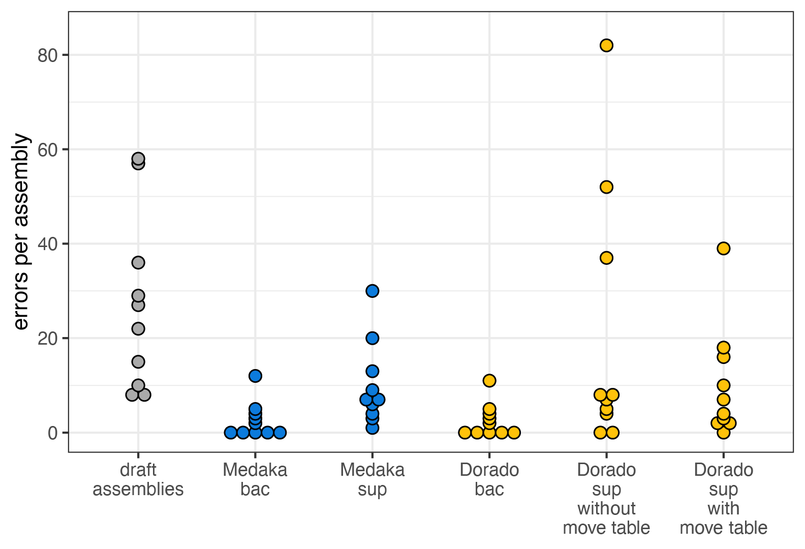

# Basics of long-read assemblies polishing 

Even a well-assembled, closed bacterial genome from long reads still carries the platform's raw per-base error rate baked into it. Polishing is the step that fixes this: it takes your draft assembly and a set of reads, lines the reads up against the draft, and uses that pileup to correct the consensus sequence base by base. This section covers medaka, the standard tool for polishing ONT assemblies, how to pick the right model for bacterial data, and where it fits alongside short-read polishing.

## What is polishing, and why does it matter?

Long-read errors aren't spread evenly across a genome — they cluster heavily around homopolymers, runs of the same base repeated several times in a row (such as `AAAAAA`). Because the raw nanopore signal for a homopolymer looks broadly similar regardless of exactly how many repeats are actually there, getting the precise length of the run right is one of the hardest things for a basecaller to do consistently, and it's the single most common source of remaining errors in a draft long-read assembly. Polishing is largely about correcting exactly this kind of error.

There are two broad approaches to polishing: long-read-only methods, which try to correct errors using nothing but the long-read data itself, and short-read polishing, where additional short-read sequencing of the same genome is used to complement and correct the long-read assembly. In this training we will use long-read-only tool - medaka.

## Software overview

### medaka

medaka creates consensus sequences and variant calls from nanopore data using neural networks applied to a pileup of individual reads against a reference — most often your own draft assembly, but sometimes a database reference sequence instead. It's reported to outperform both older sequence-graph-based and signal-based polishing approaches, while also running faster than either.

#### Running medaka

The simplest way to run medaka is through `medaka_consensus`, which uses sensible default settings out of the box. It needs two inputs: your draft assembly in FASTA format, and your basecalls in FASTA or FASTQ format.

```bash
medaka_consensus \
    -i /path/to/basecalls.fastq \
    -d /path/to/draft_assembly.fasta \
    -o /path/to/output_dir \
    -t <int> \
    --bacteria
```

- `-i` — input basecalls, required, FASTA or FASTQ.
- `-d` — input draft assembly, required, FASTA.
- `-o` — output folder (default: `medaka`).
- `-t` — number of threads used to create features (default: 1).
- `-m` — the medaka model to use (default: `r1041_e82_400bps_sup_v5.2.0`). See "Choosing the right model" below for how to pick this, or run `medaka_consensus -h` / `medaka tools list_models` for the full, current list of allowed values.
- `--bacteria` — automatically selects the best model for bacterial and plasmid sequencing (see below), as an alternative to specifying `-m` directly.
- `-p` — prefix for output files (default: `consensus`).
- `-b` — batch size, controls memory use (default: 100).
- `-f` — force overwrite of outputs; by default, medaka reuses existing outputs where present.
- `-x` — force recreation of the alignment index.
- `-g` / `-r` — gap-filling controls: by default, gaps in the consensus are filled in with draft sequence; `-g` turns that off, and `-r` supplies a specific character to use instead.
- `-q` — output the consensus as FASTQ with per-base quality scores, instead of FASTA.
- `-B` — restrict polishing to specific regions.
- `-M` — minimum mapping quality (mapQ) to consider (default: none).

#### Choosing the right model

**Recent basecallers**

Getting good results depends on specifying the correct inference model for the basecaller that generated your reads — the full list of supported models is available by running `medaka tools list_models`.

For bacterial and plasmid sequencing specifically — which covers exactly the kind of native bacterial isolate data used in this training — there's a dedicated research model with improved consensus accuracy, compatible with several basecaller versions across the R10 chemistries. Adding the `--bacteria` flag tells medaka to select this model automatically if it's compatible with your input:

```
medaka_consensus -i ${BASECALLS} -d ${DRAFT} -o ${OUTDIR} -t ${NPROC} --bacteria
```

If the bacterial model isn't compatible with your basecaller, medaka quietly falls back to a legacy default model instead. You can check which one was actually selected by running:

```
medaka tools resolve_model --auto_model consensus_bacteria <input.bam/input.fastq>
```

which reports either `r1041_e82_400bps_bacterial_methylation` (the bacterial model) or the default model name if the bacterial model wasn't applicable.

**Older basecallers**

Older medaka models followed a naming scheme describing both chemistry and basecaller version; these are now deprecated, and if you find yourself reaching for one, it's a sign your data would be better off rebasecalled with a more recent basecaller first rather than propped up with a legacy model.

If automatic model selection isn't successful, you can specify a medaka model directly with `medaka_consensus`'s `-m` flag. Medaka's own model names are short and self-contained — no basecaller software prefix, no explicit kHz sampling-rate tag, no modified-base suffix — so rather than constructing a name, you pick the matching entry directly from medaka's own (fairly short) list (medaka 2.2.2):

```
r103_fast_g507                                r1041_e82_400bps_sup_v4.0.0
r103_hac_g507                                 r1041_e82_400bps_sup_v4.1.0
r103_sup_g507                                 r1041_e82_400bps_sup_v4.2.0
r1041_e82_260bps_fast_g632                    r1041_e82_400bps_sup_v4.3.0
r1041_e82_260bps_hac_g632                     r1041_e82_400bps_sup_v5.0.0
r1041_e82_260bps_hac_v4.0.0                   r1041_e82_400bps_sup_v5.0.0_rl_lstm384_dwells
r1041_e82_260bps_hac_v4.1.0                   r1041_e82_400bps_sup_v5.0.0_rl_lstm384_no_dwells
r1041_e82_260bps_joint_apk_ulk_v5.0.0         r1041_e82_400bps_sup_v5.2.0
r1041_e82_260bps_sup_g632                     r1041_e82_400bps_sup_v5.2.0_rl_lstm384_dwells
r1041_e82_260bps_sup_v4.0.0                   r1041_e82_400bps_sup_v5.2.0_rl_lstm384_no_dwells
r1041_e82_260bps_sup_v4.1.0                   r104_e81_fast_g5015
r1041_e82_400bps_bacterial_methylation        r104_e81_hac_g5015
r1041_e82_400bps_fast_g615                    r104_e81_sup_g5015
r1041_e82_400bps_fast_g632                    r104_e81_sup_g610
r1041_e82_400bps_hac_g615                     r941_e81_fast_g514
r1041_e82_400bps_hac_g632                     r941_e81_hac_g514
r1041_e82_400bps_hac_v4.0.0                   r941_e81_sup_g514
r1041_e82_400bps_hac_v4.1.0                   r941_min_fast_g507
r1041_e82_400bps_hac_v4.2.0                   r941_min_hac_g507
r1041_e82_400bps_hac_v4.3.0                   r941_min_sup_g507
r1041_e82_400bps_hac_v5.0.0                   r941_prom_fast_g507
r1041_e82_400bps_hac_v5.0.0_rl_lstm384_dwells  r941_prom_hac_g507
r1041_e82_400bps_hac_v5.0.0_rl_lstm384_no_dwells  r941_prom_sup_g507
r1041_e82_400bps_hac_v5.2.0                   r941_sup_plant_g610
r1041_e82_400bps_hac_v5.2.0_rl_lstm384_dwells
r1041_e82_400bps_hac_v5.2.0_rl_lstm384_no_dwells
r1041_e82_400bps_hac_v6.0.0
r1041_e82_400bps_hac_v6.0.0_rl_lstm384_dwells
r1041_e82_400bps_hac_v6.0.0_rl_lstm384_no_dwells
r1041_e82_400bps_sup_g615
```

Every medaka model name is built from the same handful of components: pore type (`r941`, `r103`, `r104`, `r1041`), chemistry code (`e81`/`e82` — present on most entries, but absent from `r103_*` and from the `r941_min_*`/`r941_prom_*`/`r941_sup_plant_g610` entries), translocation speed (`260bps`/`400bps` — only shown on r1041 entries, the one pore generation that actually offered both), a model type, and a version tag. Where older and newer models differ is in the model type and version vocabulary:

- **Current models** use `fast` / `hac` / `sup` for model type, and either a semantic version (`v4.0.0` through `v6.0.0`) or a Guppy-derived release tag (`g507`, `g514`, `g610`, `g615`, `g632`, `g5015`) for version.
- **Older models** use different vocabulary for model type — `high` (short for "high accuracy"), rather than `hac` — and their version tag is simply the Guppy release number with the dots removed. 

So with only a handful of entries in the current list, and a predictable naming pattern behind even the older, no-longer-listed ones, you don't need automatic detection to find a match — if you know your data's pore type, device (`min` for MinION, `prom` for PromethION), basecalling mode, and the Guppy version it was called with, you can match or construct the model name directly: `r<pore>_<device>_<mode>_g<Guppy version, dots removed>` for an older-style name, or a direct match against the list above for a current one.

```bash
medaka_consensus \
    -i ${BASECALLS} \
    -d ${DRAFT} \
    -o ${OUTDIR} \
    -t ${NPROC} \
    -m r941_min_high_g360
```

#### Which draft assembler does medaka expect?

It's worth knowing that medaka has specifically been trained to correct draft sequences produced by the Flye assembler — which lines up neatly with the assembly workflow used earlier in this training. If you feed it a draft from a different assembler, such as Canu or wtdbg2, results may be different, since that's simply not the data medaka was trained against.

#### Medaka vs Dorado: how much does the polisher matter?

Dorado has recently gained its own polishing capability, which raises an obvious question for bacterial genome work: does it matter which one you use? One detailed independent comparison tested this directly, polishing 10 bacterial draft genomes (each containing a mix of introduced errors, totalling 270 errors across the set) using five different polishing configurations:

| Polisher | Model | Errors remaining | Overall Q-score | Time | RAM |
|---|---|---|---|---|---|
| *(unpolished draft)* | — | 270 | Q52.2 | n/a | n/a |
| Medaka-bac | bacterial methylation model (`--bacteria`) | 26 | Q62.4 | 0:02:09 | 7.2 GB |
| Medaka-sup | default sup model | 100 | Q56.5 | 0:01:44 | 7.1 GB |
| Dorado-bac | bacterial methylation model (`--bacteria`) | 25 | Q62.5 | 0:03:30 | 10.3 GB |
| Dorado-sup | default sup model | 203 | Q53.4 | 1:00:35 | 46.5 GB |
| Dorado-sup-mv | default sup model, with move-table data | 101 | Q56.5 | 1:02:23 | 46.7 GB |


*Source: https://rrwick.github.io/2025/02/07/dorado-polish.html*

The two bacterial-specific models — Medaka-bac and Dorado-bac — came out clearly ahead of the rest, each cutting errors roughly 10-fold (from Q52 to Q62), which isn't surprising given these are the models ONT specifically recommends for native bacterial DNA. What's more striking is that Medaka-bac and Dorado-bac produced results that were nearly identical, differing by just a single base pair across all 10 genomes — strongly suggesting the two tools are currently using the same underlying trained weights for bacterial polishing, not just a similar architecture. For now, that means Medaka and Dorado are effectively interchangeable for this specific task, though it's plausible ONT will shift its recommended tooling toward Dorado over time, which could eventually see Medaka deprecated. The practical takeaway either way is the same: whichever tool you use, make sure you're actually invoking the bacterial-specific model — the generic "sup" models left two to four times as many errors on the table.

#### Polishing at scale

`medaka_consensus` is convenient for a single genome or a small batch, but it isn't the most efficient option once you're running many samples at scale. Internally, it performs three discrete steps, and running them separately gives you much more control over parallelism:

1. **Alignment** — reads are aligned to the draft assembly via `mini_align`, which is essentially a thin wrapper around minimap2.
2. **Inference** — `medaka inference` runs the neural network across assembly regions. This step is normally the bottleneck, but it parallelises easily: passing a `--regions` argument restricts a given job to particular sequences from the alignment, so you can run several regions as separate jobs simultaneously.
3. **Aggregation** — `medaka sequence` collects the results from one or more `.hdf` files produced in step 2 and assembles them into the final consensus sequence.

One practical note on threading: it's not worth setting `--threads` above 2 for `medaka inference`, since compute scaling efficiency drops off sharply beyond that point. Also budget for slightly more resource use than the thread count suggests — medaka inference typically uses around `<threads> + 4`, since an additional four threads handle reading and preparing input data in the background.

#### Outputs

TO DO

### Racon

TO DO

## Should you polish with short reads too?

This training polishes assemblies using long reads alone, which should be enough if the recent flow cell chemistries and basecalling models were used to create the data. If you want to push accuracy further, though, a common approach is to also polish with short reads. An example of a workflow could be: 1. Assemble with long reads
2. Polish with long reads using Racon (typically four rounds)
3. Polish once more with long reads using medaka
4. Finish with short-read polishing — commonly two rounds with Pilon. 
It's a longer pipeline, and not always necessary, but it's worth knowing the option exists if a particular genome needs the extra accuracy.

# Exercise

1. Work out which medaka model to use to polish your sample, using the Sample table together with the model information above. 
   - **SRR\* samples** — look up the sample's device, flow cell, basecalling mode and medaka version in the table, then find matching entries directly in that version of medaka model list (`medaka tools list_models`) - what options do you have? Which one should you go for?
   - **ERR\* samples** — the table gives a Guppy version (v3.6.0) and basecalling mode, but no medaka version. Check medaka's own changelog/release notes first, to find which medaka version actually introduced — and later defaulted to — a model for this Guppy version. Then use the table's device and flow cell alongside that changelog information to name the specific model. Finally, confirm whether that model is actually available by listing the models your installed medaka currently offers (`medaka tools list_models`) — is it there?
2. Run your *de novo* assembly through medaka to polish the genome, using the model you identified in step 1. You can use the following command as a starting point:

```bash

# EDIT THESE LINES
# Replace with the path to your sample FASTQ file
input_fastq=$(realpath "$1")
# The model you identified in step 1
medaka_model="r941_min_fast_g507"

# Derive the sample ID and set the input/output file paths
sample_id=$(basename "${input_fastq}" .fastq.gz)
filtered_fastq="filtered/${sample_id}.filtered.fastq.gz"
draft_assembly="draft_assembly.fasta"

# Polish the draft assembly using the filtered reads
medaka_consensus \
    -i "${filtered_fastq}" \
    -d "${draft_assembly}" \
    -o medaka \
    -t "${THREADS}" \
    -m "${medaka_model}"
```
3. Run QC (QUAST + BUSCO) on the polished assembly.
4. Inspect the outputs and answer the following questions:
   - How did the contig lengths change after polishing?
   - How many corrections did medaka make?
   - What was the most frequent correction it made?

Answers

TO DO
