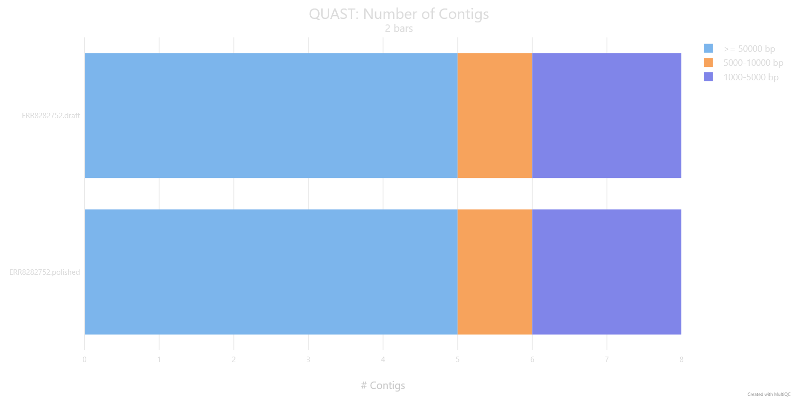
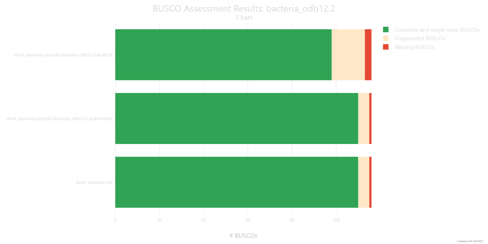

# Basics of long-read assemblies polishing 

!!! hint Learning objectives

    - Explain why even a well-assembled long-read genome still needs polishing
    - Run medaka to polish a draft assembly, and choose an appropriate model for your data
    - Compare QUAST and BUSCO metrics before and after polishing to assess whether it improved the assembly

Even a well-assembled, closed bacterial genome from long reads still carries the platform's raw per-base error rate baked into it. Polishing is the step that fixes this: it takes your draft assembly and a set of reads, lines the reads up against the draft, and uses that pileup to correct the consensus sequence base by base. This section covers medaka, the standard tool for polishing ONT assemblies, how to pick the right model for bacterial data, and where it fits alongside short-read polishing.

## What is polishing, and why does it matter?

Long-read errors aren't spread evenly across a genome — they cluster heavily around homopolymers, runs of the same base repeated several times in a row (such as `AAAAAA`). Because the raw nanopore signal for a homopolymer looks broadly similar regardless of exactly how many repeats are actually there, getting the precise length of the run right is one of the hardest things for a basecaller to do consistently, and it's the single most common source of remaining errors in a draft long-read assembly. Polishing is largely about correcting exactly this kind of error.

There are two broad approaches to polishing: long-read-only methods, which try to correct errors using nothing but the long-read data itself, and short-read polishing, where additional short-read sequencing of the same genome is used to complement and correct the long-read assembly. In this training we will use long-read-only tool - medaka.

### Should you polish with short reads too?

This training polishes assemblies using long reads alone, which should be enough if the recent flow cell chemistries and basecalling models were used to create the data. If you want to push accuracy further, though, a common approach is to also polish with short reads. An example of a workflow could be: 
1. Assemble with long reads
2. Polish with long reads using Racon (several rounds)
3. Polish once more with long reads using medaka
4. Finish with short-read polishing (several rounds as well)
It's a longer pipeline, and not always necessary, but it's worth knowing the option exists if a particular genome needs the extra accuracy.

## Software overview

### medaka

medaka creates consensus sequences and variant calls from nanopore data using neural networks applied to a pileup of individual reads against a reference — most often your own draft assembly, but sometimes a database reference sequence instead. It's reported to outperform both older sequence-graph-based and signal-based polishing approaches, while also running faster than either.

#### Which draft assembler does medaka expect?

It's worth knowing that medaka has specifically been trained to correct draft sequences produced by the Flye assembler — which lines up neatly with the assembly workflow used earlier in this training. If you feed it a draft from a different assembler, such as Canu or wtdbg2, results may be different, since that's simply not the data medaka was trained against.

#### Running medaka

The simplest way to run medaka is through `medaka_consensus`, which uses sensible default settings out of the box. It needs two inputs: your draft assembly in FASTA format, and your basecalls in FASTA or FASTQ format. This is the command we are going to use today:

```bash
medaka_consensus \
    -i /path/to/filtered.fastq \
    -d /path/to/draft_assembly.fasta \
    -m <model> \
    -o /path/to/output_dir \
    -t <int> \
    -b 50
```

- `-i` — input basecalls, required, FASTA or FASTQ.
- `-d` — input draft assembly, required, FASTA.
- `-m` — the medaka model to use. See "Choosing the right model" below for how to pick this.
- `-o` — output folder (default: `medaka`).
- `-t` — number of threads used to create features (default: 1).
- `-b` — batch size, controls memory use (default: 100). This training's pipeline uses `-b 50` to keep memory use down.

`medaka_consensus` has several other options — for the full list, run `medaka_consensus -h` or see the [medaka documentation](https://github.com/nanoporetech/medaka).

#### Choosing the right model

**Recent basecallers**

Getting good results depends on specifying the correct inference model for the basecaller that generated your reads — the full list of supported models is available by running `medaka tools list_models`.

For bacterial and plasmid sequencing specifically — which covers exactly the kind of native bacterial isolate data used in this training — there's a dedicated research model with improved consensus accuracy, compatible with several basecaller versions across the R10 chemistries. Adding the `--bacteria` flag tells medaka to select this model automatically if it's compatible with your input:

```bash
medaka_consensus \
    -i /path/to/filtered.fastq \
    -d /path/to/draft_assembly.fasta \
    --bacteria \
    -o /path/to/output_dir \
    -t <int> \
    -b 50
```

If the bacterial model isn't compatible with your basecaller, medaka quietly falls back to a legacy default model instead. You can check which one was actually selected by running:

```
medaka tools resolve_model --auto_model consensus_bacteria <input.bam/input.fastq>
```

which reports either `r1041_e82_400bps_bacterial_methylation` (the bacterial model) or the default model name if the bacterial model wasn't applicable.

**Older basecallers**

If automatic model selection isn't successful, you can specify a medaka model directly with `medaka_consensus`'s `-m` flag. Medaka's own model names are short and self-contained — no basecaller software prefix, no explicit kHz sampling-rate tag, no modified-base suffix. For example, here is a list of models available in `medaka 2.2.2`:

```
r103_fast_g507                                r1041_e82_400bps_sup_v4.0.0
r103_hac_g507                                 r1041_e82_400bps_sup_v4.1.0
r103_sup_g507                                 r1041_e82_400bps_sup_v4.2.0
r1041_e82_260bps_fast_g632                    r1041_e82_400bps_sup_v4.3.0
r1041_e82_260bps_hac_g632                     r1041_e82_400bps_sup_v5.0.0
r1041_e82_260bps_hac_v4.0.0                   r1041_e82_400bps_sup_v5.0.0_rl_lstm384_dwells
r1041_e82_260bps_hac_v4.1.0                   r1041_e82_400bps_sup_v5.0.0_rl_lstm384_no_dwells
r1041_e82_260bps_joint_apk_ulk_v5.0.0         r1041_e82_400bps_sup_v5.2.0
r1041_e82_260bps_sup_g632                     r1041_e82_400bps_sup_v5.2.0_rl_lstm384_dwells
r1041_e82_260bps_sup_v4.0.0                   r1041_e82_400bps_sup_v5.2.0_rl_lstm384_no_dwells
r1041_e82_260bps_sup_v4.1.0                   r104_e81_fast_g5015
r1041_e82_400bps_bacterial_methylation        r104_e81_hac_g5015
r1041_e82_400bps_fast_g615                    r104_e81_sup_g5015
r1041_e82_400bps_fast_g632                    r104_e81_sup_g610
r1041_e82_400bps_hac_g615                     r941_e81_fast_g514
r1041_e82_400bps_hac_g632                     r941_e81_hac_g514
r1041_e82_400bps_hac_v4.0.0                   r941_e81_sup_g514
r1041_e82_400bps_hac_v4.1.0                   r941_min_fast_g507
r1041_e82_400bps_hac_v4.2.0                   r941_min_hac_g507
r1041_e82_400bps_hac_v4.3.0                   r941_min_sup_g507
r1041_e82_400bps_hac_v5.0.0                   r941_prom_fast_g507
r1041_e82_400bps_hac_v5.0.0_rl_lstm384_dwells  r941_prom_hac_g507
r1041_e82_400bps_hac_v5.0.0_rl_lstm384_no_dwells  r941_prom_sup_g507
r1041_e82_400bps_hac_v5.2.0                   r941_sup_plant_g610
r1041_e82_400bps_hac_v5.2.0_rl_lstm384_dwells
r1041_e82_400bps_hac_v5.2.0_rl_lstm384_no_dwells
r1041_e82_400bps_hac_v6.0.0
r1041_e82_400bps_hac_v6.0.0_rl_lstm384_dwells
r1041_e82_400bps_hac_v6.0.0_rl_lstm384_no_dwells
r1041_e82_400bps_sup_g615
```

Every medaka model name is built from the same handful of components: pore type (`r941`, `r103`, `r104`, `r1041`), chemistry code (`e81`/`e82` — present on most entries, but absent from `r103_*` and from the `r941_min_*`/`r941_prom_*`/`r941_sup_plant_g610` entries), translocation speed (`260bps`/`400bps` — only shown on r1041 entries, the one pore generation that actually offered both), a model type, and a version tag. Where older and newer models differ is in the model type and version vocabulary:

- **Current models** use `fast` / `hac` / `sup` for model type, and either a semantic version (`v4.0.0` through `v6.0.0`) or a Guppy-derived release tag (`g507`, `g514`, `g610`, `g615`, `g632`, `g5015`) for version.
- **Older models** use different vocabulary for model type — `high` (short for "high accuracy"), rather than `hac` — and their version tag is simply the Guppy release number with the dots removed. 

!!! info Medaka vs Dorado: how much does the polisher matter?

    Dorado has recently gained its own polishing capability, which raises an obvious question for bacterial genome work: does it matter which one you use? One detailed independent comparison tested this directly, polishing 10 bacterial draft genomes (each containing a mix of introduced errors, totalling 270 errors across the set) using five different polishing configurations:
    * Medaka-bac (bacterial methylation model)
    * Medaka-sup (default sup model)
    * Dorado-bac (bacterial methylation model; `--bacteria`)
    * Dorado-sup (default sup model)
    * Dorado-sup-mv (default sup model, with move-table data)

    
    *Source: https://rrwick.github.io/2025/02/07/dorado-polish.html*

    The two bacterial-specific models — Medaka-bac and Dorado-bac — came out clearly ahead of the rest, each cutting errors roughly 10-fold (from Q52 to Q62), which isn't surprising given these are the models ONT specifically recommends for native bacterial DNA. What's more striking is that Medaka-bac and Dorado-bac produced results that were nearly identical, differing by just a single base pair across all 10 genomes — strongly suggesting the two tools are currently using the same underlying trained weights for bacterial polishing, not just a similar architecture. For now, that means Medaka and Dorado are effectively interchangeable for this specific task, though it's plausible ONT will shift its recommended tooling toward Dorado over time, which could eventually see Medaka deprecated. The practical takeaway either way is the same: whichever tool you use, make sure you're actually invoking the bacterial-specific model — the generic "sup" models left two to four times as many errors on the table.

#### Outputs

`medaka_consensus` doesn't polish in one single step — internally it runs alignment, then inference, then aggregation, and each of these leaves a file behind in the output folder:

- `calls_to_draft.bam` / `calls_to_draft.bam.bai` — your input reads aligned against the draft assembly (via `mini_align`, a wrapper around minimap2), plus its index.
- `consensus_probs.hdf` — the neural network's per-position output from the inference step, ahead of being turned into a sequence.
- `consensus.fasta` — the final polished assembly, aggregated from the `.hdf` file(s). This is the file used downstream in the rest of the pipeline.
- `consensus.fasta.gaps_in_draft_coords.bed` — a BED file marking any regions, in draft-assembly coordinates, where medaka had no read-based evidence to polish and instead fell back to the original draft sequence (this is what the `-g`/`-r` options control).

To see what polishing actually changes, we ran QUAST and BUSCO on both the draft and the polished `consensus.fasta` for `ERR8282752`, then combined the reports with MultiQC:

| Assembly | N50 (Kbp) | L50 | Largest contig (Kbp) | Total length (Mbp) |
|---|---|---|---|---|
| draft | 5057.19 | 1 | 5057.19 | 5.358 |
| polished | 5058.99 | 1 | 5058.99 | 5.360 |



*The number and size distribution of contigs is unchanged by polishing (5 contigs ≥50 kb, 1 in the 5–10 kb range, 2 in the 1–5 kb range, both before and after) — medaka corrects base-level errors within the existing contigs rather than changing the assembly's structure, which is why N50, L50 and the largest contig barely move.*



*BUSCO tells a different story: complete and single-copy BUSCOs rise from 98 to 110, fragmented BUSCOs fall from 15 to 5, and missing BUSCOs fall from 3 to 1. Genes that were incomplete or truncated in the draft are recovered once those base-level errors are corrected. This is the polishing benefit that a purely structural metric like N50 can't show.*

!!! success Wrap-up

    You've polished your draft assembly with medaka and, in doing so, worked through how to pick the right model for both recent and older basecalled data. Next, in the annotation module, we'll use this polished assembly to search for antimicrobial resistance genes.

# Exercise

1. Work out which medaka model to use to polish your sample, using [the samples information](00.samples.md) together with the model information above. We checked medaka's changelog/release notes for you, to find which versions of medaka you could use (we are going to use `medaka 1.3.3` for this exercise). Confirm whether that model is actually available by listing the models (`medaka tools list_models`) — is it there?
2. Run your *de novo* assembly through medaka to polish the genome, using the model you identified in step 1. You can use the following command as a starting point:

```bash
# EDIT THESE LINES
# Replace with the path to your filtered sample FASTQ file
filtered_fastq="filtered/<sample_id>.filtered.fastq.gz"
# The model you identified in step 1
medaka_model=<your_model>

# Set the name of the draft assembly file 
draft_assembly="draft_assembly.fasta"

# Polish the draft assembly using the filtered reads
medaka_consensus \
    -i "${filtered_fastq}" \
    -d "${draft_assembly}" \
    -o medaka \
    -t 4 \
    -m "${medaka_model}"
```
3. Run QC (QUAST + BUSCO) on the polished assembly. Run MultiQC on the entire analysis folder. Answer the following questions:
    1. How did the N50 and L50 values and the longest contig change for your assembly after polishing?
    2. How did the number of complete and single-copy BUSCOs change after polishing?
    3. Did polishing improve the quality of the assembly?

!!! solution Solution

    | Metric | ERR8282742 (draft) | ERR8282742 (polished) | ERR8282751 (draft) | ERR8282751 (polished) | ERR8282753 (draft) | ERR8282753 (polished) |
    |---|---|---|---|---|---|---|
    | N50 (Kbp) | 6193.75 | 6195.10 | 4871.22 | 4872.77 | 3782.87 | 3784.16 |
    | L50 | 1 | 1 | 1 | 1 | 1 | 1 |
    | Largest contig (Kbp) | 6193.75 | 6195.10 | 4871.22 | 4872.77 | 3782.87 | 3784.16 |
    | Total length (Mbp) | 6.808 | 6.810 | 4.989 | 4.991 | 3.937 | 3.938 |
    | Complete & single-copy BUSCOs | 106 | 113 | 101 | 113 | 97 | 112 |

    1. Barely at all. All three genomes assemble into the same small number of contigs before and after polishing (L50 = 1 in every case, i.e. a single contig accounts for half the assembly), so polishing doesn't restructure the assembly. N50 and the longest contig do shift slightly upward (by roughly 1–2 kb out of several Mb), because medaka is filling in small indels within contigs, not merging or breaking them.
    2. It went up for every sample: 106 → 113 (ERR8282742), 101 → 113 (ERR8282751), 97 → 112 (ERR8282753). Genes that were broken by small base-level errors in the draft becoming complete again once those errors were corrected.
    3. Yes. Polishing barely changes assembly structure (contig count, N50, L50 are all essentially unchanged), but it does correct base-level errors that were disrupting gene predictions — reflected in every sample's BUSCO completeness improving. 

# References

TO DO