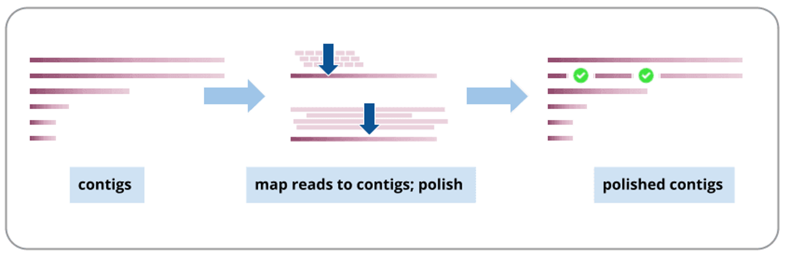
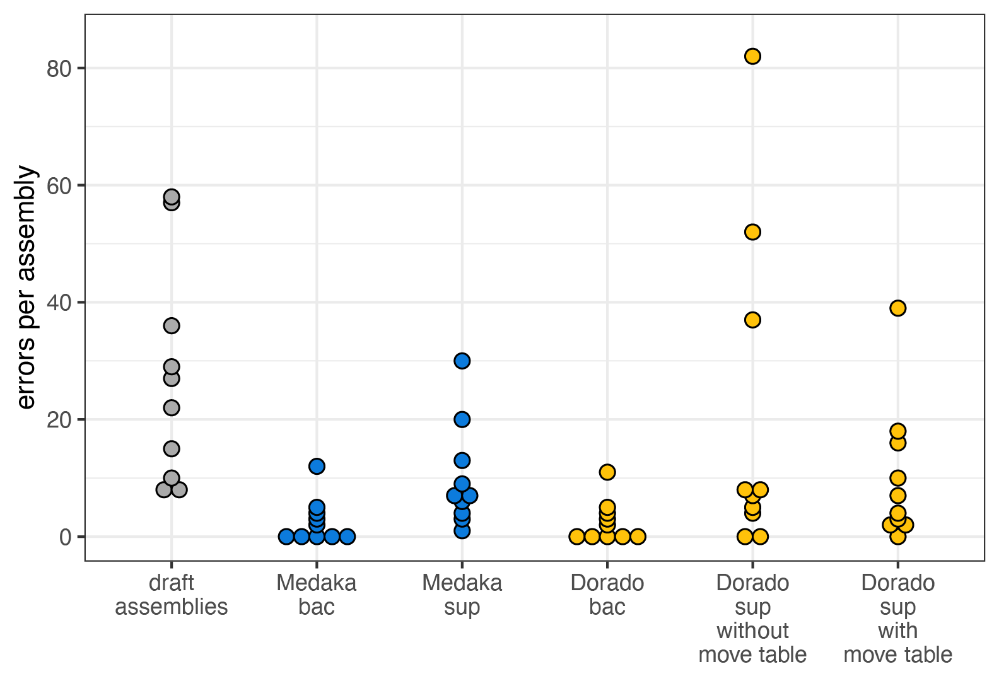
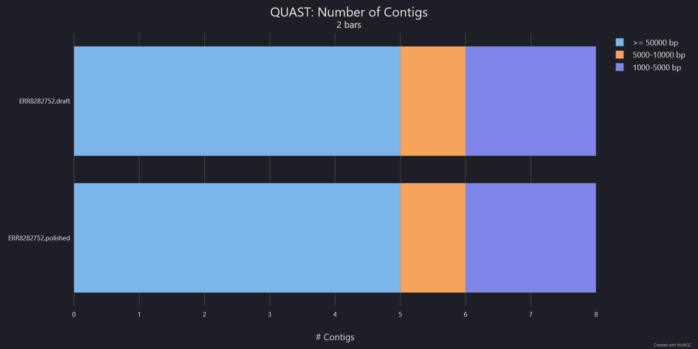
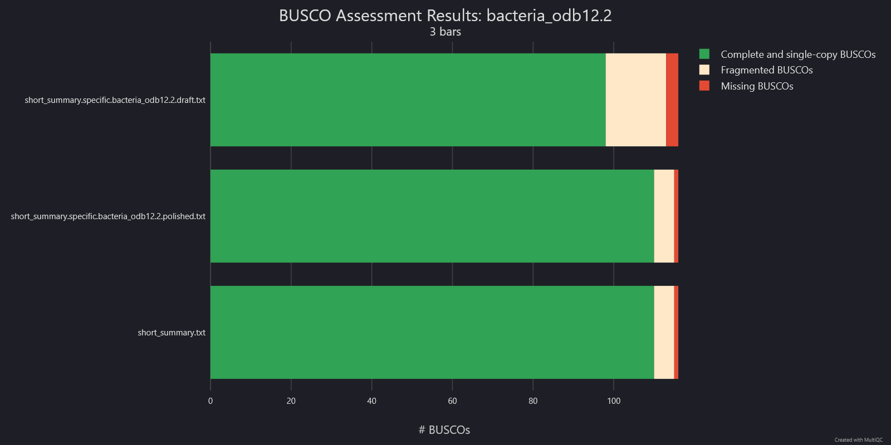

# Lesson 8 - Long-read assemblies polishing

!!! hint "Learning objectives"

    - Explain why even a well-assembled long-read genome still needs polishing
    - Run medaka to polish a draft assembly, and choose an appropriate model for your data
    - Compare QUAST and BUSCO metrics before and after polishing to assess whether it improved the assembly

Even a well-assembled, closed bacterial genome from long reads still carries the platform's raw per-base error rate baked into it. Polishing is the step that fixes this: it takes your draft assembly and a set of reads, lines the reads up against the draft, and uses that pileup to correct the consensus sequence base by base. This section covers medaka, the standard tool for polishing ONT assemblies, how to pick the right model for bacterial data, and where it fits alongside short-read polishing.

## 8.1 What is polishing, and why does it matter?

Long-read errors aren't spread evenly across a genome — they cluster heavily around homopolymers, runs of the same base repeated several times in a row (such as `AAAAAA`). Because the raw nanopore signal for a homopolymer looks broadly similar regardless of exactly how many repeats are actually there, getting the precise length of the run right is one of the hardest things for a basecaller to do consistently, and it's the single most common source of remaining errors in a draft long-read assembly. Polishing is largely about correcting exactly this kind of error.



*Polishing maps the reads back against the draft contigs, then uses that pileup to correct the consensus sequence, producing polished contigs. Source: [Assembly of a large genome | Galaxy Training Material](https://training.galaxyproject.org/training-material/topics/assembly/tutorials/largegenome/tutorial.html)*

There are two broad approaches to polishing: long-read-only methods, which try to correct errors using nothing but the long-read data itself, and short-read polishing, where additional short-read sequencing of the same genome is used to complement and correct the long-read assembly. In this training we will use a long-read-only tool — medaka.

### 8.1.1 Should you polish with short reads too?

This training polishes assemblies using long reads alone, which should be enough if recent flow cell chemistries and basecalling models were used to create the data. If you want to push accuracy further, though, a common approach is to also polish with short reads. An example of a workflow could be: 
1. Assemble with long reads
2. Polish with long reads using Racon (several rounds)
3. Polish once more with long reads using medaka
4. Finish with short-read polishing (several rounds as well)
It's a longer pipeline, and not always necessary, but it's worth knowing the option exists if a particular genome needs the extra accuracy.

## 8.2 Software overview

### 8.2.1 medaka

medaka creates consensus sequences and variant calls from nanopore data using neural networks applied to a pileup of individual reads against a reference — most often your own draft assembly, but sometimes a database reference sequence instead. It's reported to outperform both older sequence-graph-based and signal-based polishing approaches, while also running faster than either.

#### 8.2.1.1 Which draft assembler does medaka expect?

It's worth knowing that medaka has specifically been trained to correct draft sequences produced by the Flye assembler — which lines up neatly with the assembly workflow used earlier in this training. If you feed it a draft from a different assembler, such as Canu or wtdbg2, results may be different, since that's simply not the data medaka was trained against.

#### 8.2.1.2 Running medaka

The simplest way to run medaka is through `medaka_consensus`, which uses sensible default settings out of the box. It needs two inputs: your draft assembly in FASTA format, and your basecalls in FASTA or FASTQ format. This is the command we are going to use today:

```bash
medaka_consensus \
    -i /path/to/filtered.fastq \
    -d /path/to/draft_assembly.fasta \
    -m <model> \
    -o /path/to/output_dir \
    -t <int> \
    -b 50
```

- `-i` — input basecalls, required, FASTA or FASTQ.
- `-d` — input draft assembly, required, FASTA.
- `-m` — the medaka model to use. See [Older vs newer data (Section 8.2.1.3)](#8213-older-vs-newer-data) for how to pick this.
- `-o` — output folder (default: `medaka`).
- `-t` — number of threads used to create features (default: 1).
- `-b` — batch size, controls memory use (default: 100). This training's pipeline uses `-b 50` to keep memory use down.

`medaka_consensus` has several other options — for the full list, run `medaka_consensus -h` or see the [medaka documentation](https://github.com/nanoporetech/medaka).

!!! warning "Wall of `SyntaxWarning: "is" with a literal` when medaka starts?"
    Older medaka versions — including the `1.3.3` this training uses — bundle an old TensorFlow release that triggers this on Python 3.8+. It's a known, purely stylistic Python warning about code inside TensorFlow itself, fired the moment it's imported — not something tied to your command or data. Ignore it and let medaka keep running.

#### 8.2.1.3 Older vs newer data

"Older" and "newer" here describe how your reads were generated, not when you happen to be running medaka: older data means R9.4.1 chemistry, generally basecalled with an older Guppy release; newer data means R10 chemistry (R10.3, R10.4, or R10.4.1), basecalled with a current basecaller (Dorado, or a recent Guppy). This split matters because medaka's active development is entirely on the newer side: automatic model selection and the `--bacteria` flag only work for R10 chemistry, while R9.4.1 support is only ever removed from new medaka releases, never added to — so older data increasingly needs you to work out both the right model *and* the right (older) medaka version by hand, where newer data mostly doesn't. They're covered separately below: [Older data](#8214-older-data) first, then [Newer data](#8215-newer-data).

Either way, you need to know how the reads were generated, including:

- the pore and sequencing chemistry — e.g. R9.4.1, R10.4.1
- the sequencing device — e.g. MinION, PromethION
- the translocation speed — 260 bps or 400 bps, where applicable (newer chemistry only)
- the basecaller accuracy model — fast / high accuracy / super accuracy
- the basecaller version — a Guppy release or a Dorado model version

!!! warning "Medaka's own recommendation for older data: rebasecall it"
    Before working through [Older data](#8214-older-data) below, know that it isn't medaka's own preferred path — it's ONT's stated position for older data generally. Medaka's own documentation says so directly: *"Historically medaka models followed a nomenclature describing both the chemistry and basecaller versions. These old models are now deprecated, users are encouraged to rebasecall their data with a more recent basecaller version prior to using medaka."* ([medaka on PyPI](https://pypi.org/project/medaka/)) If you still have the raw signal (FAST5/POD5) for this run, rebasecalling with a current basecaller (Dorado, or a recent Guppy) is the preferred path, not a last resort — it also gets you the accuracy improvements of a modern basecalling model, not just a model medaka happens to still support. 

#### 8.2.1.4 Older data

This section is for when rebasecalling genuinely isn't an option — no raw signal survives for this run, only the already-basecalled reads.

For R9.4.1 chemistry, an older-style model name like `r941_prom_high_g303` breaks down as:

| Component | Meaning |
|---|---|
| `r941` | R9.4.1 pore and chemistry |
| `prom` | PromethION sequencing device |
| `high` | High-accuracy basecalling model |
| `g303` | Guppy version 3.0.3, with the dots removed |

There's no automatic model selection or `--bacteria` flag for this chemistry (see [Newer data](#8215-newer-data) for those) — work out the model name from your basecaller's details, then specify it directly with `medaka_consensus`'s `-m` flag (the rest of the command is the same as [Section 8.2.1.2](#8212-running-medaka)):

```bash
medaka_consensus \
    -i /path/to/filtered.fastq \
    -d /path/to/draft_assembly.fasta \
    -m <model_name> \
    -o /path/to/output_dir \
    -t <int> \
    -b 50
```

Once you have the model name, check whether *any* medaka release still ships it: browse the `medaka/data` folder of a tagged version directly on GitHub, tag by tag, to see exactly which models that release shipped — e.g. [github.com/nanoporetech/medaka/tree/v1.2.0/medaka/data](https://github.com/nanoporetech/medaka/tree/v1.2.0/medaka/data) for `v1.2.0` — or check [medaka's changelog](https://github.com/nanoporetech/medaka/blob/master/CHANGELOG.md) to see when a given model was first added. These models are dropped from newer medaka releases over time, so don't assume a recent version still has it. If you do find it, pin that medaka version and use the model directly. This is exactly the situation this training's own ERR\* samples are in (Guppy v3.6.0), which is why their exercise uses `medaka 1.3.3` rather than the current release.

!!! tip "Model not listed in any medaka version you can find, and no raw signal data available to rebasecall?"
    Fall back to the closest available model on the same pore, chemistry, and accuracy tier — but stay on the same chemistry if possible. Crossing chemistries could cost you more than a version mismatch does: on `medaka 2.2.2`, running R9.4.1 data through the same-chemistry fallback `r941_min_hac_g507` produced a bigger polishing improvement than letting medaka fall back to its R10 default model, `r1041_e82_400bps_sup_v5.2.0`.

#### 8.2.1.5 Newer data

For R10 chemistry, a current-style model name like `r1041_e82_400bps_sup_v5.2.0` breaks down as:

| Component | Meaning |
|---|---|
| `r1041` | R10.4.1 pore and chemistry |
| `e82` | Associated chemistry/pore configuration |
| `400bps` | Translocation speed (260 or 400 bases per second) |
| `sup` | Super-accuracy basecalling model (`fast` / `hac` / `sup`) |
| `v5.2.0` | Basecaller model version, or a Guppy-derived tag (e.g. `g632`) |

Unlike [older data](#8214-older-data), you often don't need to work this out by hand. For bacterial and plasmid sequencing specifically — which covers exactly the kind of native bacterial isolate data used in this training — there's a dedicated research model with improved consensus accuracy, compatible with several basecaller versions across the R10 chemistries. Adding the `--bacteria` flag tells medaka to select this model automatically if it's compatible with your input:

```bash
medaka_consensus \
    -i /path/to/filtered.fastq \
    -d /path/to/draft_assembly.fasta \
    --bacteria \
    -o /path/to/output_dir \
    -t <int> \
    -b 50
```

If the bacterial model isn't compatible with your basecaller, medaka quietly falls back to a legacy default model instead. You can check which one was actually selected by running:

```
medaka tools resolve_model --auto_model consensus_bacteria <input.bam/input.fastq>
```

which reports either `r1041_e82_400bps_bacterial_methylation` (the bacterial model) or the default model name if the bacterial model wasn't applicable. Outside this bacterial case, specify the model directly instead, with the same `-m` flag and the same "check `list_models`, fall back if needed" approach covered under [Older data](#8214-older-data) — R10 support just means you're far more likely to actually find the exact match in the current release.

!!! info "Medaka vs Dorado: how much does the polisher matter?"

    Dorado has recently gained its own polishing capability, which raises an obvious question for bacterial genome work: does it matter which one you use? One detailed independent comparison tested this directly, polishing 10 bacterial draft genomes (each containing a mix of introduced errors, totalling 270 errors across the set) using five different polishing configurations:
    * Medaka-bac (bacterial methylation model)
    * Medaka-sup (default sup model)
    * Dorado-bac (bacterial methylation model; `--bacteria`)
    * Dorado-sup (default sup model)
    * Dorado-sup-mv (default sup model, with move-table data)

    
    *Source: [Medaka vs Dorado polish | Ryan Wick's bioinformatics blog](https://rrwick.github.io/2025/02/07/dorado-polish.html)*

    The two bacterial-specific models — Medaka-bac and Dorado-bac — came out clearly ahead of the rest, each cutting errors roughly 10-fold (from Q52 to Q62), which isn't surprising given these are the models ONT specifically recommends for native bacterial DNA. What's more striking is that Medaka-bac and Dorado-bac produced results that were nearly identical, differing by just a single base pair across all 10 genomes — strongly suggesting the two tools are currently using the same underlying trained weights for bacterial polishing, not just a similar architecture. For now, that means Medaka and Dorado are effectively interchangeable for this specific task, though it's plausible ONT will shift its recommended tooling toward Dorado over time, which could eventually see Medaka deprecated. The practical takeaway either way is the same: whichever tool you use, make sure you're actually invoking the bacterial-specific model — the generic "sup" models left two to four times as many errors on the table.

#### 8.2.1.6 Outputs

`medaka_consensus` doesn't polish in one single step — internally it runs alignment, then inference, then aggregation, and each of these leaves a file behind in the output folder:

- `calls_to_draft.bam` / `calls_to_draft.bam.bai` — your input reads aligned against the draft assembly (via `mini_align`, a wrapper around minimap2), plus its index.
- `consensus_probs.hdf` — the neural network's per-position output from the inference step, ahead of being turned into a sequence.
- `consensus.fasta` — the final polished assembly, aggregated from the `.hdf` file(s). This is the file used downstream in the rest of the pipeline.
- `consensus.fasta.gaps_in_draft_coords.bed` — a BED file marking any regions, in draft-assembly coordinates, where medaka had no read-based evidence to polish and instead fell back to the original draft sequence (this is what the `-g`/`-r` options control).

To see what polishing actually changes, we ran QUAST and BUSCO on both the draft and the polished `consensus.fasta` for `ERR8282752`, then combined the reports with MultiQC:

| Assembly | N50 (Kbp) | L50 | Largest contig (Kbp) | Total length (Mbp) |
|---|---|---|---|---|
| draft | 5057.19 | 1 | 5057.19 | 5.358 |
| polished | 5058.99 | 1 | 5058.99 | 5.360 |



*The number and size distribution of contigs is unchanged by polishing (5 contigs ≥50 kb, 1 in the 5–10 kb range, 2 in the 1–5 kb range, both before and after) — medaka corrects base-level errors within the existing contigs rather than changing the assembly's structure, which is why N50, L50 and the largest contig barely move.*



*BUSCO tells a different story: complete and single-copy BUSCOs rise from 98 to 110, fragmented BUSCOs fall from 15 to 5, and missing BUSCOs fall from 3 to 1. Genes that were incomplete or truncated in the draft are recovered once those base-level errors are corrected. This is the polishing benefit that a purely structural metric like N50 can't show.*

## 8.3 Exercise: Choose a medaka model

Work out which medaka model to use to polish your sample, using [the samples information](00.samples.md) together with the model information in [Section 8.2.1.4, Older data](#8214-older-data) (we'll use `medaka 1.3.3` for this exercise — we checked medaka's changelog/release notes for you, to find which versions of medaka you could use). Confirm whether that model is actually available by listing the models (`medaka tools list_models`) — is it there?

!!! tip "How you run these commands is up to you"
    Type each command straight into the terminal, or write them into a script and execute that — whichever you find easier. Best to run everything from your home directory unless a step tells you otherwise.

??? success "Solution"
    <!--
    [The samples information](00.samples.md) gives the ERR\* samples' basecalling setup as: R9.4.1 chemistry, MinION device, Guppy v3.6.0, high-accuracy model — this is [older data](#8214-older-data). Mapped onto the model-name components:

    | Component | From the sample metadata | Model component |
    |---|---|---|
    | Pore/chemistry | R9.4.1 | `r941` |
    | Device | MinION | `min` |
    | Accuracy model | High accuracy | `high` |
    | Basecaller version | Guppy 3.6.0 | `g360` (dots removed) |

    Put together, that's `r941_min_high_g360`.
    -->

    ```bash
    medaka tools list_models
    ```

    <!--
    Yes — `r941_min_high_g360` is in the list of models `medaka 1.3.3` ships. (It isn't in more recent medaka releases, e.g. `2.2.2` — see the "Model not listed in any medaka version you can find, and no raw signal data available to rebasecall?" tip in [Section 8.2.1.4](#8214-older-data) — which is exactly why this exercise uses the older `medaka 1.3.3`.)
    -->

## 8.4 Exercise: Polish and assess quality

1. Run your *de novo* assembly through medaka to polish the genome, using the model you identified in the previous exercise.

    ??? success "Solution"
        ```bash
        # EDIT THESE LINES
        # Replace with the path to your filtered sample FASTQ file
        filtered_fastq="filtered/<sample_id>.filtered.fastq.gz"
        # The model you identified in the previous exercise
        medaka_model=r941_min_high_g360

        # Set the name of the draft assembly file
        draft_assembly="draft_assembly.fasta"

        # Polish the draft assembly using the filtered reads
        medaka_consensus \
            -i "${filtered_fastq}" \
            -d "${draft_assembly}" \
            -m "${medaka_model}" \
            -o medaka \
            -t 4 \
            -b 50
        ```

2. Run QC (QUAST + BUSCO) on the polished assembly — the same commands as the Assembly QC module, just pointed at `medaka/consensus.fasta` instead of the draft assembly, writing into `assembly_qc/quast/polished` and `assembly_qc/busco/polished` alongside the draft's own `assembly_qc/quast/draft` and `assembly_qc/busco/draft`.

    ??? success "Solution"
        ```bash
        # QUAST on the polished assembly
        quast \
            medaka/consensus.fasta \
            --labels "${sample_id}_polished" \
            --output-dir assembly_qc/quast/polished \
            --threads 4

        # BUSCO on the polished assembly
        busco \
            --in medaka/consensus.fasta \
            --lineage_dataset ~/data/ref/busco/bacteria_odb12 \
            --out assembly_qc/busco/polished \
            --mode genome \
            --offline \
            --cpu 4
        ```

3. Run MultiQC on the whole `assembly_qc` folder to compare the draft and polished reports side by side.

    ??? success "Solution"
        ```bash
        # MultiQC across the whole assembly_qc folder (draft + polished reports)
        multiqc \
            -o assembly_qc \
            -f \
            --fullnames \
            assembly_qc
        ```

!!! question "Answer the following questions"
    Use the MultiQC report you just generated (`assembly_qc/multiqc_report.html`) to compare the draft and polished statistics side by side (see the Live Server warning in [Section 2.7](02.qc.md#27-multiqc) if it throws a JavaScript error).

    1. How did the N50 and L50 values and the longest contig change for your assembly after polishing?
    2. How did the number of complete and single-copy BUSCOs change after polishing?
    3. Did polishing improve the quality of the assembly?

<!--
??? success "Solution"

    | Metric | ERR8282742 (draft) | ERR8282742 (polished) | ERR8282751 (draft) | ERR8282751 (polished) | ERR8282753 (draft) | ERR8282753 (polished) |
    |---|---|---|---|---|---|---|
    | N50 (Kbp) | 6193.75 | 6195.10 | 4871.22 | 4872.77 | 3782.87 | 3784.16 |
    | L50 | 1 | 1 | 1 | 1 | 1 | 1 |
    | Largest contig (Kbp) | 6193.75 | 6195.10 | 4871.22 | 4872.77 | 3782.87 | 3784.16 |
    | Total length (Mbp) | 6.808 | 6.810 | 4.989 | 4.991 | 3.937 | 3.938 |
    | Complete & single-copy BUSCOs | 106 | 113 | 101 | 113 | 97 | 112 |

    1. Barely at all. All three genomes assemble into the same small number of contigs before and after polishing (L50 = 1 in every case, i.e. a single contig accounts for half the assembly), so polishing doesn't restructure the assembly. N50 and the longest contig do shift slightly upward (by roughly 1–2 kb out of several Mb), because medaka is filling in small indels within contigs, not merging or breaking them.
    2. It went up for every sample: 106 → 113 (ERR8282742), 101 → 113 (ERR8282751), 97 → 112 (ERR8282753). Genes that were broken by small base-level errors in the draft becoming complete again once those errors were corrected.
    3. Yes. Polishing barely changes assembly structure (contig count, N50, L50 are all essentially unchanged), but it does correct base-level errors that were disrupting gene predictions — reflected in every sample's BUSCO completeness improving. 
-->

!!! success "Wrap-up"
    You've polished your draft assembly with medaka and, in doing so, worked through how to pick the right model for both recent and older basecalled data. Next, in the annotation module, we'll use this polished assembly to search for antimicrobial resistance genes.

## 8.5 References

nanoporetech/medaka: Neural-network consensus polishing and variant calling for Oxford Nanopore sequencing data. Accessed September 17, 2026. https://github.com/nanoporetech/medaka

Medaka vs Dorado polish | Ryan Wick’s bioinformatics blog. Accessed September 17, 2026. https://rrwick.github.io/2025/02/07/dorado-polish.html

FAQ: Can we polish the assembly with long reads too? / Chloroplast genome assembly / Assembly. Accessed September 17, 2026. https://training.galaxyproject.org/training-material/topics/assembly/tutorials/chloroplast-assembly/faqs/polish_longreads.html

medaka/CHANGELOG.md at master · nanoporetech/medaka. Accessed September 17, 2026. https://github.com/nanoporetech/medaka/blob/master/CHANGELOG.md

Hands-on: Large genome assembly and polishing / Large genome assembly and polishing / Assembly. Accessed September 30, 2026. https://training.galaxyproject.org/training-material/topics/assembly/tutorials/largegenome/tutorial.html

medaka 2.2.2 | PyPI. Accessed October 1, 2026. https://pypi.org/project/medaka/
  