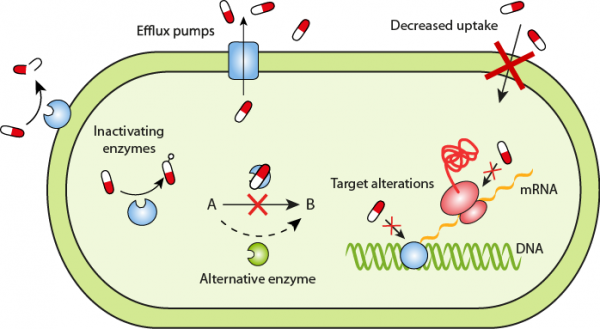
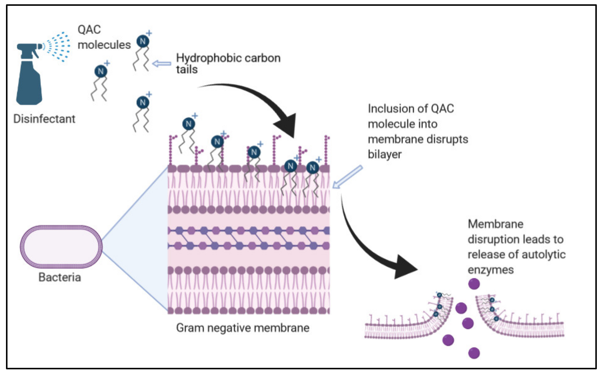
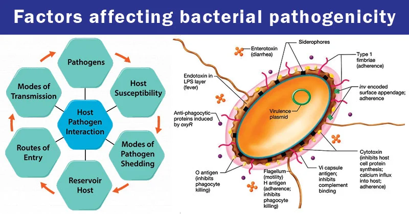
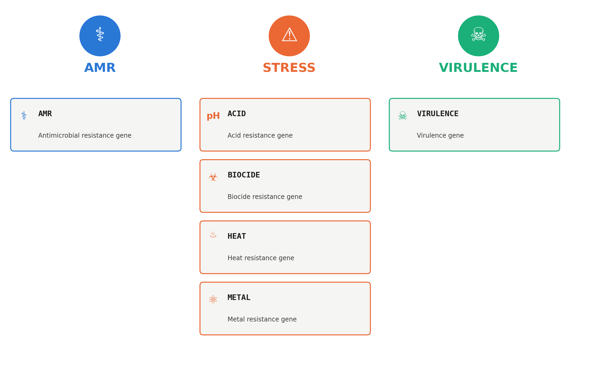
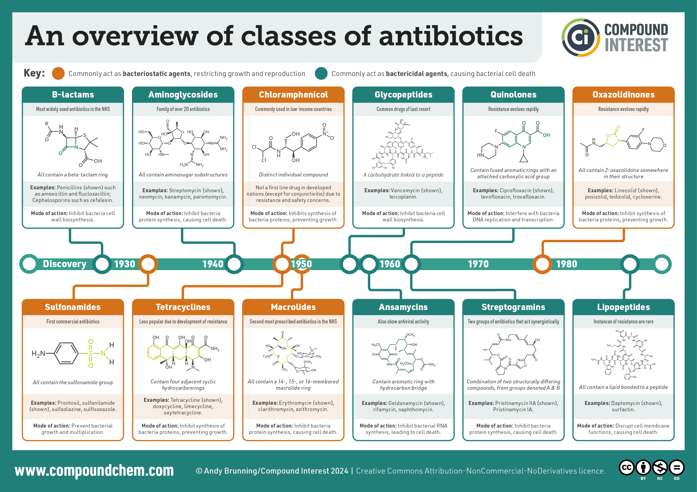

# Basics of antimicrobial resistance gene annotation

!!! hint Learning objectives
    - Explain the difference between intrinsic and acquired antimicrobial resistance, and why plasmid-borne AMR genes are of particular concern
    - Run AMRFinderPlus on a bacterial assembly and interpret its Scope and Method columns
    - Explain why an AMR gene hit is not the same as a confirmed resistance phenotype

## Why antimicrobial resistance matters

Antimicrobial resistance occurs when bacteria, viruses, fungi, or parasites stop responding to the medicines used to treat them, making infections harder — sometimes impossible — to treat. It's a major global health threat: bacterial AMR was associated with more than 4.7 million deaths globally in 2021, and roughly 1 in 6 laboratory-confirmed bacterial infections worldwide were resistant to antibiotics in 2023. Between 2018 and 2023, resistance rose in over 40% of the pathogen–antibiotic combinations being monitored, at an average annual increase of 5–15%. Resistance isn't evenly distributed either — it's currently highest in the WHO South-East Asia and Eastern Mediterranean regions, where around 1 in 3 reported infections are resistant, and tends to be worse wherever health systems lack the capacity to diagnose or treat bacterial infections properly. Among drug-resistant Gram-negative bacteria, *E. coli* and *K. pneumoniae* are the leading causes of resistant bloodstream infections — among the most severe bacterial infections there are, often progressing to sepsis, organ failure, and death.

Misuse and overuse of antibiotics is one of the main drivers. In 2022, "access" antibiotics — the recommended first-choice treatments for most common infections — accounted for only about 53% of global human antibiotic use, short of the global target of at least 70% by 2030; "watch" antibiotics, which carry a higher resistance risk, made up around 45% of use and exceeded 70% of total use in nearly a third of countries. The knock-on effects reach well beyond the clinic: AMR drives up healthcare costs through longer hospital stays and greater reliance on intensive care, second-line antibiotics, and additional diagnostic testing, and it disproportionately affects vulnerable populations while also threatening food security through its impact on animal and plant health.

## How bacteria become resistant

Resistance isn't a single mechanism — it's a whole toolkit bacteria can draw on, and it's worth understanding the basic biology before interpreting a resistance gene report. Whenever a population of bacteria is exposed to an antibiotic, any cells that happen to be resistant gain a survival advantage: as susceptible bacteria die off, the resistant ones multiply and come to dominate the population. Widespread antibiotic use is, in effect, a selection pressure for resistance.

Broadly, bacteria resist antibiotics in one of two ways: by preventing the antibiotic reaching its target at an effective concentration, or by modifying or bypassing the target itself.

**Keeping the antibiotic away from its target:**
- **Efflux pumps** — membrane- or cell-wall-embedded pumps that can expel a variety of compounds, including antibiotics, out of the cell. Mutations that cause a bacterium to overproduce a particular pump can increase resistance further.
- **Reduced membrane permeability** — changes to the bacterial membrane that make it harder for the antibiotic to get in at all.
- **Destroying the antibiotic** — bacterial enzymes that inactivate the drug outright. β-lactamase, which breaks down the β-lactam ring in penicillins, is the classic example; extended-spectrum β-lactamase (ESBL)-producing bacteria, which can degrade a much broader range of β-lactam antibiotics — including some last-resort options — have become a major clinical problem.
- **Modifying the antibiotic** — enzymes that attach chemical groups to the antibiotic, preventing it from binding its target.

**Modifying or bypassing the target itself:**
- **Camouflaging the target** — mutations or chemical modifications that change the target's structure enough to stop the antibiotic recognising it.
- **Expressing alternative proteins** — producing a substitute protein that does the same job as the one the antibiotic inhibits. *Staphylococcus aureus* acquiring the *mecA* gene, which produces an alternative penicillin-binding protein with low affinity for β-lactam antibiotics, is the basis of MRSA (methicillin-resistant *S. aureus*).
- **Reprogramming the target** — building a structurally different version of something the antibiotic needs to bind. Vancomycin-resistant bacteria, for example, construct a different cell wall that the antibiotic can no longer interact with effectively.


*Antibiotic resistance strategies in bacteria. Source: https://www.reactgroup.org/toolbox/understand/antibiotic-resistance/resistance-mechanisms-in-bacteria/*

Some bacteria are naturally immune to a given antibiotic from the outset — intrinsic resistance, such as an antibiotic that targets a cell wall structure a particular species simply doesn't have. Acquired resistance is different: it's when a previously susceptible population evolves resistance over time, whether through spontaneous mutation or by picking up resistance genes from elsewhere.

That second route matters a great deal for genomic surveillance: resistance genes are often carried on mobilisable genetic elements such as plasmids, which allows horizontal gene transfer to spread resistance rapidly through — and between — bacterial populations, independent of normal reproduction. Whether an AMR gene sits on the main bacterial chromosome or on a plasmid makes a significant difference in practice — plasmids are mobile and can be passed between bacterial cells and even between species, making plasmid-borne genes far more capable of spreading through a hospital environment than chromosomal ones. Carbapenem resistance is a well-documented example of this in action: carbapenems are broad-spectrum antibiotics used for a wide range of infections, and over the last three decades, resistance has spread worldwide via an expanding array of carbapenemase genes, driving outbreaks of carbapenemase-producing bacteria in healthcare settings globally. This makes plasmid-borne carbapenemase genes a particular concern for outbreak control.

## Software overview

### AMRFinderPlus

In this workshop we will run AMRFinderPlus. It compares isolate genomes against the NCBI Bacterial Antimicrobial Resistance Reference Gene Database using BLAST, and against a curated HMM set using HMMER, then uses a built-in gene hierarchy to report the most specific AMR gene or family present — rather than simply returning the closest database hit. 

!!! info Why does it matter?
    That distinction matters in practice: presented with a novel *bla*KPC allele nearly identical to *bla*KPC-2, a closest-hit tool might call it *bla*KPC-2, but AMRFinderPlus calls it *bla*KPC, avoiding a name that could mislead a reader into assuming a specific, well-characterised phenotype.
    
Beyond the core AMR gene and point-mutation calls made by the original AMRFinder, AMRFinderPlus also identifies select members of related gene classes — virulence factors, and biocide, heat, acid, and metal resistance genes.

!!! info Biocides
    Biocides are antimicrobial chemical agents used heavily across domestic, industrial, and healthcare settings for disinfection — disinfectants, antiseptics, and preservatives including quaternary ammonium compounds (QACs), biguanides, chlorine-releasing agents, and peroxygens. Their heavy use is itself a source of selective pressure: bacteria can evolve biocide resistance much as they evolve antibiotic resistance.

    
    *How a QAC disinfectant kills a Gram-negative cell: it inserts into the membrane bilayer and disrupts it, releasing the autolytic enzymes that finish the cell off. Source: [Jones & Joshi, 2021 — "Biocide Use in the Antimicrobial Era: A Review"](https://www.mdpi.com/1420-3049/26/8/2276)*

!!! info Virulence factors
    Virulence factors are the physical structures and chemical substances a bacterium produces that let it infect a host and evade the host's defences — collectively, what makes a pathogen actually pathogenic, rather than just present. Common examples include capsules (protective outer coatings), flagella and pili (movement and attachment), toxins, and siderophores (iron-scavenging molecules bacteria use to compete with the host for iron).

    
    *Source: [microbenotes.com — Factors affecting bacterial pathogenicity](https://microbenotes.com/factors-affecting-bacterial-pathogenicity/) (Sagar Aryal)*

#### Typical command and options

```bash
amrfinder \
    -n /path/to/assembly.fasta \
    -d /path/to/amrfinderplus_db \
    --threads <int> \
    -o /path/to/output/sample.amrfinder.tsv
```

- `-n` / `--nucleotide <nucleotide_fasta>` — assembled nucleotide FASTA to search. A protein FASTA can be given instead with `-p <protein_fasta>`, useful once you already have annotated proteins (e.g. from Bakta or Prokka).
- `-d` / `--database <database_dir>` — path to the AMRFinderPlus database directory.
- `--threads <#>` — number of threads to use (defaults to 4 on machines with 4 or more cores).
- `-o` / `--output <output_file>` — write results directly to a file.

**Other options worth knowing:**

- `-O` / `--organism <name>` — screens for organism-specific point mutations and filters out near-universal, uninformative genes for that taxon.
- `--plus` — also report the "Plus" subset such as virulence factors, stress-response genes, etc. alongside the default "Core" set.
- `--coverage_min <0-1>` — minimum proportion of the reference gene that must be covered for a BLAST-based hit (default `0.5`) — this is the 50% floor referenced in the Method column description below.

For anything else — combined-mode input formats, the full `--organism` support table, custom databases, and more — see the [Running AMRFinderPlus](https://github.com/ncbi/amr/wiki/Running-AMRFinderPlus) page on AMRFinderPlus's GitHub wiki.

#### Outputs

!!! warning Genotype is not phenotype
    Before reading a results table, it's worth stating plainly: finding an AMR gene in your assembly does not, by itself, mean the isolate is actually resistant to the corresponding antibiotic. AMRFinderPlus identifies genes and mutations with the *capacity* to contribute to resistance — it does not predict resistance phenotype directly. A gene has to actually be expressed to confer resistance, and many AMR proteins only reduce antibiotic susceptibility partially, not enough to cross a clinically meaningful resistance threshold. The reverse can happen too: an isolate can gain or lose resistance through mechanisms with no corresponding gene hit at all, such as losing the porin protein an antibiotic needs to enter the cell in the first place.

##### The "Scope" column and the `--plus` option

AMRFinderPlus splits its database into two subsets, and by default only reports genes from the first:

- **Core** — highly curated, AMR-specific genes and point mutations from the Bacterial Antimicrobial Resistance Reference Gene Database (BioProject PRJNA313047).
- **Plus** — genes related to biocide and stress resistance, general efflux, virulence, or antigenicity, or AMR genes whose presence/absence is unlikely to affect phenotype or is highly uncertain. Only reported when `--plus` is used.

##### The "Method" column

Each hit is tagged with a method describing how — and how confidently — it was found, which is worth reading before trusting a given row:

- **EXACTX / EXACTP / ALLELEX / ALLELEP** — an amino-acid-identical match to a database protein. `ALLELE` is used for gene families with a formal allele-numbering scheme (so the "gene symbol" is really an allele symbol); `EXACT` is used where no such scheme exists, so the same symbol may be shared across closely related sequences.
- **BLASTX / BLASTP** — a BLAST hit below 100% identity but above 90% coverage. The identity cutoff defaults to 90%, though it can be set higher or lower where a gene family's cutoff has been manually curated (usually true of "Plus" genes, which lack a curated HMM).
- **PARTIALX / PARTIALP / PARTIAL_CONTIG_ENDX / PARTIAL_CONTIG_ENDP** — a hit covering less than 90% of the reference protein. `PARTIAL_CONTIG_END` specifically flags a hit ending within two bases of a contig boundary, in the orientation expected if the gene continues past it — since assemblers can split genes across contigs, these are often full-length genes in reality. By default, AMRFinderPlus doesn't report anything below 50% coverage at all (tunable with `--coverage_min`), so a `PARTIAL` hit always falls between 50–90% coverage.
- **INTERNAL_STOP** — a premature stop codon appears when the hit is translated from genomic sequence, making it less likely to be functional. Only assessed when a nucleotide FASTA is supplied.
- **HMM** — no BLAST hit met the cutoff, but an HMM built for that gene or gene family scored above its curated threshold. Usually a distant relative of a known family, and occasionally a strong candidate for a new one.

An `X`, `P`, or `N` suffix on most of these methods indicates whether the match came from translated genomic sequence (`X`), protein sequence (`P`), or nucleotide sequence (`N`, point mutations only).

##### The "Type", "Subtype", "Class", and "Subclass" columns

**Type** and **Subtype** describe *what kind* of element was found.


*Selected definitions of Type (AMR, STRESS and VIRULENCE) and Subtype follow the AMRFinderPlus wiki's own [Element Type and Subtype](https://github.com/ncbi/amr/wiki/Interpreting-results#element-type-and-subtype) table.*

**Class** and **Subclass** describe *what it's relevant to*. 
- Class — the drug class (or, for `STRESS` genes, the compound class) the gene is known to affect. 
- Subclass — narrows Class further when known. Sometimes it's identical to Class, as for `qacEdelta1`: Class `QUATERNARY AMMONIUM`, Subclass `QUATERNARY AMMONIUM`, no further detail available. Sometimes it's narrower — `blaIMP-15` is Class `BETA-LACTAM` but Subclass `CARBAPENEM` specifically, which matters clinically since not every beta-lactamase is a carbapenemase.

!!! info Examples of antibiotics you can see in the **Class** column
    

TO DO show one example, lower and higher coverage

### What else can you do?

TO DO Prokka, Bakta, Abricate
TO DO IF TIME LEFT Variants, phylogeny

!!! success Wrap-up
    You've now run AMRFinderPlus on your assembly and can read its Scope and Method columns to judge how confident each AMR gene call is. This is one of the most common real-world endpoints of bacterial long-read sequencing — identifying resistance genes to inform outbreak investigation and treatment decisions.

# Exercise

1. Run AMRFinderPlus on your polished assembly.
2. Fill in the following table and comment on resistance and outbreak potential of this sample.

TO DO table

!!! solution Solution
    TO DO

# References

TO DO