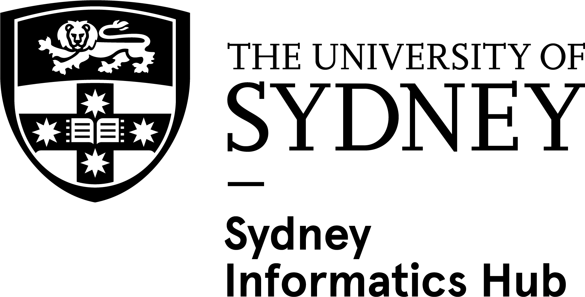

# Long read sequencing for bacterial genomics 

This workshop will introduce you to some of the basic concepts of long read sequencing analysis, using bacterial genomics as a use case. Long read sequencing is a powerful tool that has several advantages over short read sequencing, and is particularly useful within the microbiology field where it can be employed for *de novo* genome and plasmid assembly and species identification of cultures, as well as metagenomic analysis of samples from the environment.

The workshop has been designed around a dataset of sequencing data obtained from bacterial cultures from hospitals, tracking antimicrobial resistance. The content will guide you through initial quality control of a sequencing run, followed by pre-processing of the reads. You will be guided through some common methods for species identification and contamination detection. Then, we will explore *de novo* genome assembly and how to assess the quality of an assembled genome. Finally, we will use the constructed assemblies to identify antimicrobial resistance genes present in each sample and compare the samples to one another. Note that while some of the methods that we will cover in this workshop are specific to this microbiological context, many of the core concepts extend to other applications of long read sequencing.

## Lesson plan

The 2026 delivery of this workshop will be as 2 half-day sessions, delivered online through Zoom. The first day will introduce participants to long read sequencing concepts and guide them through quality control, read filtering and pre-processing, and species identification and contamination detection. The second day will explore *de novo* genome assembly, assembly quality control, and downstream genome annotation. **Note** that not all of the lessons present in these materials will be covered during the workshop. Instead, the most vital concepts will be covered, while other lessons will be left for participants to complete at their leisure.

The following table lists the lessons and their planned delivery during the workshop. Lessons with `N/A` listed under the `Day` column are additional content that won't be covered on the day but can be completed in your own time.

| Lesson # | Title | Day | Description |
| -------- | ----- | --- | ----------- |
| 1 | Introduction | 1 | Introduction to long read sequencing concepts and comparison with short read sequencing |
| 2 | Quality control | 1 | Explore different tools to assess the quality of a long read sequencing run and the sequencing reads |
| 3 | Read pre-processing | 1 | Trimming reads to remove adapters and filtering to remove low-quality reads |
| 4 | Species identification | 1 | Using public databases for rapid identification of species from long read sequences |
| 5 | Contamination removal | N/A | Methods for removing contaminating sequences (additional content) |
| 6 | *De novo* genome assembly | 2 | Assembling bacterial genomes from long read sequences |
| 7 | *De novo* plasmid assembly | N/A | Exploring tools for specifically assembling plasmids from long read sequences (additional content) |
| 8 | Consensus genome assembly | N/A | Using multiple genome assemblies to construct higher-quality consensus assemblies (additional content) |
| 9 | Assembly polishing | 2 | Polishing *de novo* assemblies to remove common long read sequencing artefacts |
| 10 | Alternative polishing methods | N/A | Exploring other methods for *de novo* assembly polishing (additional content) |
| 11 | Assembly quality control | 2 | Interpreting standard quality control metrics for *de novo* genome assembly |
| 12 | Genome annotation and AMR gene detection | 2 | Annotating *de novo* bacterial genome assemblies to identify antimicrobial resistance (AMR) genes |
| 13 | Comparative genomics | N/A | Phylogenetic and sequence similarity comparisons of assemblies (additional content) |

## Trainers

- Dr Magda Antczak, Queensland Cyber Infrastructure Foundation (QCIF)
- Dr Michael Geaghan, Sydney Informatics Hub, The University of Sydney

## Facilitators

TODO

## Setup instructions and prerequisites

Please review and complete the [setup instructions](./00.setup.md) before the course.

If you have any issues with setting up your environment, please contact us ASAP.

## Code of conduct

In order to foster a positive and professional learning environment we encourage the following kinds of behaviours at all our events and on our platforms:

- Use welcoming and inclusive language
- Be respectful of different viewpoints and experiences
- Gracefully accept constructive criticism
- Focus on what is best for the community
- Show courtesy and respect towards other community members

Our full code of conduct, with incident reporting guidelines, is available [here](https://sydney-informatics-hub.github.io/codeofconduct/).

## Course survey

Please fill out our [course survey](#) before you leave.

## Credits and acknowledgements

This workshop event and accompanying materials were jointly developed by the Sydney Informatics Hub, University of Sydney and the Queensland Cyber Infrastructure Foundation (QCIF). The workshop was enabled through the Australian BioCommons (Australian Research Data Commons and NCRIS via Bioplatforms Australia).

Developers
- Dr Magda Antczak, Queensland Cyber Infrastructure Foundation (QCIF)
- Dr Michael Geaghan, Sydney Informatics Hub, The University of Sydney

{width=40%; style="margin-right: 50px"}
{width=25%}
